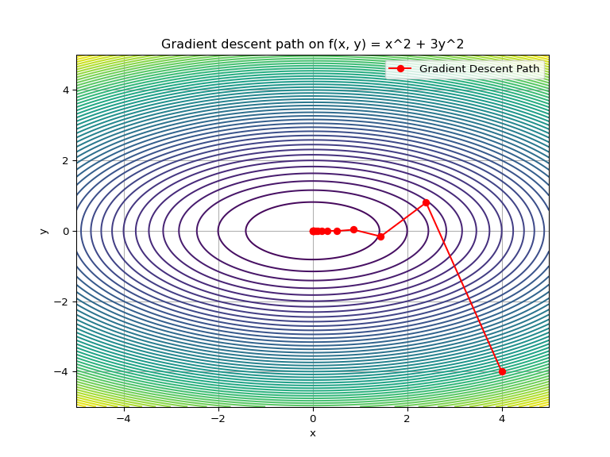
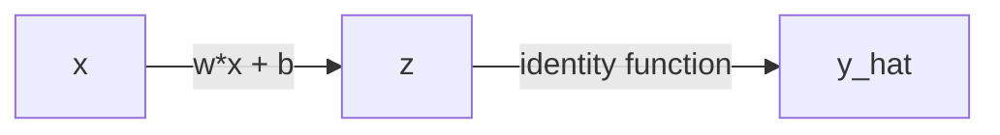
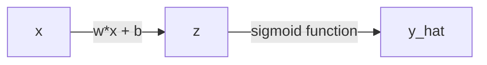
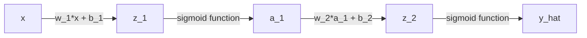

# Review of backpropagation
Erika Duan
2025-05-05

- [Derivatives](#derivatives)
- [Gradient descent](#gradient-descent)
- [Backpropagation](#backpropagation)
- [Single data point and single neural
  unit](#single-data-point-and-single-neural-unit)
- [Multiple data points and single neural
  network](#multiple-data-points-and-single-neural-network)
- [Single data point and 2 neural
  units](#single-data-point-and-2-neural-units)
- [](#section)
- [Implementing neuronal network from scratch
  example](#implementing-neuronal-network-from-scratch-example)

``` python
# Import Python libraries ------------------------------------------------------
import numpy as np
import sympy as sp
import matplotlib.pyplot as plt 
import math
```

This is a review of backpropagation from the following blog posts and
videos:

- [Step by step guide to
  backpropagation](https://datamapu.com/posts/deep_learning/backpropagation/)
  by Datamapu  
- [Backpropagation visual
  explainer](https://xnought.github.io/backprop-explainer/) by Donald
  Bertucci and Minsuk Kahng  
- [StatQuest neural networks Youtube
  playlist](https://www.youtube.com/playlist?list=PLblh5JKOoLUIxGDQs4LFFD--41Vzf-ME1)
  by Josh Starmer  
- [3Blue1Brown neural networks Youtube
  playlist](https://www.youtube.com/playlist?list=PLZHQObOWTQDNU6R1_67000Dx_ZCJB-3pi)
  by Grant Sanderson  
- [Tutorial for implementating a neural network from
  scratch](https://www.geeksforgeeks.org/implementation-of-neural-network-from-scratch-using-numpy/)
  by GeeksforGeeks  
- ChatGPT3 prompts for simple backpropagation examples

# Derivatives

We can use `SymPy` to obtain the derivatives of functions in Python.

``` python
# Obtain derivative of univariate functions ------------------------------------
# Example 1: f(x) = x**2 + 1
x = sp.Symbol('x') # define the variable  
f_x = x**2 + 1 # define the function   
sp.diff(f_x, x)  
```

    2*x

``` python
# Example 2: f(x) = (x + 3)**3
# x is already defined
f_x = (x + 3)**3 
sp.diff(f_x, x)
```

    3*(x + 3)**2

``` python
# Obtain partial derivatives of multivariate functions -------------------------
x, y = sp.symbols('x y')
f_xy = x**2 + 3*y**2  

# Partial derivative w.r.t. x
sp.diff(f_xy, x)
```

    2*x

``` python
# Partial derivative w.r.t. y
sp.diff(f_xy, y)  
```

    6*y

``` python
# Alternatively use list comprehension to compute the gradient (the vector of 
# partial derivatives)  
[sp.diff(f_xy, var) for var in (x, y)]
```

    [2*x, 6*y]

# Gradient descent

The general steps of gradient descent are:

1.  Take the derivative of the loss function. If the loss function has
    multiple parameters, you need to calculate the partial derivative of
    each parameter (the gradient of the loss function).  
2.  Start with random values for all parameters to be estimated.  
3.  Use the random values to calculate the value of the derivative or
    gradient.  
4.  Calculate the step size, where step size = derivative
    
    learning rate.  
5.  Calculate the new parameter values, where new value = old value
     step size for loss
    functions.

Let’s try the simplest example of finding an optimal parameter using
gradient descent.

- **Loss function:**
   = x^2")  
- **Derivative**:
   = \tfrac{d}{dx} x^2= 2x")

We would like to find the value of
 for which
") is the
lowest. This is equivalent to finding
 where
.

``` python
# Use gradient descent to minimize f(x) = x**2 ---------------------------------
def f(x):
    return x**2

def gradient_f(x):
    return 2*x

# Parameters
x = 4.0              # Initial guess
alpha = 0.2          # Learning rate
iterations = 20

print(f"Starting gradient descent with x = {x} and gradient = {gradient_f(x)}")
```

    Starting gradient descent with x = 4.0 and gradient = 8.0

``` python
for i in range(iterations):
    gradient = gradient_f(x)
    x = x - (alpha * gradient)
    print(f"Iteration {i+1}: x = {x: .4f}, f(x) = {f(x): .4f}")
    
    if gradient < 0.01:
        print(f"""
        Stopping early: f'(x) < 0.01
        Optimal value of x: {x: .4f}
        """)
        
        break
```

    Iteration 1: x =  2.4000, f(x) =  5.7600
    Iteration 2: x =  1.4400, f(x) =  2.0736
    Iteration 3: x =  0.8640, f(x) =  0.7465
    Iteration 4: x =  0.5184, f(x) =  0.2687
    Iteration 5: x =  0.3110, f(x) =  0.0967
    Iteration 6: x =  0.1866, f(x) =  0.0348
    Iteration 7: x =  0.1120, f(x) =  0.0125
    Iteration 8: x =  0.0672, f(x) =  0.0045
    Iteration 9: x =  0.0403, f(x) =  0.0016
    Iteration 10: x =  0.0242, f(x) =  0.0006
    Iteration 11: x =  0.0145, f(x) =  0.0002
    Iteration 12: x =  0.0087, f(x) =  0.0001
    Iteration 13: x =  0.0052, f(x) =  0.0000
    Iteration 14: x =  0.0031, f(x) =  0.0000
    Iteration 15: x =  0.0019, f(x) =  0.0000

            Stopping early: f'(x) < 0.01
            Optimal value of x:  0.0019
            

Let’s try an example where we need to find two parameters.

- **Loss function:**
   = x^2 + 3y^2")  
- **Gradient**:
   = (2x, 6y)")

We would like to find the values of
 and
 for which
")
is the lowest using gradient descent. We do this by travelling down the
slope where
") and
") is
the steepest to hopefully reach the global minima.

``` python
# Use gradient descent to minimize f(x, y) = x**2 + 3*y**2 ---------------------
def f(x, y):
    return x**2 + 3*y**2  

# Store gradient in an numpy array for maximal efficiency  
def gradient(x, y):
    return np.array([2*x, 6*y])

# Parameters
x, y = 4.0, -4.0     # Initial guess
alpha = 0.2          # Learning rate
iterations = 20

print(f"Starting with (x, y) = ({x}, {y}) and gradient = {gradient(x, y)}")  
```

    Starting with (x, y) = (4.0, -4.0) and gradient = [  8. -24.]

``` python
# Store the path for inspection  
path = []  

for i in range(iterations):
    # Store the current path before the next iteration
    path.append((x, y, f(x, y)))
    
    # Calculate new gradient  
    gradient_xy = gradient(x, y)   
    
    # Update new values of x and y  
    x = x - (alpha * gradient_xy[0])
    y = y - (alpha * gradient_xy[1])
    
    print(f"Iteration {i+1}: x = {x: .4f}, y = {y: .4f}, f(x, y) = {f(x, y): .4f}")
    
    if gradient_xy[0] < 0.01 and gradient_xy[1] < 0.01:
        print(f"""
        Stopping early: f'(x) < 0.01 & f'(y) < 0.01  
        Optimal value of x, y is ({x: .4f}, {y: .4f})
        """)
        
        break
```

    Iteration 1: x =  2.4000, y =  0.8000, f(x, y) =  7.6800
    Iteration 2: x =  1.4400, y = -0.1600, f(x, y) =  2.1504
    Iteration 3: x =  0.8640, y =  0.0320, f(x, y) =  0.7496
    Iteration 4: x =  0.5184, y = -0.0064, f(x, y) =  0.2689
    Iteration 5: x =  0.3110, y =  0.0013, f(x, y) =  0.0968
    Iteration 6: x =  0.1866, y = -0.0003, f(x, y) =  0.0348
    Iteration 7: x =  0.1120, y =  0.0001, f(x, y) =  0.0125
    Iteration 8: x =  0.0672, y = -0.0000, f(x, y) =  0.0045
    Iteration 9: x =  0.0403, y =  0.0000, f(x, y) =  0.0016
    Iteration 10: x =  0.0242, y = -0.0000, f(x, y) =  0.0006
    Iteration 11: x =  0.0145, y =  0.0000, f(x, y) =  0.0002
    Iteration 12: x =  0.0087, y = -0.0000, f(x, y) =  0.0001
    Iteration 13: x =  0.0052, y =  0.0000, f(x, y) =  0.0000
    Iteration 14: x =  0.0031, y = -0.0000, f(x, y) =  0.0000
    Iteration 15: x =  0.0019, y =  0.0000, f(x, y) =  0.0000

            Stopping early: f'(x) < 0.01 & f'(y) < 0.01  
            Optimal value of x, y is ( 0.0019,  0.0000)
            

``` python

# Store the final path point 
path.append((x, y, f(x, y)))
```

``` python
# Plot gradient descent path using contour plot --------------------------------
# Extract path components for plotting
xs, ys, zs = zip(*path)

# Create grid for contour plot
X, Y = np.meshgrid(np.linspace(-5, 5, 400), np.linspace(-5, 5, 400))
Z = f(X, Y)

# Plot contour and path
plt.figure(figsize = (8, 6))
plt.contour(X, Y, Z, levels = 50, cmap = 'viridis')

# Plot gradient descent path
plt.plot(xs, ys, marker = 'o', color = 'red', label = 'Gradient Descent Path')
plt.title('Gradient descent path on f(x, y) = x^2 + 3y^2')
plt.xlabel('x')
plt.ylabel('y')
plt.legend()
plt.grid(True)

# Show plot in Quarto notebook
plt.show()
```



# Backpropagation

The general steps of training a neural network are:

1.  **Forward pass** - calculate
    
    using the given input and initial neural network parameters (weights
    and biases).  
2.  Calculate the model error using the chosen loss function.  
3.  **Backpropagation** or **backward pass** - use gradient descent to
    update the neural network parameters to reduce the model error. To
    do this, we need to calculate the partial derivatives of the loss
    function with respect to the neural network parameters.  
4.  Iterate these steps until a specific stopping criterion is met.

# Single data point and single neural unit

Let’s try the simplest example with a single data point and a single
neural unit using the identity function (no additional transformation
through the activation function).



- **Model parameters:** 
  (weight) and  (bias)  
- **Loss function:**
  ^2")  
- **Activation function**:
  
  where
    
- **Derivatives:**
  - ^1 \times (1-0) = \hat y - y")  
  - Since
    ,
      
  - We want to find
    
    and
      
  -  \times 1 \times x = x(\hat y - y)")  
  -  \times 1 \times 1 = \hat y - y")

``` python
# Use backpropagation to find the optimal values of w and b --------------------
# This example assumes we only have 1 data point i.e. (x, y) = (2, 5)

# Sample data point  
x = 2.0        
y = 5.0        

# Initial random parameters
w = 0.5        
b = 1.0     

# Model hyperparameters  
learning_rate = 0.1
i = 1
epoches = 20  

for i in range(epoches):    
    # Step 1: Calculate the forward pass    
    z = w * x + b      # Calculate linear combination
    y_hat = z          # Calculate identity activation function

    # Step 2: Compute model loss (mean squared error) 
    loss = 0.5 * (y_hat - y) ** 2
    
    # Early stopping criterion if model loss is 0.01
    if loss < 0.01:
        print(f"""
        Stopping early at epoch {i + 1}
        Loss = {loss:.4f}, w = {w:.4f}, b = {b:.4f}
        """)
        break

    # Step 3: Calculate the backward pass 
    # Calculate individual gradients
    dL_dy_hat = y_hat - y       
    dy_hat_dz = 1              
    dz_dw = x
    dz_db = 1

    # Apply chain rule
    dL_dw = dL_dy_hat * dy_hat_dz * dz_dw
    dL_db = dL_dy_hat * dy_hat_dz * dz_db

    # Step 4: Update model parameters 
    w = w - learning_rate * dL_dw
    b = b - learning_rate * dL_db

    print(f"Epoch: {i + 1}, Loss = {loss:.4f}, w = {w:.4f}, b = {b:.4f}")
```

    Epoch: 1, Loss = 4.5000, w = 1.1000, b = 1.3000
    Epoch: 2, Loss = 1.1250, w = 1.4000, b = 1.4500
    Epoch: 3, Loss = 0.2812, w = 1.5500, b = 1.5250
    Epoch: 4, Loss = 0.0703, w = 1.6250, b = 1.5625
    Epoch: 5, Loss = 0.0176, w = 1.6625, b = 1.5813

            Stopping early at epoch 6
            Loss = 0.0044, w = 1.6625, b = 1.5813
            

Let’s try another example with a single data point and a single neural
unit using the sigmoid activation function
").



- **Model parameters:** 
  and   
- **Loss function:**
  ^2")  
- **Activation function**:
   = \tfrac{1}{1+e^{-z}}")
  where
    
- **Derivatives:**
  -   
  - ^2} = \sigma(z) \times (1 - \sigma(z))")  
  -  \times \sigma(z) \times (1- \sigma(z)) \times x")  
  -  \times \sigma(z) \times (1- \sigma(z)) \times 1")

``` python
# Use backpropagation to find the optimal values of w and b --------------------
# This example assumes we only have 1 data point i.e. (x, y) = (0.5, 1.0)

# Sample data point  
x = 0.5        
y = 1.0        

# Initial random parameters
w = 0.3        
b = 0.1     

# Model hyperparameters  
learning_rate = 0.1
i = 1
epoches = 20  

# Create sigmoid activation function  
def sigmoid(z):
    return 1/(1 + np.exp(-z))  

for i in range(epoches):    
    # Step 1: Calculate the forward pass    
    z = w * x + b      # Calculate linear combination
    y_hat = sigmoid(z) # Calculate sigmoid activation function  

    # Step 2: Compute model loss (mean squared error) 
    loss = 0.5 * (y_hat - y) ** 2
    
    # Early stopping criterion if model loss is 0.01
    if loss < 0.01:
        print(f"""
        Stopping early at epoch {i + 1}
        Loss = {loss:.4f}, w = {w:.4f}, b = {b:.4f}
        """)
        break

    # Step 3: Calculate the backward pass 
    # Calculate individual gradients
    dL_dy_hat = y_hat - y       
    dy_hat_dz = sigmoid(z) * (1 - sigmoid(z))              
    dz_dw = x
    dz_db = 1

    # Apply chain rule
    dL_dw = dL_dy_hat * dy_hat_dz * dz_dw
    dL_db = dL_dy_hat * dy_hat_dz * dz_db

    # Step 4: Update model parameters 
    w = w - learning_rate * dL_dw
    b = b - learning_rate * dL_db

    print(f"Epoch: {i + 1}, Loss = {loss:.4f}, w = {w:.4f}, b = {b:.4f}")
```

    Epoch: 1, Loss = 0.0958, w = 0.3054, b = 0.1108
    Epoch: 2, Loss = 0.0944, w = 0.3107, b = 0.1215
    Epoch: 3, Loss = 0.0930, w = 0.3160, b = 0.1320
    Epoch: 4, Loss = 0.0916, w = 0.3213, b = 0.1425
    Epoch: 5, Loss = 0.0902, w = 0.3264, b = 0.1529
    Epoch: 6, Loss = 0.0889, w = 0.3316, b = 0.1632
    Epoch: 7, Loss = 0.0876, w = 0.3367, b = 0.1734
    Epoch: 8, Loss = 0.0863, w = 0.3417, b = 0.1834
    Epoch: 9, Loss = 0.0850, w = 0.3467, b = 0.1934
    Epoch: 10, Loss = 0.0838, w = 0.3517, b = 0.2033
    Epoch: 11, Loss = 0.0826, w = 0.3566, b = 0.2131
    Epoch: 12, Loss = 0.0814, w = 0.3614, b = 0.2228
    Epoch: 13, Loss = 0.0802, w = 0.3662, b = 0.2325
    Epoch: 14, Loss = 0.0790, w = 0.3710, b = 0.2420
    Epoch: 15, Loss = 0.0779, w = 0.3757, b = 0.2514
    Epoch: 16, Loss = 0.0768, w = 0.3804, b = 0.2607
    Epoch: 17, Loss = 0.0757, w = 0.3850, b = 0.2700
    Epoch: 18, Loss = 0.0747, w = 0.3896, b = 0.2792
    Epoch: 19, Loss = 0.0736, w = 0.3941, b = 0.2882
    Epoch: 20, Loss = 0.0726, w = 0.3986, b = 0.2972

# Multiple data points and single neural network

In reality, training data sets are large and we need to process many
data points during each forward and backward pass. We can do this
efficiently using matrix multiplication.

Let’s try the example above (a single neural unit using the sigmoid
activation function) but with multiple data points.

``` python
# Use backpropagation using multiple data points -------------------------------
# We store our data points inside a numpy array  

# Store input data i.e. x_1 to x_n in a 1D numpy array    
X = np.array(
  [0.5, 0.8, 1.5, 0.4, 0.4, 1.0, 1.9]
  )

# Store output data i.e. y_1 to y_n in a 1D numpy array
Y = np.array(
  [1.0, 1.2, 1.2, 0.6, 0.5, 1.1, 1.3]
  )

# Initial random parameters
w = 0.3        
b = 0.1     

# Model hyperparameters  
learning_rate = 0.1
i = 1
epoches = 20  

# Create sigmoid activation function that can input and output vectors 
def sigmoid(z):
    return 1/(1 + np.exp(-z))  

for i in range(epoches):    
    # Step 1: Calculate the forward pass    
    z = w * X + b      # Calculate linear combination using scalar multiplication
    y_hat = sigmoid(z) # Calculate sigmoid activation function  

    # Step 2: Compute model loss (mean squared error) 
    loss = 0.5 * (y_hat - y) ** 2
    avg_loss = np.mean(loss)
    
    # Early stopping criterion if model loss is 0.01
    if avg_loss < 0.01:  
        print(f"""
        Stopping early at epoch {i + 1}
        Average loss = {avg_loss:.4f}, w = {w:.4f}, b = {b:.4f}
        """)
        break

    # Step 3: Calculate the backward pass 
    # Calculate individual gradients
    dL_dy_hat = y_hat - y       
    dy_hat_dz = sigmoid(z) * (1 - sigmoid(z))              
    dz_dw = x
    dz_db = 1

    # Apply chain rule
    dL_dw = dL_dy_hat * dy_hat_dz * dz_dw
    dL_db = dL_dy_hat * dy_hat_dz * dz_db
    
    # Average over the dL_dw, dL_db and loss vectors  
    # The expected outputs for w, b and loss are scalar. As X and Y are vectors,
    # z, y_hat, loss and all derivative outputs are all vectors.  
    # We need to average dL_dw, dL_db and loss to return a scalar for w and b
    avg_dL_dw = np.mean(dL_dw)
    avg_dL_db = np.mean(dL_db)
    
    # Step 4: Update model parameters 
    w = w - learning_rate * avg_dL_dw
    b = b - learning_rate * avg_dL_db

    print(f"Epoch: {i + 1}, Average loss = {avg_loss:.4f}, w = {w:.4f}, b = {b:.4f}")
```

    Epoch: 1, Average loss = 0.0836, w = 0.3049, b = 0.1098
    Epoch: 2, Average loss = 0.0822, w = 0.3097, b = 0.1195
    Epoch: 3, Average loss = 0.0809, w = 0.3145, b = 0.1291
    Epoch: 4, Average loss = 0.0796, w = 0.3193, b = 0.1385
    Epoch: 5, Average loss = 0.0783, w = 0.3240, b = 0.1479
    Epoch: 6, Average loss = 0.0771, w = 0.3286, b = 0.1572
    Epoch: 7, Average loss = 0.0759, w = 0.3332, b = 0.1664
    Epoch: 8, Average loss = 0.0747, w = 0.3377, b = 0.1754
    Epoch: 9, Average loss = 0.0735, w = 0.3422, b = 0.1844
    Epoch: 10, Average loss = 0.0724, w = 0.3466, b = 0.1933
    Epoch: 11, Average loss = 0.0713, w = 0.3510, b = 0.2020
    Epoch: 12, Average loss = 0.0702, w = 0.3554, b = 0.2107
    Epoch: 13, Average loss = 0.0691, w = 0.3597, b = 0.2193
    Epoch: 14, Average loss = 0.0681, w = 0.3639, b = 0.2278
    Epoch: 15, Average loss = 0.0671, w = 0.3681, b = 0.2362
    Epoch: 16, Average loss = 0.0661, w = 0.3722, b = 0.2445
    Epoch: 17, Average loss = 0.0651, w = 0.3764, b = 0.2527
    Epoch: 18, Average loss = 0.0641, w = 0.3804, b = 0.2608
    Epoch: 19, Average loss = 0.0632, w = 0.3844, b = 0.2689
    Epoch: 20, Average loss = 0.0623, w = 0.3884, b = 0.2768

# Single data point and 2 neural units

Let’s try a more complex example with 2 neurons organised one after
another and using the sigmoid activation function. We now have 2 weights
()
and 2 biases
()
to estimate.

When there are multiple neurons, the notation
")
becomes useful where  is
the neuronal input and 
is the neuronal output. In this example,
.



Estimating  and
 using

and

is identical to the example above for a single neural unit. Estimating
 and
 requires further
application of the chain rule.

- **Model parameters:**
  ![W = \[w_1, w_2\]](https://latex.codecogs.com/svg.latex?W%20%3D%20%5Bw_1%2C%20w_2%5D "W = [w_1, w_2]")
  and
  ![B = \[b_1, b_2\]b](https://latex.codecogs.com/svg.latex?B%20%3D%20%5Bb_1%2C%20b_2%5Db "B = [b_1, b_2]b")  
- **Loss function:**
  ^2")  
- **Activation function**:
   = \tfrac{1}{1+e^{-z}}")  
- **Derivatives:**
  -   
  -  \times (1 - \sigma(z))")  
  -  \times \sigma(z_2) \times (1- \sigma(z_2)) \times x")  
  -  \times \sigma(z_2) \times (1- \sigma(z_2)) \times 1")  
  -   
  - 

**Note:** As the derivative of the sigmoid function is represented in
terms of the original sigmoid function,
 \times (1- \sigma(z_2))")
and
 \times (1 - \sigma(z_1))").
This makes applying the gradient rule more computationally efficient.

``` python
# Use backpropagation to find the optimal values of w1, w2, b1 and b2 ----------
# This example assumes we only have 1 data point i.e. (x, y) = (0.5, 1.0)

# Sample data point
x = 0.5
y = 1.0

# Initial random parameters
w1 = 0.3
w2 = 0.2
b1 = 0.1
b2 = 0.2

# Model hyperparameters
learning_rate = 0.1
i = 1
epoches = 20

# Create sigmoid activation function
def sigmoid(z):
    return 1/(1 + np.exp(-z))

for i in range(epoches):
    # Step 1: Calculate the forward pass
    z1 = w1 * x + b1    # Calculate 1st linear combination
    a1 = sigmoid(z1)    # Calculate 1st sigmoid activation function
    z2 = w2 * a1 + b2   # Calculate 2nd linear combination
    y_hat = sigmoid(z2) # Calculate 2nd sigmoid activation function

    # Step 2: Compute model loss (mean squared error)
    loss = 0.5 * (y_hat - y) ** 2

    # Early stopping criterion if model loss is 0.01
    if loss < 0.01:
        print(f"""
        Stopping early at epoch {i + 1}
        Loss = {loss:.4f}, W = [{w1:.4f}, {w2:.4f}], B = [{b1:.4f}, {b2:.4f}]  
        """)
        break

    # Step 3: Calculate the backward pass
    # Calculate individual gradients
    dL_dy_hat = y_hat - y
    dy_hat_dz2 = sigmoid(z2) * (1 - sigmoid(z2))   
    dz2_dw2 = a1   
    dz2_db2 = 1   
    
    dz2_da1 = w2  
    da1_dz1 = sigmoid(z1) * (1 - sigmoid(z1)) 
    dz1_dw1 = x
    dz1_db1 = 1

    # Apply chain rule
    # First find dL_dw2 and dL_db2
    dL_dw2 = dL_dy_hat * dy_hat_dz2 * dz2_dw2
    dL_db2 = dL_dy_hat * dy_hat_dz2 * dz2_db2  
    # Then find dL_dw1 and dL_db1   
    dL_dw1 = dL_dy_hat * dy_hat_dz2 * dz2_da1 * da1_dz1 * dz1_dw1
    dL_db1 = dL_dy_hat * dy_hat_dz2 * dz2_da1 * da1_dz1 * dz1_db1  

    # Step 4: Update model parameters
    w2 = w2 - learning_rate * dL_dw2
    b2 = b2 - learning_rate * dL_db2
    
    w1 = w2 - learning_rate * dL_dw2
    b1 = b1 - learning_rate * dL_db2

    print(f"Epoch: {i + 1}, Loss = {loss:.4f}, W = [{w1:.4f}, {w2:.4f}], B = [{b1:.4f}, {b2:.4f}]")   
```

    Epoch: 1, Loss = 0.0893, W = [0.2116, 0.2058], B = [0.1103, 0.2103]
    Epoch: 2, Loss = 0.0880, W = [0.2171, 0.2115], B = [0.1205, 0.2205]
    Epoch: 3, Loss = 0.0866, W = [0.2227, 0.2171], B = [0.1306, 0.2306]
    Epoch: 4, Loss = 0.0852, W = [0.2283, 0.2227], B = [0.1406, 0.2406]
    Epoch: 5, Loss = 0.0838, W = [0.2339, 0.2283], B = [0.1506, 0.2506]
    Epoch: 6, Loss = 0.0825, W = [0.2394, 0.2338], B = [0.1603, 0.2603]
    Epoch: 7, Loss = 0.0812, W = [0.2449, 0.2393], B = [0.1700, 0.2700]
    Epoch: 8, Loss = 0.0798, W = [0.2503, 0.2448], B = [0.1796, 0.2796]
    Epoch: 9, Loss = 0.0786, W = [0.2558, 0.2503], B = [0.1891, 0.2891]
    Epoch: 10, Loss = 0.0773, W = [0.2611, 0.2557], B = [0.1985, 0.2985]
    Epoch: 11, Loss = 0.0761, W = [0.2665, 0.2611], B = [0.2078, 0.3078]
    Epoch: 12, Loss = 0.0748, W = [0.2718, 0.2665], B = [0.2169, 0.3169]
    Epoch: 13, Loss = 0.0737, W = [0.2771, 0.2718], B = [0.2260, 0.3260]
    Epoch: 14, Loss = 0.0725, W = [0.2824, 0.2771], B = [0.2350, 0.3350]
    Epoch: 15, Loss = 0.0713, W = [0.2876, 0.2824], B = [0.2439, 0.3439]
    Epoch: 16, Loss = 0.0702, W = [0.2928, 0.2876], B = [0.2527, 0.3527]
    Epoch: 17, Loss = 0.0691, W = [0.2980, 0.2928], B = [0.2613, 0.3613]
    Epoch: 18, Loss = 0.0680, W = [0.3031, 0.2980], B = [0.2699, 0.3699]
    Epoch: 19, Loss = 0.0669, W = [0.3082, 0.3031], B = [0.2784, 0.3784]
    Epoch: 20, Loss = 0.0659, W = [0.3133, 0.3082], B = [0.2868, 0.3868]

# 

LEt’s try 2 neurons in a layer

# Implementing neuronal network from scratch example

**Note:** LLMs like ChatGPT help speed up the revision of fundamental
principles. Current free LLMs generate many small but egregious code
errors, so using examples with pre-determined model parameters is a good
safety check.
