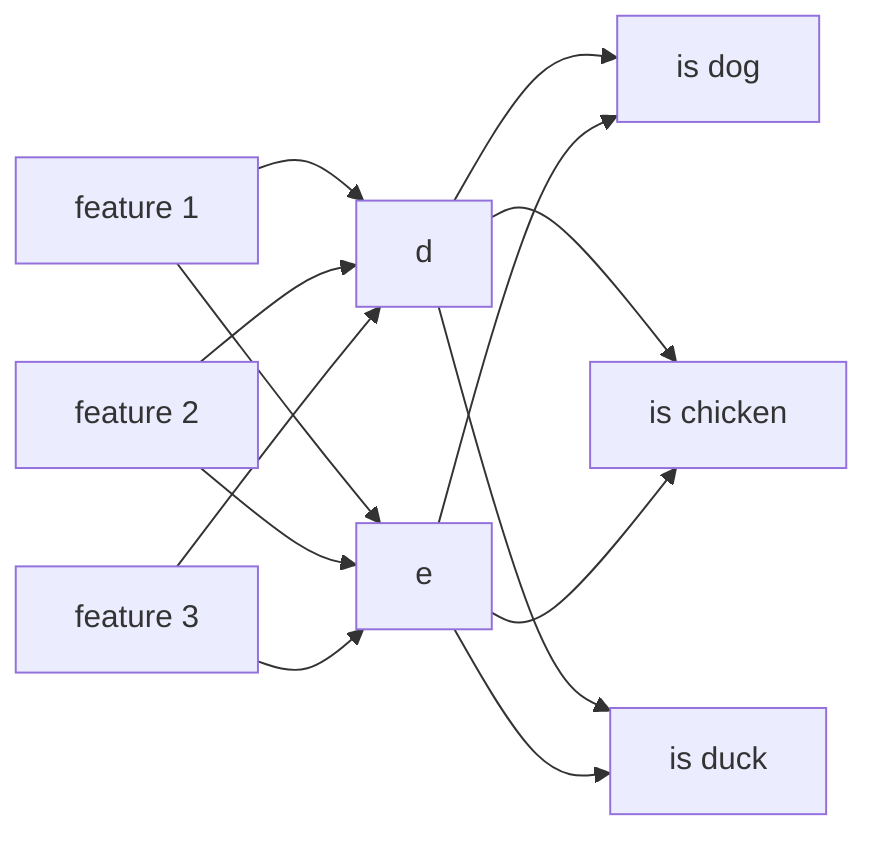
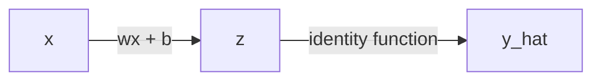
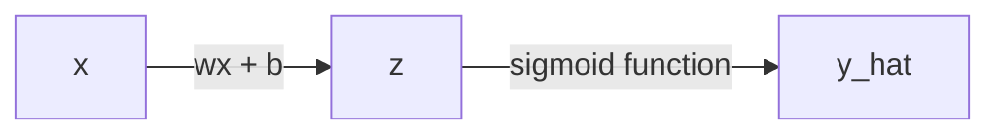
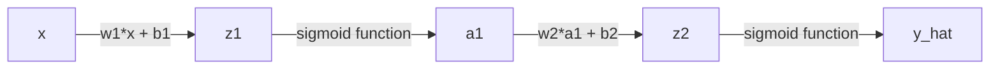
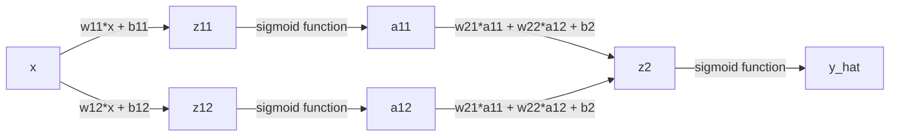
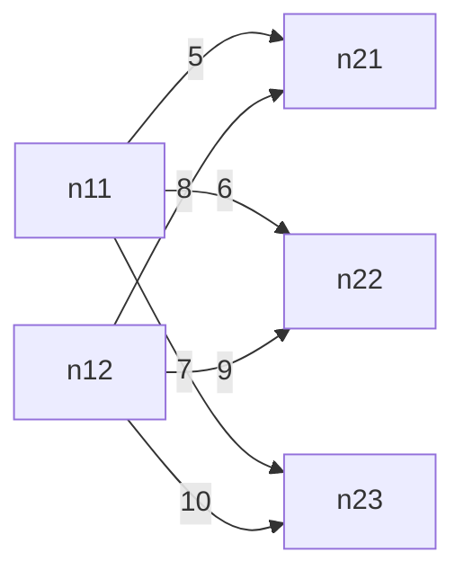
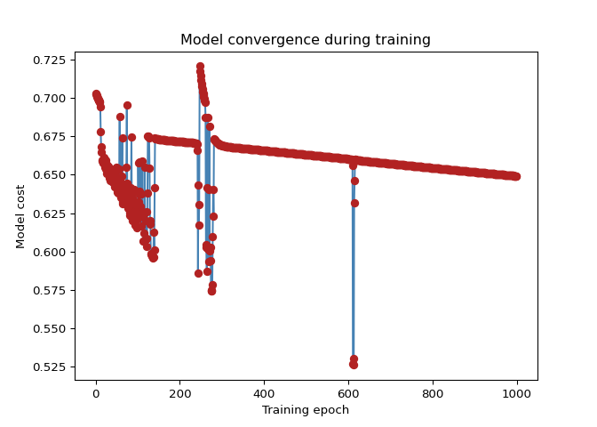

# Review of backpropagation
Erika Duan
2025-05-19

- [Derivatives](#derivatives)
- [Gradient descent](#gradient-descent)
- [Neural network annotation](#neural-network-annotation)
- [Backpropagation](#backpropagation)
- [Single data point and 1 neuron](#single-data-point-and-1-neuron)
- [Multiple data points and 1
  neuron](#multiple-data-points-and-1-neuron)
- [Single data point and 2 neurons as 2 hidden
  layers](#single-data-point-and-2-neurons-as-2-hidden-layers)
- [Single data point and 2 neurons in 1 single hidden
  layer](#single-data-point-and-2-neurons-in-1-single-hidden-layer)
- [Storing parameters using matrix
  multiplication](#storing-parameters-using-matrix-multiplication)
- [Coding a neural network classifier from
  scratch](#coding-a-neural-network-classifier-from-scratch)

``` python
# Import Python libraries ------------------------------------------------------
import numpy as np
import sympy as sp
import matplotlib.pyplot as plt 
import math
```

This is a review of backpropagation from the following blog posts and
videos:

- [Step by step guide to
  backpropagation](https://datamapu.com/posts/deep_learning/backpropagation/)
  by Datamapu  
- [Backpropagation visual
  explainer](https://xnought.github.io/backprop-explainer/) by Donald
  Bertucci and Minsuk Kahng  
- [StatQuest neural networks Youtube
  playlist](https://www.youtube.com/playlist?list=PLblh5JKOoLUIxGDQs4LFFD--41Vzf-ME1)
  by Josh Starmer  
- [3Blue1Brown neural networks Youtube
  playlist](https://www.youtube.com/playlist?list=PLZHQObOWTQDNU6R1_67000Dx_ZCJB-3pi)
  by Grant Sanderson  
- [Coding a neural network from
  scratch](https://medium.com/@waadlingaadil/learn-to-build-a-neural-network-from-scratch-yes-really-cac4ca457efc)
  by Aadil Mallick  
- ChatGPT3 prompts for simple backpropagation examples

# Derivatives

We can use `SymPy` to obtain the derivatives of functions in Python.

``` python
# Obtain derivative of univariate functions ------------------------------------
# Example 1: f(x) = x**2 + 1
x = sp.Symbol('x') # define the variable  
f_x = x**2 + 1 # define the function   
sp.diff(f_x, x)  
```

    2*x

``` python
# Example 2: f(x) = (x + 3)**3
# x is already defined above
f_x = (x + 3)**3 
sp.diff(f_x, x)
```

    3*(x + 3)**2

``` python
# Obtain partial derivatives of multivariate functions -------------------------
x, y = sp.symbols('x y')
f_xy = x**2 + 3*y**2  

# Partial derivative w.r.t. x
sp.diff(f_xy, x)
```

    2*x

``` python
# Partial derivative w.r.t. y
sp.diff(f_xy, y)  
```

    6*y

``` python
# Alternatively use list comprehension to compute the gradient (the vector of 
# partial derivatives)  
[sp.diff(f_xy, var) for var in (x, y)]
```

    [2*x, 6*y]

# Gradient descent

The general steps of gradient descent are:

1.  Take the derivative of the loss function. If the loss function has
    multiple parameters, you need to calculate the partial derivative of
    each parameter (the gradient of the loss function).  
2.  Start with random values for all parameters to be estimated.  
3.  Use the random values to calculate the value of the derivative or
    gradient.  
4.  Calculate the step size, where step size = derivative
    
    learning rate.  
5.  Calculate the new parameter values, where new value = old value
     step size for loss
    functions.

Let’s try the simplest example of finding an optimal parameter using
gradient descent.

- **Loss function:**
   = x^2")  
- **Derivative**:
   = \tfrac{d}{dx} x^2= 2x")

We would like to find the value of
 for which
") is the
lowest. This is equivalent to finding
 where
.

``` python
# Use gradient descent to minimize f(x) = x**2 ---------------------------------
def f(x):
    return x**2

def gradient_f(x):
    return 2*x

# Parameters
x = 4.0              # Initial guess
alpha = 0.2          # Learning rate
iterations = 20

print(f"Starting gradient descent with x = {x} and gradient = {gradient_f(x)}")
```

    Starting gradient descent with x = 4.0 and gradient = 8.0

``` python
for i in range(iterations):
    gradient = gradient_f(x)
    # For loss functions, we subtract from the gradient to find the steepest rate of loss
    x = x - (alpha * gradient) 
    print(f"Iteration {i+1}: x = {x: .4f}, f(x) = {f(x): .4f}")
    
    if gradient < 0.01:
        print(f"""
        Stopping early: f'(x) < 0.01
        Optimal value of x: {x: .4f}
        """)
        
        break
```

    Iteration 1: x =  2.4000, f(x) =  5.7600
    Iteration 2: x =  1.4400, f(x) =  2.0736
    Iteration 3: x =  0.8640, f(x) =  0.7465
    Iteration 4: x =  0.5184, f(x) =  0.2687
    Iteration 5: x =  0.3110, f(x) =  0.0967
    Iteration 6: x =  0.1866, f(x) =  0.0348
    Iteration 7: x =  0.1120, f(x) =  0.0125
    Iteration 8: x =  0.0672, f(x) =  0.0045
    Iteration 9: x =  0.0403, f(x) =  0.0016
    Iteration 10: x =  0.0242, f(x) =  0.0006
    Iteration 11: x =  0.0145, f(x) =  0.0002
    Iteration 12: x =  0.0087, f(x) =  0.0001
    Iteration 13: x =  0.0052, f(x) =  0.0000
    Iteration 14: x =  0.0031, f(x) =  0.0000
    Iteration 15: x =  0.0019, f(x) =  0.0000

            Stopping early: f'(x) < 0.01
            Optimal value of x:  0.0019
            

Let’s try an example where we need to find two parameters.

- **Loss function:**
   = x^2 + 3y^2")  
- **Gradient**:
   = (2x, 6y)")

We would like to find the values of
 and
 for which
")
is the lowest using gradient descent. We do this by travelling down the
slope where
") and
") is
the steepest to hopefully reach the global minima.

``` python
# Use gradient descent to minimize f(x, y) = x**2 + 3*y**2 ---------------------
def f(x, y):
    return x**2 + 3*y**2  

# Store gradient in an numpy array for maximal efficiency  
def gradient(x, y):
    return np.array([2*x, 6*y])

# Parameters
x, y = 4.0, -4.0     # Initial guess
alpha = 0.2          # Learning rate
iterations = 20

print(f"""
Starting with (x, y) = ({x}, {y}) 
Starting with gradient = [{gradient(x, y)[0]}, {gradient(x, y)[1]}]
""")  
```


    Starting with (x, y) = (4.0, -4.0) 
    Starting with gradient = [8.0, -24.0]

``` python
# Store the path for inspection  
path = []  

for i in range(iterations):
    # Store the current path before the next iteration
    path.append((x, y, f(x, y)))
    
    # Calculate new gradient  
    gradient_xy = gradient(x, y)   
    
    # Update new values of x and y  
    x = x - (alpha * gradient_xy[0])
    y = y - (alpha * gradient_xy[1])
    
    print(f"Iteration {i+1}: x = {x: .4f}, y = {y: .4f}, f(x, y) = {f(x, y): .4f}")
    
    if gradient_xy[0] < 0.01 and gradient_xy[1] < 0.01:
        print(f"""
        Stopping early: f'(x) < 0.01 & f'(y) < 0.01  
        Optimal value of x, y is ({x: .4f}, {y: .4f})
        """)
        
        break
```

    Iteration 1: x =  2.4000, y =  0.8000, f(x, y) =  7.6800
    Iteration 2: x =  1.4400, y = -0.1600, f(x, y) =  2.1504
    Iteration 3: x =  0.8640, y =  0.0320, f(x, y) =  0.7496
    Iteration 4: x =  0.5184, y = -0.0064, f(x, y) =  0.2689
    Iteration 5: x =  0.3110, y =  0.0013, f(x, y) =  0.0968
    Iteration 6: x =  0.1866, y = -0.0003, f(x, y) =  0.0348
    Iteration 7: x =  0.1120, y =  0.0001, f(x, y) =  0.0125
    Iteration 8: x =  0.0672, y = -0.0000, f(x, y) =  0.0045
    Iteration 9: x =  0.0403, y =  0.0000, f(x, y) =  0.0016
    Iteration 10: x =  0.0242, y = -0.0000, f(x, y) =  0.0006
    Iteration 11: x =  0.0145, y =  0.0000, f(x, y) =  0.0002
    Iteration 12: x =  0.0087, y = -0.0000, f(x, y) =  0.0001
    Iteration 13: x =  0.0052, y =  0.0000, f(x, y) =  0.0000
    Iteration 14: x =  0.0031, y = -0.0000, f(x, y) =  0.0000
    Iteration 15: x =  0.0019, y =  0.0000, f(x, y) =  0.0000

            Stopping early: f'(x) < 0.01 & f'(y) < 0.01  
            Optimal value of x, y is ( 0.0019,  0.0000)
            

``` python

# Store the final path point 
path.append((x, y, f(x, y)))
```

``` python
# Plot gradient descent path using contour plot --------------------------------
# Extract path components for plotting
xs, ys, zs = zip(*path)

# Create grid for contour plot
min_grid = min(min(xs), min(ys)) - 1
max_grid = max(max(xs), max(ys), -min_grid)

X, Y = np.meshgrid(
  np.linspace(min_grid, max_grid, 400),
  np.linspace(min_grid, max_grid, 400)
  )

Z = f(X, Y)

# Plot contour and path
plt.figure(figsize = (8, 6))
plt.contour(X, Y, Z, levels = 50, cmap = 'viridis')

# Plot gradient descent path
plt.plot(xs, ys, marker = 'o', color = 'red', label = 'Gradient Descent Path')
plt.title('Gradient descent path on f(x, y) = x^2 + 3y^2')
plt.xlabel('x')
plt.ylabel('y')
plt.legend()
plt.grid(True)

# Show plot in Quarto notebook
plt.show()
```


``` python

# Clears plot configurations 
plt.clf()
```


# Neural network annotation

Backpropagation is used to iteratively search for the best neural
network parameters (weights and biases).

Consider a neural network which uses 3 variables i.e. `can_bark`,
`leg_number`, and `can_swim` to classify a record into 1 of 3 classes
i.e. `dog`, `chicken` and `duck`.



The annotation for the structure and parameters in a neural network are:

- Layers are counted from the first hidden layer. The first hidden layer
  is referred to as
  ![n^{\[1\]}](https://latex.codecogs.com/svg.latex?n%5E%7B%5B1%5D%7D "n^{[1]}").
  The input layer is often referred to as
  ![n^{\[0\]}](https://latex.codecogs.com/svg.latex?n%5E%7B%5B0%5D%7D "n^{[0]}")
  for consistency.  
- Our example neural network has 2 layers.  
- A unique **weight** exists for each unique **connection** in the
  neural network.  
- In each layer, the total number of weights is equal to the total
  number of neurons in the current layer multiplied by the total number
  of neurons in the previous layer.  
- In our example,
  ![n^{\[1\]}](https://latex.codecogs.com/svg.latex?n%5E%7B%5B1%5D%7D "n^{[1]}")
  has
  
  weights and
  ![n^{\[2\]}](https://latex.codecogs.com/svg.latex?n%5E%7B%5B2%5D%7D "n^{[2]}")
  has
  
  weights.  
- The weight
  ![w^{\[1\]}\_{2,3}](https://latex.codecogs.com/svg.latex?w%5E%7B%5B1%5D%7D_%7B2%2C3%7D "w^{[1]}_{2,3}")
  refers to the weight assigned to the second neuron in the first layer
  connected from the third neuron in the previous layer.  
- A unique **bias** exists for each unique **non-input neuron** in the
  neural network.  
- In each non-input layer, the total number of biases is equal to the
  total number of neurons.  
- In our example above,
  ![n^{\[1\]}](https://latex.codecogs.com/svg.latex?n%5E%7B%5B1%5D%7D "n^{[1]}")
  has 2 biases and
  ![n^{\[2\]}](https://latex.codecogs.com/svg.latex?n%5E%7B%5B2%5D%7D "n^{[2]}")
  has 3 biases.  
- In practice, the weights and biases for each layer are represented as
  matrices
  i.e. ![W^{\[2\]}](https://latex.codecogs.com/svg.latex?W%5E%7B%5B2%5D%7D "W^{[2]}")
  and
  ![b^{\[2\]}](https://latex.codecogs.com/svg.latex?b%5E%7B%5B2%5D%7D "b^{[2]}")
  for
  ![n^{\[2\]}](https://latex.codecogs.com/svg.latex?n%5E%7B%5B2%5D%7D "n^{[2]}").

# Backpropagation

The general steps of training a neural network are:

1.  **Forward pass** - calculate
    
    using the given input(s) and randomly initialised neural network
    parameters (weights and biases).  
2.  Calculate the model error using the chosen loss function.  
3.  **Backpropagation** or **backward pass** - use gradient descent to
    update the neural network parameters to reduce the model error. To
    do this, we need to calculate the partial derivatives of the loss
    function with respect to all individual neural network parameters.  
4.  Iterate these steps until a specific stopping criterion is met.

# Single data point and 1 neuron

Let’s try the simplest example with a single data point and a single
neuron using the identity function (no additional transformation through
the activation function).



- **Model parameters:** 
  (weight) and  (bias)  
- **Loss function:**
  ^2")  
- **Activation function**:
  
  where
    
- **Partial derivatives:**
  - ^1 \cdot (1-0) = \hat y - y")  
  - Since
    ,
      
  - We want to find
    
    and
      
  -  \cdot 1 \cdot x = (\hat y - y) \cdot x")  
  -  \cdot 1 \cdot 1 = \hat y - y")

``` python
# Use backpropagation to find the optimal values of w and b --------------------
# This example assumes we only have 1 data point i.e. (x, y) = (2, 5)

# Sample input data point  
x = 2.0        
y = 5.0        

# Initial random parameters
w = 0.5        
b = 1.0     

# Model hyperparameters  
learning_rate = 0.1
i = 1
epoches = 20  

for i in range(epoches):    
    # Step 1: Calculate the forward pass    
    z = w * x + b      # Calculate linear combination
    y_hat = z          # Calculate identity activation function

    # Step 2: Compute model loss (mean squared error) 
    loss = 0.5 * (y_hat - y) ** 2
    
    # Early stopping criterion if model loss is 0.01
    if loss < 0.01:
        print(f"""
        Stopping early at epoch {i + 1}
        Loss = {loss:.4f}, w = {w:.4f}, b = {b:.4f}
        """)
        break

    # Step 3: Calculate the backward pass 
    # Calculate individual gradients
    dL_dy_hat = y_hat - y       
    dy_hat_dz = 1              
    dz_dw = x
    dz_db = 1

    # Apply chain rule
    dL_dw = dL_dy_hat * dy_hat_dz * dz_dw
    dL_db = dL_dy_hat * dy_hat_dz * dz_db

    # Step 4: Update model parameters 
    w = w - learning_rate * dL_dw
    b = b - learning_rate * dL_db

    print(f"Epoch: {i + 1}, Loss = {loss:.4f}, w = {w:.4f}, b = {b:.4f}")
```

    Epoch: 1, Loss = 4.5000, w = 1.1000, b = 1.3000
    Epoch: 2, Loss = 1.1250, w = 1.4000, b = 1.4500
    Epoch: 3, Loss = 0.2812, w = 1.5500, b = 1.5250
    Epoch: 4, Loss = 0.0703, w = 1.6250, b = 1.5625
    Epoch: 5, Loss = 0.0176, w = 1.6625, b = 1.5813

            Stopping early at epoch 6
            Loss = 0.0044, w = 1.6625, b = 1.5813
            

**Note:** Because the activation function is an identity function,
.
This simplest neural network fits a linear function to the training data
set and we can do this more efficiently using linear regression.

Neural networks are useful for approximating very complex non-linear
functions, which is achieved by any combination of:

- Adding more neurons to a hidden layer
- Adding more hidden layers
- Using non-identity activation functions

Let’s try another example with a single data point and a single neuron
using the sigmoid activation function
").
This allows us to estimate the non-linear function
 = \tfrac{1}{1+e^{-(wx+b)}}").



- **Model parameters:** 
  and   
- **Loss function:**
  ^2")  
- **Activation function**:
   = \tfrac{1}{1+e^{-z}}")
  where
    
- **Partial derivatives:**
  -   
  - ^2} = \sigma(z) \cdot (1 - \sigma(z))")  
  -  \cdot \sigma(z) \cdot (1- \sigma(z)) \cdot x")  
  -  \cdot \sigma(z) \cdot (1- \sigma(z)) \cdot 1")

``` python
# Use backpropagation to find the optimal values of w and b --------------------
# This example assumes we only have 1 data point i.e. (x, y) = (0.5, 1.0)

# Sample input data point  
x = 0.5        
y = 1.0        

# Initial random parameters
w = 0.3        
b = 0.1     

# Model hyperparameters  
learning_rate = 0.1
i = 1
epoches = 20  

# Create sigmoid activation function  
def sigmoid(z):
    return 1/(1 + np.exp(-z))  

for i in range(epoches):    
    # Step 1: Calculate the forward pass    
    z = w * x + b      # Calculate linear combination
    y_hat = sigmoid(z) # Calculate sigmoid activation function  

    # Step 2: Compute model loss (mean squared error) 
    loss = 0.5 * (y_hat - y) ** 2
    
    # Early stopping criterion if model loss is 0.01
    if loss < 0.01:
        print(f"""
        Stopping early at epoch {i + 1}
        Loss = {loss:.4f}, w = {w:.4f}, b = {b:.4f}
        """)
        break

    # Step 3: Calculate the backward pass
    # Calculate individual gradients
    dL_dy_hat = y_hat - y       
    dy_hat_dz = sigmoid(z) * (1 - sigmoid(z))              
    dz_dw = x
    dz_db = 1

    # Apply chain rule
    dL_dw = dL_dy_hat * dy_hat_dz * dz_dw
    dL_db = dL_dy_hat * dy_hat_dz * dz_db

    # Step 4: Update model parameters
    w = w - learning_rate * dL_dw
    b = b - learning_rate * dL_db

    print(f"Epoch: {i + 1}, Loss = {loss:.4f}, w = {w:.4f}, b = {b:.4f}")
```

    Epoch: 1, Loss = 0.0958, w = 0.3054, b = 0.1108
    Epoch: 2, Loss = 0.0944, w = 0.3107, b = 0.1215
    Epoch: 3, Loss = 0.0930, w = 0.3160, b = 0.1320
    Epoch: 4, Loss = 0.0916, w = 0.3213, b = 0.1425
    Epoch: 5, Loss = 0.0902, w = 0.3264, b = 0.1529
    Epoch: 6, Loss = 0.0889, w = 0.3316, b = 0.1632
    Epoch: 7, Loss = 0.0876, w = 0.3367, b = 0.1734
    Epoch: 8, Loss = 0.0863, w = 0.3417, b = 0.1834
    Epoch: 9, Loss = 0.0850, w = 0.3467, b = 0.1934
    Epoch: 10, Loss = 0.0838, w = 0.3517, b = 0.2033
    Epoch: 11, Loss = 0.0826, w = 0.3566, b = 0.2131
    Epoch: 12, Loss = 0.0814, w = 0.3614, b = 0.2228
    Epoch: 13, Loss = 0.0802, w = 0.3662, b = 0.2325
    Epoch: 14, Loss = 0.0790, w = 0.3710, b = 0.2420
    Epoch: 15, Loss = 0.0779, w = 0.3757, b = 0.2514
    Epoch: 16, Loss = 0.0768, w = 0.3804, b = 0.2607
    Epoch: 17, Loss = 0.0757, w = 0.3850, b = 0.2700
    Epoch: 18, Loss = 0.0747, w = 0.3896, b = 0.2792
    Epoch: 19, Loss = 0.0736, w = 0.3941, b = 0.2882
    Epoch: 20, Loss = 0.0726, w = 0.3986, b = 0.2972

# Multiple data points and 1 neuron

In reality, training data sets are large and we need to process many
data points (and many variables or features) during each forward and
backward pass. We can do this efficiently using vectorisation and matrix
multiplication.

Let’s try the example above (a single neuron using the sigmoid
activation function) but with multiple data points. With 1 variable (or
feature) and multiple data points, we expect
,
 and
 to
all have the dimensions (1,
), where
 is the number of data
points for model training.

The following properties change:

- The loss function is now a sum where
   = \displaystyle\sum^{n}_{i=1} L_i = \tfrac{1}{2}\displaystyle\sum^{n}_{i=1}(y_i - \hat y_i)^2").  
- To take the derivative of a summation, we can find the derivative
  first and then sum the derivatives. This is because
  .  
- The derivative of the loss function with respect to
  
  is therefore
  .  
- The partial derivative
  
  is therefore also a sum where
  .

In practice, however, average loss (or cost) and average partial
derivative are used instead of sums because:

- Average loss and average partial derivatives are **scale
  independent**. The total loss and total partial derivative would keep
  increasing even if the model performed identically well on each data
  point.  
- Averaging helps maintain consistent gradient magnitudes and makes
  learning rates easier to tune and interpret.  
- Averages are more intuitive and meaning to interpret.

``` python
# Use backpropagation using multiple data points -------------------------------
# We store our data points inside a NumPy array  

# Store input data i.e. x_1 to x_n in a 1D NumPy array    
X = np.array(
  [0.5, 0.8, 1.5, 0.4, 0.4, 1.0, 1.9]
  )

# Store output data i.e. y_1 to y_n in a 1D NumPy array
y = np.array(
  [1.0, 1.2, 1.2, 0.6, 0.5, 1.1, 1.3]
  )

# Initial random parameters
w = 0.3        
b = 0.1     

# Model hyperparameters  
learning_rate = 0.1
i = 1
epoches = 20  

# Create sigmoid activation function that can input and output vectors 
def sigmoid(Z):
    return 1/(1 + np.exp(-Z))  

for i in range(epoches):    
    # Step 1: Calculate the forward pass    
    Z = w * X + b      # Calculate linear combination using scalar multiplication
    y_hat = sigmoid(Z) # Calculate sigmoid activation function  

    # Step 2: Compute model loss as a sum of vectors 
    loss = 0.5 * (y_hat - y) ** 2  
    avg_loss = np.mean(loss)
    
    # Early stopping criterion if model loss is 0.01
    if avg_loss < 0.01:  
        print(f"""
        Stopping early at epoch {i + 1}
        Average loss = {avg_loss:.4f}, w = {w:.4f}, b = {b:.4f}
        """)
        break

    # Step 3: Calculate the backward pass 
    # Calculate individual gradients
    dL_dy_hat = y_hat - y       
    dy_hat_dz = sigmoid(z) * (1 - sigmoid(z))              
    dz_dw = x
    dz_db = 1

    # Apply chain rule
    dL_dw = dL_dy_hat * dy_hat_dz * dz_dw
    dL_db = dL_dy_hat * dy_hat_dz * dz_db
    
    # The expected outputs for w and b are scalar. As X and y are vectors,
    # z, y_hat and all derivative outputs are vectors. We need to average 
    # dL_dw and dL_db to return a scalar w and b.   
    avg_dL_dw = np.mean(dL_dw)
    avg_dL_db = np.mean(dL_db)
    
    # Step 4: Update model parameters 
    w = w - learning_rate * avg_dL_dw
    b = b - learning_rate * avg_dL_db

    print(f"Epoch: {i + 1}, average loss = {avg_loss:.4f}, w = {w:.4f}, b = {b:.4f}")
```

    Epoch: 1, average loss = 0.1111, w = 0.3046, b = 0.1093
    Epoch: 2, average loss = 0.1097, w = 0.3092, b = 0.1185
    Epoch: 3, average loss = 0.1084, w = 0.3138, b = 0.1276
    Epoch: 4, average loss = 0.1071, w = 0.3183, b = 0.1366
    Epoch: 5, average loss = 0.1058, w = 0.3228, b = 0.1456
    Epoch: 6, average loss = 0.1046, w = 0.3272, b = 0.1545
    Epoch: 7, average loss = 0.1033, w = 0.3316, b = 0.1633
    Epoch: 8, average loss = 0.1021, w = 0.3360, b = 0.1720
    Epoch: 9, average loss = 0.1010, w = 0.3404, b = 0.1807
    Epoch: 10, average loss = 0.0998, w = 0.3447, b = 0.1893
    Epoch: 11, average loss = 0.0987, w = 0.3489, b = 0.1979
    Epoch: 12, average loss = 0.0976, w = 0.3532, b = 0.2063
    Epoch: 13, average loss = 0.0965, w = 0.3574, b = 0.2147
    Epoch: 14, average loss = 0.0954, w = 0.3615, b = 0.2231
    Epoch: 15, average loss = 0.0943, w = 0.3657, b = 0.2313
    Epoch: 16, average loss = 0.0933, w = 0.3698, b = 0.2396
    Epoch: 17, average loss = 0.0923, w = 0.3738, b = 0.2477
    Epoch: 18, average loss = 0.0913, w = 0.3779, b = 0.2558
    Epoch: 19, average loss = 0.0904, w = 0.3819, b = 0.2638
    Epoch: 20, average loss = 0.0894, w = 0.3859, b = 0.2718

# Single data point and 2 neurons as 2 hidden layers

Let’s try a more complex example with 2 hidden layers and using the
sigmoid activation function. The hidden layers comprise of 1 neuron per
layer. We now have 2 weights

and 2 biases

to estimate.

When there are multiple hidden layers, the notation
![(z^{\[i\]}\|a^{\[i\]})](https://latex.codecogs.com/svg.latex?%28z%5E%7B%5Bi%5D%7D%7Ca%5E%7B%5Bi%5D%7D%29 "(z^{[i]}|a^{[i]})")
becomes useful where
![z^{\[i\]}](https://latex.codecogs.com/svg.latex?z%5E%7B%5Bi%5D%7D "z^{[i]}")
is the input and
![a^{\[i\]}](https://latex.codecogs.com/svg.latex?a%5E%7B%5Bi%5D%7D "a^{[i]}")
is the output of the neuron(s) in layer
![n^{\[i\]}](https://latex.codecogs.com/svg.latex?n%5E%7B%5Bi%5D%7D "n^{[i]}").
In this example,
![\hat y = a^{\[2\]}](https://latex.codecogs.com/svg.latex?%5Chat%20y%20%3D%20a%5E%7B%5B2%5D%7D "\hat y = a^{[2]}").



Estimating  and
 using

and

is identical to the example above for a single neuron. Estimating
 and
 requires further
application of the chain rule.

- **Model parameters:**
  ![w^{\[1\]}](https://latex.codecogs.com/svg.latex?w%5E%7B%5B1%5D%7D "w^{[1]}"),
  ![w^{\[2\]}](https://latex.codecogs.com/svg.latex?w%5E%7B%5B2%5D%7D "w^{[2]}"),
  ![b^{\[1\]}](https://latex.codecogs.com/svg.latex?b%5E%7B%5B1%5D%7D "b^{[1]}")
  and
  ![b^{\[2\]}](https://latex.codecogs.com/svg.latex?b%5E%7B%5B2%5D%7D "b^{[2]}")  
- **Loss function:**
  ^2")  
- **Activation function**:
   = \tfrac{1}{1+e^{-z}}")  
- **Partial derivatives:**
  -   
  -  \cdot (1 - \sigma(z))")  
  - ![\tfrac{dL}{dw^{\[2\]}} = \tfrac{dL}{d\hat y} \cdot \tfrac{d\hat y}{dz^{\[2\]}}   \cdot \tfrac{dz^{\[2\]}}{dw^{\[2\]}} = (\hat y - y) \cdot \sigma(z^{\[2\]}) \cdot (1- \sigma(z^{\[2\]})) \cdot a^{\[1\]}](https://latex.codecogs.com/svg.latex?%5Ctfrac%7BdL%7D%7Bdw%5E%7B%5B2%5D%7D%7D%20%3D%20%5Ctfrac%7BdL%7D%7Bd%5Chat%20y%7D%20%5Ccdot%20%5Ctfrac%7Bd%5Chat%20y%7D%7Bdz%5E%7B%5B2%5D%7D%7D%20%20%20%5Ccdot%20%5Ctfrac%7Bdz%5E%7B%5B2%5D%7D%7D%7Bdw%5E%7B%5B2%5D%7D%7D%20%3D%20%28%5Chat%20y%20-%20y%29%20%5Ccdot%20%5Csigma%28z%5E%7B%5B2%5D%7D%29%20%5Ccdot%20%281-%20%5Csigma%28z%5E%7B%5B2%5D%7D%29%29%20%5Ccdot%20a%5E%7B%5B1%5D%7D "\tfrac{dL}{dw^{[2]}} = \tfrac{dL}{d\hat y} \cdot \tfrac{d\hat y}{dz^{[2]}}   \cdot \tfrac{dz^{[2]}}{dw^{[2]}} = (\hat y - y) \cdot \sigma(z^{[2]}) \cdot (1- \sigma(z^{[2]})) \cdot a^{[1]}")  
  - ![\tfrac{dL}{db^{\[2\]}} = \tfrac{dL}{d\hat y} \cdot \tfrac{d\hat y}{dz^{\[2\]}} \cdot \tfrac{dz^{\[2\]}}{db^{\[2\]}} = (\hat y - y) \cdot \sigma(z^{\[2\]}) \cdot (1- \sigma(z^{\[2\]})) \cdot 1](https://latex.codecogs.com/svg.latex?%5Ctfrac%7BdL%7D%7Bdb%5E%7B%5B2%5D%7D%7D%20%3D%20%5Ctfrac%7BdL%7D%7Bd%5Chat%20y%7D%20%5Ccdot%20%5Ctfrac%7Bd%5Chat%20y%7D%7Bdz%5E%7B%5B2%5D%7D%7D%20%5Ccdot%20%5Ctfrac%7Bdz%5E%7B%5B2%5D%7D%7D%7Bdb%5E%7B%5B2%5D%7D%7D%20%3D%20%28%5Chat%20y%20-%20y%29%20%5Ccdot%20%5Csigma%28z%5E%7B%5B2%5D%7D%29%20%5Ccdot%20%281-%20%5Csigma%28z%5E%7B%5B2%5D%7D%29%29%20%5Ccdot%201 "\tfrac{dL}{db^{[2]}} = \tfrac{dL}{d\hat y} \cdot \tfrac{d\hat y}{dz^{[2]}} \cdot \tfrac{dz^{[2]}}{db^{[2]}} = (\hat y - y) \cdot \sigma(z^{[2]}) \cdot (1- \sigma(z^{[2]})) \cdot 1")  
  - ![\tfrac{dL}{dw^{\[1\]}} = \tfrac{dL}{d\hat y} \cdot \tfrac{d\hat y}{dz^{\[2\]}}   \cdot \tfrac{dz^{\[2\]}}{da^{\[1\]}} \cdot \tfrac{da^{\[1\]}}{dz^{\[1\]}} \cdot \tfrac{dz^{\[1\]}}{dw^{\[1\]}}](https://latex.codecogs.com/svg.latex?%5Ctfrac%7BdL%7D%7Bdw%5E%7B%5B1%5D%7D%7D%20%3D%20%5Ctfrac%7BdL%7D%7Bd%5Chat%20y%7D%20%5Ccdot%20%5Ctfrac%7Bd%5Chat%20y%7D%7Bdz%5E%7B%5B2%5D%7D%7D%20%20%20%5Ccdot%20%5Ctfrac%7Bdz%5E%7B%5B2%5D%7D%7D%7Bda%5E%7B%5B1%5D%7D%7D%20%5Ccdot%20%5Ctfrac%7Bda%5E%7B%5B1%5D%7D%7D%7Bdz%5E%7B%5B1%5D%7D%7D%20%5Ccdot%20%5Ctfrac%7Bdz%5E%7B%5B1%5D%7D%7D%7Bdw%5E%7B%5B1%5D%7D%7D "\tfrac{dL}{dw^{[1]}} = \tfrac{dL}{d\hat y} \cdot \tfrac{d\hat y}{dz^{[2]}}   \cdot \tfrac{dz^{[2]}}{da^{[1]}} \cdot \tfrac{da^{[1]}}{dz^{[1]}} \cdot \tfrac{dz^{[1]}}{dw^{[1]}}")  
  - ![\tfrac{dL}{db^{\[1\]}} = \tfrac{dL}{d\hat y} \cdot \tfrac{d\hat y}{dz^{\[2\]}} \cdot \tfrac{dz^{\[2\]}}{da^{\[1\]}} \cdot \tfrac{da^{\[1\]}}{dz^{\[1\]}} \cdot \tfrac{dz^{\[1\]}}{db^{\[1\]}}](https://latex.codecogs.com/svg.latex?%5Ctfrac%7BdL%7D%7Bdb%5E%7B%5B1%5D%7D%7D%20%3D%20%5Ctfrac%7BdL%7D%7Bd%5Chat%20y%7D%20%5Ccdot%20%5Ctfrac%7Bd%5Chat%20y%7D%7Bdz%5E%7B%5B2%5D%7D%7D%20%5Ccdot%20%5Ctfrac%7Bdz%5E%7B%5B2%5D%7D%7D%7Bda%5E%7B%5B1%5D%7D%7D%20%5Ccdot%20%5Ctfrac%7Bda%5E%7B%5B1%5D%7D%7D%7Bdz%5E%7B%5B1%5D%7D%7D%20%5Ccdot%20%5Ctfrac%7Bdz%5E%7B%5B1%5D%7D%7D%7Bdb%5E%7B%5B1%5D%7D%7D "\tfrac{dL}{db^{[1]}} = \tfrac{dL}{d\hat y} \cdot \tfrac{d\hat y}{dz^{[2]}} \cdot \tfrac{dz^{[2]}}{da^{[1]}} \cdot \tfrac{da^{[1]}}{dz^{[1]}} \cdot \tfrac{dz^{[1]}}{db^{[1]}}")

**Note:** As the derivative of the sigmoid function is represented in
terms of the original sigmoid function,
![\tfrac{d\hat y}{dz^{\[2\]}} = \sigma(z^{\[2\]}) \cdot (1- \sigma(z^{\[2\]}))](https://latex.codecogs.com/svg.latex?%5Ctfrac%7Bd%5Chat%20y%7D%7Bdz%5E%7B%5B2%5D%7D%7D%20%3D%20%5Csigma%28z%5E%7B%5B2%5D%7D%29%20%5Ccdot%20%281-%20%5Csigma%28z%5E%7B%5B2%5D%7D%29%29 "\tfrac{d\hat y}{dz^{[2]}} = \sigma(z^{[2]}) \cdot (1- \sigma(z^{[2]}))")
and
![\tfrac{da^{\[1\]}}{dz^{\[1\]}} = \sigma(z^{\[1\]}) \cdot (1 - \sigma(z^{\[1\]}))](https://latex.codecogs.com/svg.latex?%5Ctfrac%7Bda%5E%7B%5B1%5D%7D%7D%7Bdz%5E%7B%5B1%5D%7D%7D%20%3D%20%5Csigma%28z%5E%7B%5B1%5D%7D%29%20%5Ccdot%20%281%20-%20%5Csigma%28z%5E%7B%5B1%5D%7D%29%29 "\tfrac{da^{[1]}}{dz^{[1]}} = \sigma(z^{[1]}) \cdot (1 - \sigma(z^{[1]}))").
This makes applying the gradient rule more computationally efficient.

``` python
# Use backpropagation to find the optimal values of w1, w2, b1 and b2 ----------
# This example assumes we only have 1 data point i.e. (x, y) = (0.5, 1.0)

# Sample input data point
x = 0.5
y = 1.0

# Initial random parameters
w1 = 0.3
w2 = 0.2
b1 = 0.1
b2 = 0.2

# Model hyperparameters
learning_rate = 0.1
i = 1
epoches = 20

# Create sigmoid activation function
def sigmoid(z):
    return 1/(1 + np.exp(-z))

for i in range(epoches):
    # Step 1: Calculate the forward pass
    z1 = w1 * x + b1    # Calculate 1st linear combination
    a1 = sigmoid(z1)    # Calculate 1st sigmoid activation function
    z2 = w2 * a1 + b2   # Calculate 2nd linear combination
    y_hat = sigmoid(z2) # Calculate 2nd sigmoid activation function

    # Step 2: Compute model loss (mean squared error)
    loss = 0.5 * (y_hat - y) ** 2

    # Early stopping criterion if model loss is 0.01
    if loss < 0.01:
        print(f"""
        Stopping early at epoch {i + 1}
        Loss = {loss:.4f}, W = [{w1:.4f}, {w2:.4f}], B = [{b1:.4f}, {b2:.4f}]  
        """)
        break

    # Step 3: Calculate the backward pass
    # Calculate individual gradients
    dL_dy_hat = y_hat - y
    dy_hat_dz2 = sigmoid(z2) * (1 - sigmoid(z2))   
    dz2_dw2 = a1   
    dz2_db2 = 1   
    
    dz2_da1 = w2  
    da1_dz1 = sigmoid(z1) * (1 - sigmoid(z1)) 
    dz1_dw1 = x
    dz1_db1 = 1

    # Apply chain rule
    # First find dL_dw2 and dL_db2
    dL_dw2 = dL_dy_hat * dy_hat_dz2 * dz2_dw2
    dL_db2 = dL_dy_hat * dy_hat_dz2 * dz2_db2  
    # Then find dL_dw1 and dL_db1   
    dL_dw1 = dL_dy_hat * dy_hat_dz2 * dz2_da1 * da1_dz1 * dz1_dw1
    dL_db1 = dL_dy_hat * dy_hat_dz2 * dz2_da1 * da1_dz1 * dz1_db1  

    # Step 4: Update model parameters
    w2 = w2 - learning_rate * dL_dw2
    b2 = b2 - learning_rate * dL_db2
    
    w1 = w2 - learning_rate * dL_dw1
    b1 = b1 - learning_rate * dL_db1

    print(f"Epoch: {i + 1}, Loss = {loss:.4f}, W = [{w1:.4f}, {w2:.4f}], B = [{b1:.4f}, {b2:.4f}]")   
```

    Epoch: 1, Loss = 0.0893, W = [0.2060, 0.2058], B = [0.1005, 0.2103]
    Epoch: 2, Loss = 0.0881, W = [0.2117, 0.2114], B = [0.1010, 0.2205]
    Epoch: 3, Loss = 0.0867, W = [0.2173, 0.2170], B = [0.1016, 0.2307]
    Epoch: 4, Loss = 0.0854, W = [0.2228, 0.2225], B = [0.1021, 0.2407]
    Epoch: 5, Loss = 0.0841, W = [0.2283, 0.2280], B = [0.1026, 0.2506]
    Epoch: 6, Loss = 0.0828, W = [0.2337, 0.2335], B = [0.1032, 0.2604]
    Epoch: 7, Loss = 0.0815, W = [0.2391, 0.2389], B = [0.1038, 0.2701]
    Epoch: 8, Loss = 0.0803, W = [0.2445, 0.2442], B = [0.1043, 0.2798]
    Epoch: 9, Loss = 0.0790, W = [0.2498, 0.2495], B = [0.1049, 0.2893]
    Epoch: 10, Loss = 0.0778, W = [0.2550, 0.2548], B = [0.1055, 0.2987]
    Epoch: 11, Loss = 0.0767, W = [0.2603, 0.2600], B = [0.1061, 0.3080]
    Epoch: 12, Loss = 0.0755, W = [0.2654, 0.2651], B = [0.1067, 0.3173]
    Epoch: 13, Loss = 0.0744, W = [0.2705, 0.2702], B = [0.1073, 0.3264]
    Epoch: 14, Loss = 0.0733, W = [0.2756, 0.2753], B = [0.1079, 0.3354]
    Epoch: 15, Loss = 0.0722, W = [0.2806, 0.2803], B = [0.1085, 0.3444]
    Epoch: 16, Loss = 0.0711, W = [0.2856, 0.2853], B = [0.1091, 0.3532]
    Epoch: 17, Loss = 0.0701, W = [0.2905, 0.2902], B = [0.1097, 0.3620]
    Epoch: 18, Loss = 0.0690, W = [0.2954, 0.2951], B = [0.1103, 0.3707]
    Epoch: 19, Loss = 0.0680, W = [0.3003, 0.3000], B = [0.1109, 0.3793]
    Epoch: 20, Loss = 0.0670, W = [0.3051, 0.3048], B = [0.1116, 0.3878]

# Single data point and 2 neurons in 1 single hidden layer

One strategy to approximate complex non-linear functions is to increase
the number of neurons in a hidden layer. Let’s try a more complex
example of two neurons organised in a single hidden layer (we have
doubled the number of weights to estimate compared to the previous
example). We will still use the sigmoid activation function.

Because there are two neurons in the hidden layer,
![z^{\[2\]}](https://latex.codecogs.com/svg.latex?z%5E%7B%5B2%5D%7D "z^{[2]}")
is calculated from the sum of all the neurons in the hidden layer
i.e. ![z^{\[2\]} = (w\_{1}^{\[2\]} \cdot a^{\[1\]}\_1) + (w\_{2}^{\[2\]} \cdot a^{\[1\]}\_2) + b^{\[2\]}](https://latex.codecogs.com/svg.latex?z%5E%7B%5B2%5D%7D%20%3D%20%28w_%7B1%7D%5E%7B%5B2%5D%7D%20%5Ccdot%20a%5E%7B%5B1%5D%7D_1%29%20%2B%20%28w_%7B2%7D%5E%7B%5B2%5D%7D%20%5Ccdot%20a%5E%7B%5B1%5D%7D_2%29%20%2B%20b%5E%7B%5B2%5D%7D "z^{[2]} = (w_{1}^{[2]} \cdot a^{[1]}_1) + (w_{2}^{[2]} \cdot a^{[1]}_2) + b^{[2]}").



- **Model parameters:**
  ![w\_{1}^{\[1\]}](https://latex.codecogs.com/svg.latex?w_%7B1%7D%5E%7B%5B1%5D%7D "w_{1}^{[1]}"),
  ![w\_{2}^{\[1\]}](https://latex.codecogs.com/svg.latex?w_%7B2%7D%5E%7B%5B1%5D%7D "w_{2}^{[1]}"),
  ![w\_{1}^{\[2\]}](https://latex.codecogs.com/svg.latex?w_%7B1%7D%5E%7B%5B2%5D%7D "w_{1}^{[2]}"),
  ![w\_{2}^{\[2\]}](https://latex.codecogs.com/svg.latex?w_%7B2%7D%5E%7B%5B2%5D%7D "w_{2}^{[2]}"),
  ![b\_{1}^{\[1\]}](https://latex.codecogs.com/svg.latex?b_%7B1%7D%5E%7B%5B1%5D%7D "b_{1}^{[1]}"),
  ![b\_{2}^{\[1\]}](https://latex.codecogs.com/svg.latex?b_%7B2%7D%5E%7B%5B1%5D%7D "b_{2}^{[1]}")
  and
  ![b^{\[2\]}](https://latex.codecogs.com/svg.latex?b%5E%7B%5B2%5D%7D "b^{[2]}")  
- **Loss function:**
  ^2")  
- **Activation function**:
   = \tfrac{1}{1+e^{-z}}")  
- **Derivatives:**
  -   
  -  \cdot (1 - \sigma(z))")  
  - ![\tfrac{dL}{dw\_{1}^{\[2\]}} = \tfrac{dL}{d\hat y} \cdot \tfrac{d\hat y}{dz^{\[2\]}} \cdot \tfrac{dz^{\[2\]}}{dw\_{1}^{\[2\]}} = (\hat y - y) \cdot \sigma(z^{\[2\]}) \cdot (1- \sigma(z^{\[2\]})) \cdot a^{\[1\]}\_1](https://latex.codecogs.com/svg.latex?%5Ctfrac%7BdL%7D%7Bdw_%7B1%7D%5E%7B%5B2%5D%7D%7D%20%3D%20%5Ctfrac%7BdL%7D%7Bd%5Chat%20y%7D%20%5Ccdot%20%5Ctfrac%7Bd%5Chat%20y%7D%7Bdz%5E%7B%5B2%5D%7D%7D%20%5Ccdot%20%5Ctfrac%7Bdz%5E%7B%5B2%5D%7D%7D%7Bdw_%7B1%7D%5E%7B%5B2%5D%7D%7D%20%3D%20%28%5Chat%20y%20-%20y%29%20%5Ccdot%20%5Csigma%28z%5E%7B%5B2%5D%7D%29%20%5Ccdot%20%281-%20%5Csigma%28z%5E%7B%5B2%5D%7D%29%29%20%5Ccdot%20a%5E%7B%5B1%5D%7D_1 "\tfrac{dL}{dw_{1}^{[2]}} = \tfrac{dL}{d\hat y} \cdot \tfrac{d\hat y}{dz^{[2]}} \cdot \tfrac{dz^{[2]}}{dw_{1}^{[2]}} = (\hat y - y) \cdot \sigma(z^{[2]}) \cdot (1- \sigma(z^{[2]})) \cdot a^{[1]}_1")  
  - ![\tfrac{dL}{dw\_{2}^{\[2\]}} = \tfrac{dL}{d\hat y} \cdot \tfrac{d\hat y}{dz^{\[2\]}} \cdot \tfrac{dz^{\[2\]}}{dw\_{2}^{\[2\]}} = (\hat y - y) \cdot \sigma(z^{\[2\]}) \cdot (1- \sigma(z^{\[2\]})) \cdot a^{\[1\]}\_2](https://latex.codecogs.com/svg.latex?%5Ctfrac%7BdL%7D%7Bdw_%7B2%7D%5E%7B%5B2%5D%7D%7D%20%3D%20%5Ctfrac%7BdL%7D%7Bd%5Chat%20y%7D%20%5Ccdot%20%5Ctfrac%7Bd%5Chat%20y%7D%7Bdz%5E%7B%5B2%5D%7D%7D%20%5Ccdot%20%5Ctfrac%7Bdz%5E%7B%5B2%5D%7D%7D%7Bdw_%7B2%7D%5E%7B%5B2%5D%7D%7D%20%3D%20%28%5Chat%20y%20-%20y%29%20%5Ccdot%20%5Csigma%28z%5E%7B%5B2%5D%7D%29%20%5Ccdot%20%281-%20%5Csigma%28z%5E%7B%5B2%5D%7D%29%29%20%5Ccdot%20a%5E%7B%5B1%5D%7D_2 "\tfrac{dL}{dw_{2}^{[2]}} = \tfrac{dL}{d\hat y} \cdot \tfrac{d\hat y}{dz^{[2]}} \cdot \tfrac{dz^{[2]}}{dw_{2}^{[2]}} = (\hat y - y) \cdot \sigma(z^{[2]}) \cdot (1- \sigma(z^{[2]})) \cdot a^{[1]}_2")  
  - ![\tfrac{dL}{db^{\[2\]}} = \tfrac{dL}{d\hat y} \cdot \tfrac{d\hat y}{dz^{\[2\]}} \cdot \tfrac{dz^{\[2\]}}{db^{\[2\]}} = (\hat y - y) \cdot \sigma(z^{\[2\]}) \cdot (1- \sigma(z^{\[2\]})) \cdot 1](https://latex.codecogs.com/svg.latex?%5Ctfrac%7BdL%7D%7Bdb%5E%7B%5B2%5D%7D%7D%20%3D%20%5Ctfrac%7BdL%7D%7Bd%5Chat%20y%7D%20%5Ccdot%20%5Ctfrac%7Bd%5Chat%20y%7D%7Bdz%5E%7B%5B2%5D%7D%7D%20%5Ccdot%20%5Ctfrac%7Bdz%5E%7B%5B2%5D%7D%7D%7Bdb%5E%7B%5B2%5D%7D%7D%20%3D%20%28%5Chat%20y%20-%20y%29%20%5Ccdot%20%5Csigma%28z%5E%7B%5B2%5D%7D%29%20%5Ccdot%20%281-%20%5Csigma%28z%5E%7B%5B2%5D%7D%29%29%20%5Ccdot%201 "\tfrac{dL}{db^{[2]}} = \tfrac{dL}{d\hat y} \cdot \tfrac{d\hat y}{dz^{[2]}} \cdot \tfrac{dz^{[2]}}{db^{[2]}} = (\hat y - y) \cdot \sigma(z^{[2]}) \cdot (1- \sigma(z^{[2]})) \cdot 1")  
  - ![\tfrac{dL}{dw\_{1}^{\[1\]}} = \tfrac{dL}{d\hat y} \cdot \tfrac{d\hat y}{dz^{\[2\]}} \cdot \tfrac{dz^{\[2\]}}{da^{\[1\]}\_1} \cdot \tfrac{da^{\[1\]}\_1}{dz^{\[1\]}\_1} \cdot \tfrac{dz^{\[1\]}\_1}{dw\_{1}^{\[1\]}}](https://latex.codecogs.com/svg.latex?%5Ctfrac%7BdL%7D%7Bdw_%7B1%7D%5E%7B%5B1%5D%7D%7D%20%3D%20%5Ctfrac%7BdL%7D%7Bd%5Chat%20y%7D%20%5Ccdot%20%5Ctfrac%7Bd%5Chat%20y%7D%7Bdz%5E%7B%5B2%5D%7D%7D%20%5Ccdot%20%5Ctfrac%7Bdz%5E%7B%5B2%5D%7D%7D%7Bda%5E%7B%5B1%5D%7D_1%7D%20%5Ccdot%20%5Ctfrac%7Bda%5E%7B%5B1%5D%7D_1%7D%7Bdz%5E%7B%5B1%5D%7D_1%7D%20%5Ccdot%20%5Ctfrac%7Bdz%5E%7B%5B1%5D%7D_1%7D%7Bdw_%7B1%7D%5E%7B%5B1%5D%7D%7D "\tfrac{dL}{dw_{1}^{[1]}} = \tfrac{dL}{d\hat y} \cdot \tfrac{d\hat y}{dz^{[2]}} \cdot \tfrac{dz^{[2]}}{da^{[1]}_1} \cdot \tfrac{da^{[1]}_1}{dz^{[1]}_1} \cdot \tfrac{dz^{[1]}_1}{dw_{1}^{[1]}}")  
  - ![\tfrac{dL}{dw\_{2}^{\[1\]}} = \tfrac{dL}{d\hat y} \cdot \tfrac{d\hat y}{dz^{\[2\]}} \cdot \tfrac{dz^{\[2\]}}{da^{\[1\]}\_2} \cdot \tfrac{da^{\[1\]}\_2}{dz^{\[1\]}\_2} \cdot \tfrac{dz^{\[1\]}\_2}{dw\_{2}^{\[1\]}}](https://latex.codecogs.com/svg.latex?%5Ctfrac%7BdL%7D%7Bdw_%7B2%7D%5E%7B%5B1%5D%7D%7D%20%3D%20%5Ctfrac%7BdL%7D%7Bd%5Chat%20y%7D%20%5Ccdot%20%5Ctfrac%7Bd%5Chat%20y%7D%7Bdz%5E%7B%5B2%5D%7D%7D%20%5Ccdot%20%5Ctfrac%7Bdz%5E%7B%5B2%5D%7D%7D%7Bda%5E%7B%5B1%5D%7D_2%7D%20%5Ccdot%20%5Ctfrac%7Bda%5E%7B%5B1%5D%7D_2%7D%7Bdz%5E%7B%5B1%5D%7D_2%7D%20%5Ccdot%20%5Ctfrac%7Bdz%5E%7B%5B1%5D%7D_2%7D%7Bdw_%7B2%7D%5E%7B%5B1%5D%7D%7D "\tfrac{dL}{dw_{2}^{[1]}} = \tfrac{dL}{d\hat y} \cdot \tfrac{d\hat y}{dz^{[2]}} \cdot \tfrac{dz^{[2]}}{da^{[1]}_2} \cdot \tfrac{da^{[1]}_2}{dz^{[1]}_2} \cdot \tfrac{dz^{[1]}_2}{dw_{2}^{[1]}}")  
  - ![\tfrac{dL}{db\_{1}^{\[1\]}} = \tfrac{dL}{d\hat y} \cdot \tfrac{d\hat y}{dz^{\[2\]}} \cdot \tfrac{dz^{\[2\]}}{da^{\[1\]}\_1} \cdot \tfrac{da^{\[1\]}\_1}{dz^{\[1\]}\_1} \cdot \tfrac{dz^{\[1\]}\_1}{db\_{1}^{\[1\]}}](https://latex.codecogs.com/svg.latex?%5Ctfrac%7BdL%7D%7Bdb_%7B1%7D%5E%7B%5B1%5D%7D%7D%20%3D%20%5Ctfrac%7BdL%7D%7Bd%5Chat%20y%7D%20%5Ccdot%20%5Ctfrac%7Bd%5Chat%20y%7D%7Bdz%5E%7B%5B2%5D%7D%7D%20%5Ccdot%20%5Ctfrac%7Bdz%5E%7B%5B2%5D%7D%7D%7Bda%5E%7B%5B1%5D%7D_1%7D%20%5Ccdot%20%5Ctfrac%7Bda%5E%7B%5B1%5D%7D_1%7D%7Bdz%5E%7B%5B1%5D%7D_1%7D%20%5Ccdot%20%5Ctfrac%7Bdz%5E%7B%5B1%5D%7D_1%7D%7Bdb_%7B1%7D%5E%7B%5B1%5D%7D%7D "\tfrac{dL}{db_{1}^{[1]}} = \tfrac{dL}{d\hat y} \cdot \tfrac{d\hat y}{dz^{[2]}} \cdot \tfrac{dz^{[2]}}{da^{[1]}_1} \cdot \tfrac{da^{[1]}_1}{dz^{[1]}_1} \cdot \tfrac{dz^{[1]}_1}{db_{1}^{[1]}}")  
  - ![\tfrac{dL}{db\_{2}^{\[1\]}} = \tfrac{dL}{d\hat y} \cdot \tfrac{d\hat y}{dz^{\[2\]}} \cdot \tfrac{dz^{\[2\]}}{da^{\[1\]}\_2} \cdot \tfrac{da^{\[1\]}\_2}{dz^{\[1\]}\_2} \cdot \tfrac{dz^{\[1\]}\_2}{db\_{2}^{\[1\]}}](https://latex.codecogs.com/svg.latex?%5Ctfrac%7BdL%7D%7Bdb_%7B2%7D%5E%7B%5B1%5D%7D%7D%20%3D%20%5Ctfrac%7BdL%7D%7Bd%5Chat%20y%7D%20%5Ccdot%20%5Ctfrac%7Bd%5Chat%20y%7D%7Bdz%5E%7B%5B2%5D%7D%7D%20%5Ccdot%20%5Ctfrac%7Bdz%5E%7B%5B2%5D%7D%7D%7Bda%5E%7B%5B1%5D%7D_2%7D%20%5Ccdot%20%5Ctfrac%7Bda%5E%7B%5B1%5D%7D_2%7D%7Bdz%5E%7B%5B1%5D%7D_2%7D%20%5Ccdot%20%5Ctfrac%7Bdz%5E%7B%5B1%5D%7D_2%7D%7Bdb_%7B2%7D%5E%7B%5B1%5D%7D%7D "\tfrac{dL}{db_{2}^{[1]}} = \tfrac{dL}{d\hat y} \cdot \tfrac{d\hat y}{dz^{[2]}} \cdot \tfrac{dz^{[2]}}{da^{[1]}_2} \cdot \tfrac{da^{[1]}_2}{dz^{[1]}_2} \cdot \tfrac{dz^{[1]}_2}{db_{2}^{[1]}}")

``` python
# Use backpropagation to find the optimal values of weights and biases ---------
# This example assumes we only have 1 data point i.e. (x, y) = (0.5, 1.0)

# Sample data point
x = 0.5
y = 1.0

# Initial random parameters
w11 = 0.3
w12 = 0.2
w21 = 0.1
w22 = 0.2

b11 = 0.1
b12 = 0.2
b2 = 0.1

# Model hyperparameters
learning_rate = 0.1
i = 1
epoches = 20

# Create sigmoid activation function
def sigmoid(z):
    return 1/(1 + np.exp(-z))

for i in range(epoches):
    # Step 1: Calculate the forward pass
    z11 = w11 * x + b11  # Calculate 1st linear combination
    a11 = sigmoid(z11)    # Calculate 1st sigmoid activation function
    
    z12 = w12 * x + b12  # Calculate 2nd linear combination
    a12 = sigmoid(z12)    # Calculate 2nd sigmoid activation function
    
    z2 = (w21 * a11) + (w22 * a12) + b2 # Calculate 3nd linear combination
    y_hat = sigmoid(z2)

    # Step 2: Compute model loss (mean squared error)
    loss = 0.5 * (y_hat - y) ** 2

    # Early stopping criterion if model loss is 0.01
    if loss < 0.01:
        print(f"""
        Stopping early at epoch {i + 1}
        Loss = {loss:.4f}
        W = [{w11:.4f}, {w12:.4f}, {w21:.4f}, {w22:.4f}]
        B = [{b11:.4f}, {b12:.4f}, {b2:.4f}]  
        """)
        break

    # Step 3: Calculate the backward pass
    # Calculate individual gradients
    dL_dy_hat = y_hat - y
    dy_hat_dz2 = sigmoid(z2) * (1 - sigmoid(z2))   
    dz2_dw21 = a11   
    dz2_dw22 = a12
    dz2_db2 = 1    
    
    dz2_da11 = w21
    dz2_da12 = w22
      
    da11_dz11 = sigmoid(z11) * (1 - sigmoid(z11)) 
    da12_dz12 = sigmoid(z12) * (1 - sigmoid(z12))
    
    dz11_dw11 = x
    dz11_db11 = 1
    dz12_dw12 = x
    dz12_db12 = 1

    # Apply chain rule
    # First find dL_dw2*s, dL_db2*s  
    dL_dw21 = dL_dy_hat * dy_hat_dz2 * dz2_dw21
    dL_dw22 = dL_dy_hat * dy_hat_dz2 * dz2_dw22
    
    dL_db2 = dL_dy_hat * dy_hat_dz2 * dz2_db2
    
    # Then find dL_dw1*s, dL_db1*s      
    dL_dw11 = dL_dy_hat * dy_hat_dz2 * dz2_da11 * da11_dz11 * dz11_dw11
    dL_dw12 = dL_dy_hat * dy_hat_dz2 * dz2_da12 * da12_dz12 * dz12_dw12
    
    dL_db11 = dL_dy_hat * dy_hat_dz2 * dz2_da11 * da11_dz11 * dz11_db11  
    dL_db12 = dL_dy_hat * dy_hat_dz2 * dz2_da12 * da12_dz12 * dz12_db12

    # Step 4: Update model parameters
    w21 = w21 - learning_rate * dL_dw21
    w22 = w22 - learning_rate * dL_dw22
    
    b2 = b2 - learning_rate * dL_db2
    
    w11 = w11 - learning_rate * dL_dw11
    w12 = w12 - learning_rate * dL_dw12
    
    b11 = b11 - learning_rate * dL_db11
    b12 = b12 - learning_rate * dL_db12

    print(f"""Epoch: {i + 1}, Loss = {loss:.4f} 
    W = [{w11:.4f}, {w12:.4f}, {w21:.4f}, {w22:.4f}], B = [{b11:.4f}, {b12:.4f}, {b2:.4f}]""")     
```

    Epoch: 1, Loss = 0.0936 
        W = [0.3001, 0.2003, 0.1060, 0.2061], B = [0.1003, 0.2005, 0.1106]
    Epoch: 2, Loss = 0.0917 
        W = [0.3003, 0.2005, 0.1119, 0.2121], B = [0.1005, 0.2010, 0.1211]
    Epoch: 3, Loss = 0.0899 
        W = [0.3004, 0.2008, 0.1177, 0.2181], B = [0.1008, 0.2016, 0.1315]
    Epoch: 4, Loss = 0.0882 
        W = [0.3006, 0.2011, 0.1234, 0.2240], B = [0.1011, 0.2021, 0.1417]
    Epoch: 5, Loss = 0.0865 
        W = [0.3007, 0.2013, 0.1291, 0.2298], B = [0.1014, 0.2027, 0.1518]
    Epoch: 6, Loss = 0.0848 
        W = [0.3009, 0.2016, 0.1347, 0.2355], B = [0.1017, 0.2032, 0.1618]
    Epoch: 7, Loss = 0.0831 
        W = [0.3010, 0.2019, 0.1403, 0.2412], B = [0.1021, 0.2038, 0.1716]
    Epoch: 8, Loss = 0.0816 
        W = [0.3012, 0.2022, 0.1458, 0.2468], B = [0.1024, 0.2044, 0.1813]
    Epoch: 9, Loss = 0.0800 
        W = [0.3014, 0.2025, 0.1512, 0.2523], B = [0.1027, 0.2050, 0.1909]
    Epoch: 10, Loss = 0.0785 
        W = [0.3015, 0.2028, 0.1565, 0.2578], B = [0.1031, 0.2055, 0.2004]
    Epoch: 11, Loss = 0.0770 
        W = [0.3017, 0.2031, 0.1618, 0.2631], B = [0.1035, 0.2061, 0.2098]
    Epoch: 12, Loss = 0.0756 
        W = [0.3019, 0.2034, 0.1670, 0.2685], B = [0.1038, 0.2067, 0.2190]
    Epoch: 13, Loss = 0.0742 
        W = [0.3021, 0.2037, 0.1721, 0.2737], B = [0.1042, 0.2073, 0.2281]
    Epoch: 14, Loss = 0.0728 
        W = [0.3023, 0.2040, 0.1772, 0.2789], B = [0.1046, 0.2079, 0.2371]
    Epoch: 15, Loss = 0.0715 
        W = [0.3025, 0.2043, 0.1822, 0.2841], B = [0.1050, 0.2085, 0.2460]
    Epoch: 16, Loss = 0.0702 
        W = [0.3027, 0.2046, 0.1871, 0.2891], B = [0.1054, 0.2091, 0.2548]
    Epoch: 17, Loss = 0.0689 
        W = [0.3029, 0.2049, 0.1920, 0.2941], B = [0.1058, 0.2098, 0.2635]
    Epoch: 18, Loss = 0.0676 
        W = [0.3031, 0.2052, 0.1968, 0.2991], B = [0.1062, 0.2104, 0.2720]
    Epoch: 19, Loss = 0.0664 
        W = [0.3033, 0.2055, 0.2016, 0.3039], B = [0.1066, 0.2110, 0.2805]
    Epoch: 20, Loss = 0.0653 
        W = [0.3035, 0.2058, 0.2063, 0.3087], B = [0.1070, 0.2116, 0.2888]

**Note:** The number of steps in forward and backward pass calculations
greatly increases as neuron architecture complexity increases. Because
of this, full (or batch) gradient descent is not used during the
backward pass in practice. Stochastic gradient descent or mini-batch
gradient descent is alternatively used.

# Storing parameters using matrix multiplication

Matrix multiplication is extremely useful for storing neural network
parameters and calculating linear combinations.

We have 2 goals:

- To represent the scalar inputs and outputs of all neurons in a layer
  as a single matrix.  
- To represent each set of weights between 2 layers as a matrix.

Let’s use a simple neural network example (with weights annotated on
arrows) to achieve this. Let the first layer be
![n^{\[1\]}](https://latex.codecogs.com/svg.latex?n%5E%7B%5B1%5D%7D "n^{[1]}")
and the second layer be
![n^{\[2\]}](https://latex.codecogs.com/svg.latex?n%5E%7B%5B2%5D%7D "n^{[2]}").



``` python
# Represent neural network weights via matrix multiplication -------------------
# The weights matrix W has dimensions n^[2] x n^[2-1]
# Weights going into n21 are stored in a row i.e. [5, 8]
# Weights going into n22 are stored in a row i.e. [6, 9]
# Weights going into n23 are stored in a row i.e. [7, 10]

# Let n11, n12 have the values 2, 3
n11 = 2
n12 = 3

n1 = np.array([n11, n12]).reshape((2, 1))    

W = np.array([
  [5, 8],
  [6, 9],
  [7, 10]
])

# Calculate the forward pass ---------------------------------------------------  
# We want to output a 3x1 matrix from W @ n1 where each value is the final input
# into each neuron in n^[2].    
# Each value in W @ n1 is a linear combination i.e. n11*w11 + n12*w12
W @ n1
```

    array([[34],
           [39],
           [44]])

``` python
# Represent neural network biases via matrix addition --------------------------
# Each non-input layer has n biases (where n = number of neurons in layer)  
# The bias for the second layer is a 3X1 column vector   
b = np.array([0.5, 0.5, 0.5]).reshape((3, 1))  

# To calculate the final output, we can add the bias matrix  
(W @ n1) + b
```

    array([[34.5],
           [39.5],
           [44.5]])

``` python
# Represent neural network biases via matrix multiplication --------------------
# Alternatively, we can store the bias in the weights matrix  
# Store additional row of 1s in n1
n1_b = np.array([n11, n12, 1]).reshape((3, 1)) 

Wb = np.array([ # Store bias as an extra column in the weights matrix
  [5, 8, 0.5],
  [6, 9, 0.5],
  [7, 10, 0.5]
])

Wb @ n1_b 
```

    array([[34.5],
           [39.5],
           [44.5]])

# Coding a neural network classifier from scratch

Let’s use our understanding of backpropagation and neural networks to
complete a
[tutorial](https://medium.com/@waadlingaadil/learn-to-build-a-neural-network-from-scratch-yes-really-cac4ca457efc)
on how to build a neural network classified from scratch.


First, we have to decide on our neural network architecture. In this
example, we have a neural network with:

- 2 neurons in the input layer
  ![n^{\[0\]}](https://latex.codecogs.com/svg.latex?n%5E%7B%5B0%5D%7D "n^{[0]}").
  This layer has 0 weights and 0 biases.  
- 3 neurons in the first hidden layer
  ![n^{\[1\]}](https://latex.codecogs.com/svg.latex?n%5E%7B%5B1%5D%7D "n^{[1]}").
  This layer has 6 weights and 3 biases.  
- 3 neurons in the second hidden layer
  ![n^{\[2\]}](https://latex.codecogs.com/svg.latex?n%5E%7B%5B2%5D%7D "n^{[2]}").
  This layer has 9 weights and 3 biases.  
- 1 neuron in the output layer
  ![n^{\[3\]}](https://latex.codecogs.com/svg.latex?n%5E%7B%5B3%5D%7D "n^{[3]}").
  This layer has 3 weights and 1 bias.  
- **Activation function:** Sigmoid
  i.e.  = \tfrac{1}{1+e^{-z}}")  
- **Loss function:** Binary cross entropy loss function
  i.e.  = - \bigl( y_i\cdot log(\hat {y_i}) + (1-y_i)log(1-\hat{y_i}) \bigr)")
  with
  ").

As there are 2 neurons in the input layer, we expect our training data
set to have 2 variables (or features). Our training data set also has
 independent data
points. Its dimensions are therefore
.

When coding neural networks from scratch, we need to think about the
expected dimensions of model parameters and neuron inputs and outputs:

- Neuron input
  (![Z^{\[L\]}](https://latex.codecogs.com/svg.latex?Z%5E%7B%5BL%5D%7D "Z^{[L]}"))
  and output
  (![A^{\[L\]}](https://latex.codecogs.com/svg.latex?A%5E%7B%5BL%5D%7D "A^{[L]}"))
  matrices have dimensions
  (![n^{\[L\]}](https://latex.codecogs.com/svg.latex?n%5E%7B%5BL%5D%7D "n^{[L]}"),
  ).  
- Weight matrices have dimensions
  (![n^{\[L\]}](https://latex.codecogs.com/svg.latex?n%5E%7B%5BL%5D%7D "n^{[L]}"),
  ![n^{\[L-1\]}](https://latex.codecogs.com/svg.latex?n%5E%7B%5BL-1%5D%7D "n^{[L-1]}")).  
- Bias matrices have dimensions
  (![n^{\[L\]}](https://latex.codecogs.com/svg.latex?n%5E%7B%5BL%5D%7D "n^{[L]}"),
  1).

``` python
# Initialise random weights and biases -----------------------------------------
# Store the number of neurons in each layer as a list  
# n^[0] represents the number of neurons in the input layer
# n^[3] represents the number of neurons in the output layer  
n = [2, 3, 3, 1]

# Create matrices of random weights and biases  
# Initialise random generator   
seed = 111
rng = np.random.default_rng(seed)

# W1 represents a 3x2 array of weights for the 1st hidden layer
# b1 represents a 3x1 array of biases for the 1st hidden layer
W1 = rng.standard_normal(size=(n[1], n[0]))
W2 = rng.standard_normal(size=(n[2], n[1]))
W3 = rng.standard_normal(size=(n[3], n[2]))
b1 = rng.standard_normal(size=(n[1], 1))
b2 = rng.standard_normal(size=(n[2], 1))
b3 = rng.standard_normal(size=(n[3], 1))
```

``` python
# Create training data set -----------------------------------------------------
# Each row represents an independent data point (height, weight) with m = 10 rows  
# Create input data as matrix X
X = np.array([
    [150, 70], 
    [254, 73],
    [312, 68],
    [120, 60],
    [154, 61],
    [212, 65],
    [216, 67],
    [145, 67],
    [184, 64],
    [130, 69]
])

# We know that W1 has dimensions (3, 2) and X has dimensions (10, 2). Matrix
# multiplication is possible for W1 @ X.T = Z1, where Z1 has dimensions (3, 10).   
# Each row in Z1 stores the input values for a unique neuron in n^[1].      

A0 = X.T

print(f"""
The training data set has dimensions {X.shape}. 
We need to transpose this to a matrix with dimensions {A0.shape}.   
""")
```


    The training data set has dimensions (10, 2). 
    We need to transpose this to a matrix with dimensions (2, 10).   

``` python
# Create output data and reshape into matrix Y
y = np.array([
    0,  
    1,   
    1, 
    0,
    0,
    1,
    1,
    0,
    1,
    0
])

m = 10 # Total number of data points  

# Y must have the same dimensions as Z3
# We need to reshape y into matrix Y with dimensions n^[3] x m 
Y = y.reshape(n[3], m)

print(f"""
The output data has dimensions {y.shape}.  
We need to reshape this into a matrix with dimensions {Y.shape}.  
""")
```


    The output data has dimensions (10,).  
    We need to reshape this into a matrix with dimensions (1, 10).  

``` python
# Create sigmoid activation function -------------------------------------------
# np.exp() works on NumPy arrays   
def sigmoid(Z):
  return 1/(1 + np.exp(-Z))
```

``` python
# Calculate the forward pass layer by layer ------------------------------------
# Layer 1         
Z1 = W1 @ A0 + b1  
assert Z1.shape == (n[1], m)
A1 = sigmoid(Z1)
 
# Layer 2  
Z2 = W2 @ A1 + b2
assert Z2.shape == (n[2], m)
A2 = sigmoid(Z2)

# Layer 3   
Z3 = W3 @ A2 + b3
assert Z3.shape == (n[3], m)
A3 = sigmoid(Z3)

# y_hat is equivalent to A3
y_hat = A3    
assert y_hat.shape == Y.shape
```

We can refactor the forward pass code above into smaller functions.

``` python
# Create forward pass functions ------------------------------------------------
def prepare_data():
  # Prepare A0 from X
  X = np.array([
      [150, 70],
      [254, 73],
      [312, 68],
      [120, 60],
      [154, 61],
      [212, 65],
      [216, 67],
      [145, 67],
      [184, 64],
      [130, 69]
  ])
  
  m = X.shape[0]
  A0 = X.T
  
  # Prepare Y from y
  # List neural network layer properties  
  L = 3 # 3 neural network layers excluding input layer
  n = [2, 3, 3, 1] # Neurons per layer 
  
  y = np.array([
    0,
    1,
    1,
    0,
    0,
    1,
    1,
    0,
    1,
    0
    ])
  
  Y = y.reshape(n[L], m)
  return A0, Y, m

def feed_forward(A0):
  # Calculate layer 1 output 
  Z1 = W1 @ A0 + b1
  A1 = sigmoid(Z1)

  # Calculate layer 2 output
  Z2 = W2 @ A1 + b2
  A2 = sigmoid(Z2)

  # Calculate layer 3 output
  Z3 = W3 @ A2 + b3
  A3 = sigmoid(Z3) # A3 is equivalent to y_hat
  
  # Store matrices A0, A1 and A2 for access during backpropagation  
  cache = {
      "A0": A0,
      "A1": A1,
      "A2": A2
  }

  return A3, cache
```

``` python
# Calculate first iteration of the feed forward component ----------------------
A0, Y, m = prepare_data()
y_hat, cache = feed_forward(A0)
```

``` python
# Calculate average model error or cost ----------------------------------------
# Define cost function as the average binary cross entropy loss function  
# The dimensions of y_hat and Y should both be (n[L], m)

def calculate_cost(y_hat, Y):
  # Calculate losses for all data points  
  # When y = 0, losses = -log(1 - y_hat)   
  # When y = 0 and y_hat = 0, losses = 0 for a correct prediction 
  # When y = 0 and y_hat = 1, losses approaches infinity for an incorrect prediction
  
  # When y = 1, losses = -log(y_hat)   
  # When y = 1 and y_hat = 0, losses approaches infinity for an incorrect prediction
  # When y = 1 and y_hat = 1, losses = 0 for a correction prediction
  losses = -(Y * np.log(y_hat) + (1 - Y) * np.log(1 - y_hat))
  m = y_hat.reshape(-1).shape[0]
  cost = (1 / m) * np.sum(losses, axis=1)
  
  # Optional: if the output layer has more than one node, sum(average_cost) to 
  # output a scalar    
  return np.sum(cost)     

# Calculate model loss for the first iteration of the feed forward component
calculate_cost(y_hat, Y)
```

    np.float64(0.7031613467097517)

The gradient of our neural network is
![\nabla C = \[\tfrac{dC}{dW^{\[1\]}}, \tfrac{dC}{dW^{\[2\]}}, \tfrac{dC}{dW^{\[3\]}}, \tfrac{dC}{db^{\[1\]}}, \tfrac{dC}{db^{\[2\]}}, \tfrac{dC}{db^{\[3\]}}\]](https://latex.codecogs.com/svg.latex?%5Cnabla%20C%20%3D%20%5B%5Ctfrac%7BdC%7D%7BdW%5E%7B%5B1%5D%7D%7D%2C%20%5Ctfrac%7BdC%7D%7BdW%5E%7B%5B2%5D%7D%7D%2C%20%5Ctfrac%7BdC%7D%7BdW%5E%7B%5B3%5D%7D%7D%2C%20%5Ctfrac%7BdC%7D%7Bdb%5E%7B%5B1%5D%7D%7D%2C%20%5Ctfrac%7BdC%7D%7Bdb%5E%7B%5B2%5D%7D%7D%2C%20%5Ctfrac%7BdC%7D%7Bdb%5E%7B%5B3%5D%7D%7D%5D "\nabla C = [\tfrac{dC}{dW^{[1]}}, \tfrac{dC}{dW^{[2]}}, \tfrac{dC}{dW^{[3]}}, \tfrac{dC}{db^{[1]}}, \tfrac{dC}{db^{[2]}}, \tfrac{dC}{db^{[3]}}]").

In this last example, the mathematics of backpropagation remains the
same. The key difference is that our weights and biases are stored in
matrices and we need to play attention to matrix dimensions for matrix
multiplication.

Because we update weights and biases by subtracting their partial
derivatives, the partial derivatives must have the same dimensions as
the weights matrices.

Let’s consider the weights of the last layer of our neural network:

- The output of the neural network is
  ![A^{\[3\]}](https://latex.codecogs.com/svg.latex?A%5E%7B%5B3%5D%7D "A^{[3]}")
  i.e. ![\hat y = A^{\[3\]}](https://latex.codecogs.com/svg.latex?%5Chat%20y%20%3D%20A%5E%7B%5B3%5D%7D "\hat y = A^{[3]}").  
- ![\tfrac{dC}{dW^{\[3\]}} = \tfrac{dC}{dA^{\[3\]}} \cdot \tfrac{dA^{\[3\]}}{dZ^{\[3\]}} \cdot \tfrac{dZ^{\[3\]}}{dW^{\[3\]}}](https://latex.codecogs.com/svg.latex?%5Ctfrac%7BdC%7D%7BdW%5E%7B%5B3%5D%7D%7D%20%3D%20%5Ctfrac%7BdC%7D%7BdA%5E%7B%5B3%5D%7D%7D%20%5Ccdot%20%5Ctfrac%7BdA%5E%7B%5B3%5D%7D%7D%7BdZ%5E%7B%5B3%5D%7D%7D%20%5Ccdot%20%5Ctfrac%7BdZ%5E%7B%5B3%5D%7D%7D%7BdW%5E%7B%5B3%5D%7D%7D "\tfrac{dC}{dW^{[3]}} = \tfrac{dC}{dA^{[3]}} \cdot \tfrac{dA^{[3]}}{dZ^{[3]}} \cdot \tfrac{dZ^{[3]}}{dW^{[3]}}")
  where
  ![Z^{\[3\]} = W^{\[3\]}A^{\[2\]} + b^{\[3\]}](https://latex.codecogs.com/svg.latex?Z%5E%7B%5B3%5D%7D%20%3D%20W%5E%7B%5B3%5D%7DA%5E%7B%5B2%5D%7D%20%2B%20b%5E%7B%5B3%5D%7D "Z^{[3]} = W^{[3]}A^{[2]} + b^{[3]}").  
- ![W^{\[3\]}](https://latex.codecogs.com/svg.latex?W%5E%7B%5B3%5D%7D "W^{[3]}")
  has dimensions (1, 3) and therefore
  ![\tfrac{dC}{dW^{\[3\]}}](https://latex.codecogs.com/svg.latex?%5Ctfrac%7BdC%7D%7BdW%5E%7B%5B3%5D%7D%7D "\tfrac{dC}{dW^{[3]}}")
  must have dimensions (1, 3).  
- From the loss function,
  ![\tfrac{dL}{dA^{\[3\]}} = -\tfrac{y}{A^{\[3\]}} + \tfrac{1-y}{1-A^{\[3\]}}](https://latex.codecogs.com/svg.latex?%5Ctfrac%7BdL%7D%7BdA%5E%7B%5B3%5D%7D%7D%20%3D%20-%5Ctfrac%7By%7D%7BA%5E%7B%5B3%5D%7D%7D%20%2B%20%5Ctfrac%7B1-y%7D%7B1-A%5E%7B%5B3%5D%7D%7D "\tfrac{dL}{dA^{[3]}} = -\tfrac{y}{A^{[3]}} + \tfrac{1-y}{1-A^{[3]}}").  
- Therefore
  ![\tfrac{dC}{dA^{\[3\]}} = -\tfrac{1}{m}\displaystyle\sum^{n}\_{i=1}(\tfrac{y}{A^{\[3\]}} - \tfrac{1-y}{1-A^{\[3\]}})](https://latex.codecogs.com/svg.latex?%5Ctfrac%7BdC%7D%7BdA%5E%7B%5B3%5D%7D%7D%20%3D%20-%5Ctfrac%7B1%7D%7Bm%7D%5Cdisplaystyle%5Csum%5E%7Bn%7D_%7Bi%3D1%7D%28%5Ctfrac%7By%7D%7BA%5E%7B%5B3%5D%7D%7D%20-%20%5Ctfrac%7B1-y%7D%7B1-A%5E%7B%5B3%5D%7D%7D%29 "\tfrac{dC}{dA^{[3]}} = -\tfrac{1}{m}\displaystyle\sum^{n}_{i=1}(\tfrac{y}{A^{[3]}} - \tfrac{1-y}{1-A^{[3]}})").  
- ![\tfrac{A^{\[3\]}}{dZ^{\[3\]}} = \sigma(Z^{\[3\]}) \cdot (1 - \sigma(Z^{\[3\]}))](https://latex.codecogs.com/svg.latex?%5Ctfrac%7BA%5E%7B%5B3%5D%7D%7D%7BdZ%5E%7B%5B3%5D%7D%7D%20%3D%20%5Csigma%28Z%5E%7B%5B3%5D%7D%29%20%5Ccdot%20%281%20-%20%5Csigma%28Z%5E%7B%5B3%5D%7D%29%29 "\tfrac{A^{[3]}}{dZ^{[3]}} = \sigma(Z^{[3]}) \cdot (1 - \sigma(Z^{[3]}))").  
- As
  ![A^{\[3\]} = \sigma(Z^{\[3\]})](https://latex.codecogs.com/svg.latex?A%5E%7B%5B3%5D%7D%20%3D%20%5Csigma%28Z%5E%7B%5B3%5D%7D%29 "A^{[3]} = \sigma(Z^{[3]})"),
  ![\tfrac{A^{\[3\]}}{dZ^{\[3\]}} = A^{\[3\]} \cdot(1-A^{\[3\]})](https://latex.codecogs.com/svg.latex?%5Ctfrac%7BA%5E%7B%5B3%5D%7D%7D%7BdZ%5E%7B%5B3%5D%7D%7D%20%3D%20A%5E%7B%5B3%5D%7D%20%5Ccdot%281-A%5E%7B%5B3%5D%7D%29 "\tfrac{A^{[3]}}{dZ^{[3]}} = A^{[3]} \cdot(1-A^{[3]})").  
- Therefore
  ![\tfrac{dC}{dZ^{\[3\]}} = \tfrac{dC}{dA^{\[3\]}} \cdot \tfrac{dA^{\[3\]}}{dZ^{\[3\]}} = \tfrac{1}{m} \displaystyle\sum^{n}\_{i=1} (A^{\[3\]} - y)](https://latex.codecogs.com/svg.latex?%5Ctfrac%7BdC%7D%7BdZ%5E%7B%5B3%5D%7D%7D%20%3D%20%5Ctfrac%7BdC%7D%7BdA%5E%7B%5B3%5D%7D%7D%20%5Ccdot%20%5Ctfrac%7BdA%5E%7B%5B3%5D%7D%7D%7BdZ%5E%7B%5B3%5D%7D%7D%20%3D%20%5Ctfrac%7B1%7D%7Bm%7D%20%5Cdisplaystyle%5Csum%5E%7Bn%7D_%7Bi%3D1%7D%20%28A%5E%7B%5B3%5D%7D%20-%20y%29 "\tfrac{dC}{dZ^{[3]}} = \tfrac{dC}{dA^{[3]}} \cdot \tfrac{dA^{[3]}}{dZ^{[3]}} = \tfrac{1}{m} \displaystyle\sum^{n}_{i=1} (A^{[3]} - y)").  
- As
  ![Z^{\[3\]} = W^{\[3\]}A^{\[2\]} + b^{\[3\]}](https://latex.codecogs.com/svg.latex?Z%5E%7B%5B3%5D%7D%20%3D%20W%5E%7B%5B3%5D%7DA%5E%7B%5B2%5D%7D%20%2B%20b%5E%7B%5B3%5D%7D "Z^{[3]} = W^{[3]}A^{[2]} + b^{[3]}"),
  ![\tfrac{dZ^{\[3\]}}{dW^{\[3\]}} = A^{\[2\]}](https://latex.codecogs.com/svg.latex?%5Ctfrac%7BdZ%5E%7B%5B3%5D%7D%7D%7BdW%5E%7B%5B3%5D%7D%7D%20%3D%20A%5E%7B%5B2%5D%7D "\tfrac{dZ^{[3]}}{dW^{[3]}} = A^{[2]}").  
- ![\tfrac{dC}{dW^{\[3\]}} = \tfrac{1}{m}(A^{\[3\]} - y)A^{\[2\]}](https://latex.codecogs.com/svg.latex?%5Ctfrac%7BdC%7D%7BdW%5E%7B%5B3%5D%7D%7D%20%3D%20%5Ctfrac%7B1%7D%7Bm%7D%28A%5E%7B%5B3%5D%7D%20-%20y%29A%5E%7B%5B2%5D%7D "\tfrac{dC}{dW^{[3]}} = \tfrac{1}{m}(A^{[3]} - y)A^{[2]}")
  but the dimensions of
  ![\tfrac{dC}{dW^{\[3\]}}](https://latex.codecogs.com/svg.latex?%5Ctfrac%7BdC%7D%7BdW%5E%7B%5B3%5D%7D%7D "\tfrac{dC}{dW^{[3]}}")
  must be (3, 1).  
- ![A^{\[3\]}](https://latex.codecogs.com/svg.latex?A%5E%7B%5B3%5D%7D "A^{[3]}")
  has dimensions (1, 30) and
  ![A^{\[2\]}](https://latex.codecogs.com/svg.latex?A%5E%7B%5B2%5D%7D "A^{[2]}")
  has dimensions (3, 30).  
- Therefore
  ![\tfrac{dC}{dW^{\[3\]}} = \tfrac{1}{m}(A^{\[3\]} - y)(A^{\[2\]})^T](https://latex.codecogs.com/svg.latex?%5Ctfrac%7BdC%7D%7BdW%5E%7B%5B3%5D%7D%7D%20%3D%20%5Ctfrac%7B1%7D%7Bm%7D%28A%5E%7B%5B3%5D%7D%20-%20y%29%28A%5E%7B%5B2%5D%7D%29%5ET "\tfrac{dC}{dW^{[3]}} = \tfrac{1}{m}(A^{[3]} - y)(A^{[2]})^T")
  for matrix multiplication to work.  
- After matrix multiplication,
  ![\tfrac{dC}{dW^{\[3\]}}](https://latex.codecogs.com/svg.latex?%5Ctfrac%7BdC%7D%7BdW%5E%7B%5B3%5D%7D%7D "\tfrac{dC}{dW^{[3]}}")
  has dimensions (1, 3) as expected.

Let’s consider the bias of the last layer of our neural network:

- As
  ![Z^{\[3\]} = W^{\[3\]}A^{\[2\]} + b^{\[3\]}](https://latex.codecogs.com/svg.latex?Z%5E%7B%5B3%5D%7D%20%3D%20W%5E%7B%5B3%5D%7DA%5E%7B%5B2%5D%7D%20%2B%20b%5E%7B%5B3%5D%7D "Z^{[3]} = W^{[3]}A^{[2]} + b^{[3]}"),
  ![\tfrac{dZ^{\[3\]}}{db^{\[3\]}} = 1](https://latex.codecogs.com/svg.latex?%5Ctfrac%7BdZ%5E%7B%5B3%5D%7D%7D%7Bdb%5E%7B%5B3%5D%7D%7D%20%3D%201 "\tfrac{dZ^{[3]}}{db^{[3]}} = 1").  
- ![\tfrac{dC}{db^{\[3\]}} = \tfrac{dC}{dZ^{\[3\]}} \tfrac{dZ^{\[3\]}}{db^{\[3\]}}](https://latex.codecogs.com/svg.latex?%5Ctfrac%7BdC%7D%7Bdb%5E%7B%5B3%5D%7D%7D%20%3D%20%5Ctfrac%7BdC%7D%7BdZ%5E%7B%5B3%5D%7D%7D%20%5Ctfrac%7BdZ%5E%7B%5B3%5D%7D%7D%7Bdb%5E%7B%5B3%5D%7D%7D "\tfrac{dC}{db^{[3]}} = \tfrac{dC}{dZ^{[3]}} \tfrac{dZ^{[3]}}{db^{[3]}}")
  where
  ![\tfrac{dC}{dZ^{\[3\]}} = \tfrac{dC}{dA^{\[3\]}} \cdot \tfrac{dA^{\[3\]}}{dZ^{\[3\]}} = \tfrac{1}{m} \displaystyle\sum^{n}\_{i=1} (A^{\[3\]} - y)](https://latex.codecogs.com/svg.latex?%5Ctfrac%7BdC%7D%7BdZ%5E%7B%5B3%5D%7D%7D%20%3D%20%5Ctfrac%7BdC%7D%7BdA%5E%7B%5B3%5D%7D%7D%20%5Ccdot%20%5Ctfrac%7BdA%5E%7B%5B3%5D%7D%7D%7BdZ%5E%7B%5B3%5D%7D%7D%20%3D%20%5Ctfrac%7B1%7D%7Bm%7D%20%5Cdisplaystyle%5Csum%5E%7Bn%7D_%7Bi%3D1%7D%20%28A%5E%7B%5B3%5D%7D%20-%20y%29 "\tfrac{dC}{dZ^{[3]}} = \tfrac{dC}{dA^{[3]}} \cdot \tfrac{dA^{[3]}}{dZ^{[3]}} = \tfrac{1}{m} \displaystyle\sum^{n}_{i=1} (A^{[3]} - y)")
  as calculated above.  
- ![\tfrac{dC}{db^{\[3\]}}](https://latex.codecogs.com/svg.latex?%5Ctfrac%7BdC%7D%7Bdb%5E%7B%5B3%5D%7D%7D "\tfrac{dC}{db^{[3]}}")
  and
  ![b^{\[3\]}](https://latex.codecogs.com/svg.latex?b%5E%7B%5B3%5D%7D "b^{[3]}")
  must have the same dimensions i.e. (1, 1). This can be obtained by
  summing up the matrix for
  ![\tfrac{dC}{db^{\[3\]}}](https://latex.codecogs.com/svg.latex?%5Ctfrac%7BdC%7D%7Bdb%5E%7B%5B3%5D%7D%7D "\tfrac{dC}{db^{[3]}}")
  by its rows.

Following this logic, we can generalise the calculations for the partial
derivatives of weights and biases in any layer.


``` python
# Create backward pass functions -----------------------------------------------
# Calculate the partial derivatives for each layer in a separate function  
def backpropagate_layer_3(y_hat, Y, m, A2, W3):
  A3 = y_hat
  
  # Calculate dC_dZ3 using the shorthand derived above  
  dC_dZ3 = (1/m) * (A3 - Y)
  assert dC_dZ3.shape == (n[3], m)

  # Calculate dC_dW3 = dC_dZ3 * dZ3_dW3 as dC_dZ3 @ (dZ3_dW3)^T
  dZ3_dW3 = A2
  assert dZ3_dW3.shape == (n[2], m)  
  dC_dW3 = dC_dZ3 @ dZ3_dW3.T
  assert dC_dW3.shape == (n[3], n[2])

  # Calculate dC_db3 by summing across the rows of matrix dC_dZ3
  dC_db3 = np.sum(dC_dZ3, axis=1, keepdims=True)
  assert dC_db3.shape == (n[3], 1)

  # Calculate propagator dC_dA2 = dC_dZ3 * dZ3_dA2
  dZ3_dA2 = W3 
  dC_dA2 = W3.T @ dC_dZ3
  assert dC_dA2.shape == (n[2], m)
  
  # Return partial derivatives for W3 and b3 and the next layer's propagator
  return dC_dW3, dC_db3, dC_dA2

def backpropagate_layer_2(propagator_dC_dA2, A1, A2, W2):
  # Calculate dC_dZ2 = dC_dA2 * dA2_dZ2 where dA2_dZ2 is calculated from the 
  # shorthand for calculating the derivative of sigmoid functions   
  dA2_dZ2 = A2 * (1 - A2)
  dC_dZ2 = propagator_dC_dA2 * dA2_dZ2
  assert dC_dZ2.shape == (n[2], m)

  # Calculate dC_dW2 = dC_dZ2 * dZ2_dW2 as dC_dZ2 @ (dZ2_dW2)^T
  dZ2_dW2 = A1
  assert dZ2_dW2.shape == (n[1], m)

  dC_dW2 = dC_dZ2 @ dZ2_dW2.T
  assert dC_dW2.shape == (n[2], n[1])

  # Calculate dC_db2 by summing across the rows of matrix dC_dW2
  dC_db2 = np.sum(dC_dW2, axis=1, keepdims=True)
  assert dC_db2.shape == (n[2], 1)

  # Calculate propagator dC_dA1 = dC_dZ2 * dZ2_dA1
  dZ2_dA1 = W2
  dC_dA1 = W2.T @ dC_dZ2
  assert dC_dA1.shape == (n[2], m)
  
  # Return partial derivatives for W2 and b2 and the next layer's propagator
  return dC_dW2, dC_db2, dC_dA1

def backpropagate_layer_1(propagator_dC_dA1, A1, A0, W1):
  # Calculate dC_dZ1 = dC_dA1 * dA1_dZ1
  dA1_dZ1 = A1 * (1 - A1)
  dC_dZ1 = propagator_dC_dA1 * dA1_dZ1
  assert dC_dZ1.shape == (n[1], m)

  # Calculate dC_dW1 = dC_dZ1 * dZ1_dW1 as dC_dZ1 @ (dZ1_dW1)^T
  dZ1_dW1 = A0
  assert dZ1_dW1.shape == (n[0], m)

  dC_dW1 = dC_dZ1 @ dZ1_dW1.T
  assert dC_dW1.shape == (n[1], n[0])

  # Calculate dC_db1 by summing across the rows of matrix dC_dW1
  dC_db1 = np.sum(dC_dW1, axis=1, keepdims=True)
  assert dC_db1.shape == (n[1], 1)

  # Return partial derivatives for W1 and b1
  return dC_dW1, dC_db1
```

To train our neural network, we iterate through the following steps
(identical to the simpler examples above):

1.  Calculate
    
    in the forward pass.  
2.  Calculate the model cost (or average loss) using the chosen loss
    function,
    
    and .  
3.  Recommended: Save the cost to a list of costs to diagnose whether
    the model is converging to a minimum cost correctly.  
4.  Run backpropagation to calculate the gradient.  
5.  Update model weights and biases using a pre-determined learning
    rate.  
6.  Iterate these steps until a specific stopping criterion is met.

``` python
# Train neural network ---------------------------------------------------------
def train_neural_network():
  # Use global keyword to access global variables from inside a function
  global W3, W2, W1, b3, b2, b1

  epochs = 1000 # Train for 1000 iterations
  alpha = 0.1 # Set learning rate to 0.1
  costs = [] # Create list to store costs

  for i in range(epochs):
    # Step 1: Calculate y_hat in the forward pass
    y_hat, cache = feed_forward(A0)
    
    # Step 2: Calculate model cost and append to costs list
    error = calculate_cost(y_hat, Y)
    costs.append(error)

    # Step 3: Perform backpropagation for all layers  
    dC_dW3, dC_db3, dC_dA2 = backpropagate_layer_3(
        y_hat, 
        Y, 
        m, 
        A2 = cache["A2"], 
        W3 = W3
    )

    dC_dW2, dC_db2, dC_dA1 = backpropagate_layer_2(
        propagator_dC_dA2 = dC_dA2, 
        A1 = cache["A1"],
        A2 = cache["A2"],
        W2 = W2
    )

    dC_dW1, dC_db1 = backpropagate_layer_1(
        propagator_dC_dA1 = dC_dA1, 
        A1 = cache["A1"],
        A0 = cache["A0"],
        W1 = W1
    )

    # Step 4: Update model weights   
    W3 = W3 - (alpha * dC_dW3)
    W2 = W2 - (alpha * dC_dW2)
    W1 = W1 - (alpha * dC_dW1)

    b3 = b3 - (alpha * dC_db3)
    b2 = b2 - (alpha * dC_db2)
    b1 = b1 - (alpha * dC_db1)

    # Optional: print costs for 1 in every 20 iterations   
    if i % 20 == 0:
      print(f"Iteration {i+1}: cost = {error:4f}")
  
  return costs

# Train neural network with previously defined functions   
A0, Y, m = prepare_data()
costs = train_neural_network() # Output costs  
```

    Iteration 1: cost = 0.703161
    Iteration 21: cost = 0.660989
    Iteration 41: cost = 0.645111
    Iteration 61: cost = 0.644840
    Iteration 81: cost = 0.623491
    Iteration 101: cost = 0.621039
    Iteration 121: cost = 0.625948
    Iteration 141: cost = 0.641517
    Iteration 161: cost = 0.672735
    Iteration 181: cost = 0.672165
    Iteration 201: cost = 0.671651
    Iteration 221: cost = 0.671134
    Iteration 241: cost = 0.670480
    Iteration 261: cost = 0.697167
    Iteration 281: cost = 0.622804
    Iteration 301: cost = 0.669105
    Iteration 321: cost = 0.668033
    Iteration 341: cost = 0.667454
    Iteration 361: cost = 0.666922
    Iteration 381: cost = 0.666388
    Iteration 401: cost = 0.665850
    Iteration 421: cost = 0.665308
    Iteration 441: cost = 0.664763
    Iteration 461: cost = 0.664217
    Iteration 481: cost = 0.663668
    Iteration 501: cost = 0.663117
    Iteration 521: cost = 0.662565
    Iteration 541: cost = 0.662012
    Iteration 561: cost = 0.661457
    Iteration 581: cost = 0.660899
    Iteration 601: cost = 0.660331
    Iteration 621: cost = 0.659653
    Iteration 641: cost = 0.658895
    Iteration 661: cost = 0.658333
    Iteration 681: cost = 0.657783
    Iteration 701: cost = 0.657231
    Iteration 721: cost = 0.656679
    Iteration 741: cost = 0.656127
    Iteration 761: cost = 0.655577
    Iteration 781: cost = 0.655029
    Iteration 801: cost = 0.654483
    Iteration 821: cost = 0.653940
    Iteration 841: cost = 0.653400
    Iteration 861: cost = 0.652863
    Iteration 881: cost = 0.652329
    Iteration 901: cost = 0.651799
    Iteration 921: cost = 0.651273
    Iteration 941: cost = 0.650751
    Iteration 961: cost = 0.650234
    Iteration 981: cost = 0.649721

We can visualise whether our model has converged to a minimal cost by
plotting the model costs from each iteration or epoch.

``` python
# Plot costs as line graph -----------------------------------------------------  
plt.plot(
  costs,
  color = 'steelblue',
  marker = 'o',
  mec = 'firebrick',
  mfc = 'firebrick'
  )
plt.xlabel('Training epoch')
plt.ylabel('Model cost')
plt.title('Model convergence during training')

plt.show()
```



**Note:** LLMs like ChatGPT help speed up the revision of fundamental
principles. Current free LLMs generate many small but egregious code
errors, so using examples with pre-determined model parameters is a good
safety check.
