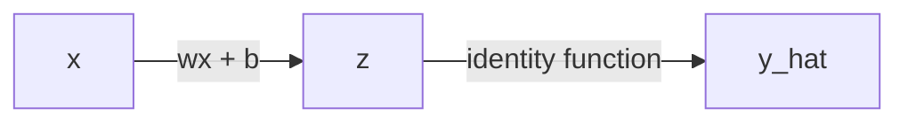
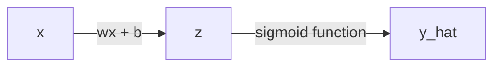
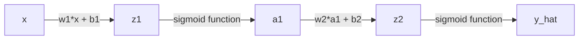
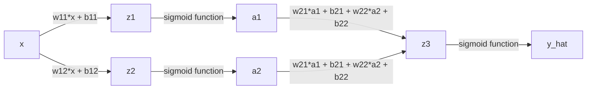

# Review of backpropagation
Erika Duan
2025-05-06

- [Derivatives](#derivatives)
- [Gradient descent](#gradient-descent)
- [Backpropagation](#backpropagation)
- [Single data point and a single
  neuron](#single-data-point-and-a-single-neuron)
- [Multiple data points and a single
  neuron](#multiple-data-points-and-a-single-neuron)
- [Single data point and 2 neurons](#single-data-point-and-2-neurons)
- [Single data point and 2 neurons in a
  layer](#single-data-point-and-2-neurons-in-a-layer)
- [Implementing a neural network classifier from
  scratch](#implementing-a-neural-network-classifier-from-scratch)

``` python
# Import Python libraries ------------------------------------------------------
import numpy as np
import sympy as sp
import matplotlib.pyplot as plt 
import math
```

This is a review of backpropagation from the following blog posts and
videos:

- [Step by step guide to
  backpropagation](https://datamapu.com/posts/deep_learning/backpropagation/)
  by Datamapu  
- [Backpropagation visual
  explainer](https://xnought.github.io/backprop-explainer/) by Donald
  Bertucci and Minsuk Kahng  
- [StatQuest neural networks Youtube
  playlist](https://www.youtube.com/playlist?list=PLblh5JKOoLUIxGDQs4LFFD--41Vzf-ME1)
  by Josh Starmer  
- [3Blue1Brown neural networks Youtube
  playlist](https://www.youtube.com/playlist?list=PLZHQObOWTQDNU6R1_67000Dx_ZCJB-3pi)
  by Grant Sanderson  
- [Tutorial for implementating a neural network from
  scratch](https://www.geeksforgeeks.org/implementation-of-neural-network-from-scratch-using-numpy/)
  by GeeksforGeeks  
- ChatGPT3 prompts for simple backpropagation examples

# Derivatives

We can use `SymPy` to obtain the derivatives of functions in Python.

``` python
# Obtain derivative of univariate functions ------------------------------------
# Example 1: f(x) = x**2 + 1
x = sp.Symbol('x') # define the variable  
f_x = x**2 + 1 # define the function   
sp.diff(f_x, x)  
```

    2*x

``` python
# Example 2: f(x) = (x + 3)**3
# x is already defined above
f_x = (x + 3)**3 
sp.diff(f_x, x)
```

    3*(x + 3)**2

``` python
# Obtain partial derivatives of multivariate functions -------------------------
x, y = sp.symbols('x y')
f_xy = x**2 + 3*y**2  

# Partial derivative w.r.t. x
sp.diff(f_xy, x)
```

    2*x

``` python
# Partial derivative w.r.t. y
sp.diff(f_xy, y)  
```

    6*y

``` python
# Alternatively use list comprehension to compute the gradient (the vector of 
# partial derivatives)  
[sp.diff(f_xy, var) for var in (x, y)]
```

    [2*x, 6*y]

# Gradient descent

The general steps of gradient descent are:

1.  Take the derivative of the loss function. If the loss function has
    multiple parameters, you need to calculate the partial derivative of
    each parameter (the gradient of the loss function).  
2.  Start with random values for all parameters to be estimated.  
3.  Use the random values to calculate the value of the derivative or
    gradient.  
4.  Calculate the step size, where step size = derivative
    
    learning rate.  
5.  Calculate the new parameter values, where new value = old value
     step size for loss
    functions.

Let’s try the simplest example of finding an optimal parameter using
gradient descent.

- **Loss function:**
   = x^2")  
- **Derivative**:
   = \tfrac{d}{dx} x^2= 2x")

We would like to find the value of
 for which
") is the
lowest. This is equivalent to finding
 where
.

``` python
# Use gradient descent to minimize f(x) = x**2 ---------------------------------
def f(x):
    return x**2

def gradient_f(x):
    return 2*x

# Parameters
x = 4.0              # Initial guess
alpha = 0.2          # Learning rate
iterations = 20

print(f"Starting gradient descent with x = {x} and gradient = {gradient_f(x)}")
```

    Starting gradient descent with x = 4.0 and gradient = 8.0

``` python
for i in range(iterations):
    gradient = gradient_f(x)
    # For loss functions, we subtract from the gradient to find the steepest rate of loss
    x = x - (alpha * gradient) 
    print(f"Iteration {i+1}: x = {x: .4f}, f(x) = {f(x): .4f}")
    
    if gradient < 0.01:
        print(f"""
        Stopping early: f'(x) < 0.01
        Optimal value of x: {x: .4f}
        """)
        
        break
```

    Iteration 1: x =  2.4000, f(x) =  5.7600
    Iteration 2: x =  1.4400, f(x) =  2.0736
    Iteration 3: x =  0.8640, f(x) =  0.7465
    Iteration 4: x =  0.5184, f(x) =  0.2687
    Iteration 5: x =  0.3110, f(x) =  0.0967
    Iteration 6: x =  0.1866, f(x) =  0.0348
    Iteration 7: x =  0.1120, f(x) =  0.0125
    Iteration 8: x =  0.0672, f(x) =  0.0045
    Iteration 9: x =  0.0403, f(x) =  0.0016
    Iteration 10: x =  0.0242, f(x) =  0.0006
    Iteration 11: x =  0.0145, f(x) =  0.0002
    Iteration 12: x =  0.0087, f(x) =  0.0001
    Iteration 13: x =  0.0052, f(x) =  0.0000
    Iteration 14: x =  0.0031, f(x) =  0.0000
    Iteration 15: x =  0.0019, f(x) =  0.0000

            Stopping early: f'(x) < 0.01
            Optimal value of x:  0.0019
            

Let’s try an example where we need to find two parameters.

- **Loss function:**
   = x^2 + 3y^2")  
- **Gradient**:
   = (2x, 6y)")

We would like to find the values of
 and
 for which
")
is the lowest using gradient descent. We do this by travelling down the
slope where
") and
") is
the steepest to hopefully reach the global minima.

``` python
# Use gradient descent to minimize f(x, y) = x**2 + 3*y**2 ---------------------
def f(x, y):
    return x**2 + 3*y**2  

# Store gradient in an numpy array for maximal efficiency  
def gradient(x, y):
    return np.array([2*x, 6*y])

# Parameters
x, y = 4.0, -4.0     # Initial guess
alpha = 0.2          # Learning rate
iterations = 20

print(f"""
Starting with (x, y) = ({x}, {y}) 
Starting with gradient = [{gradient(x, y)[0]}, {gradient(x, y)[1]}]
""")  
```


    Starting with (x, y) = (4.0, -4.0) 
    Starting with gradient = [8.0, -24.0]

``` python
# Store the path for inspection  
path = []  

for i in range(iterations):
    # Store the current path before the next iteration
    path.append((x, y, f(x, y)))
    
    # Calculate new gradient  
    gradient_xy = gradient(x, y)   
    
    # Update new values of x and y  
    x = x - (alpha * gradient_xy[0])
    y = y - (alpha * gradient_xy[1])
    
    print(f"Iteration {i+1}: x = {x: .4f}, y = {y: .4f}, f(x, y) = {f(x, y): .4f}")
    
    if gradient_xy[0] < 0.01 and gradient_xy[1] < 0.01:
        print(f"""
        Stopping early: f'(x) < 0.01 & f'(y) < 0.01  
        Optimal value of x, y is ({x: .4f}, {y: .4f})
        """)
        
        break
```

    Iteration 1: x =  2.4000, y =  0.8000, f(x, y) =  7.6800
    Iteration 2: x =  1.4400, y = -0.1600, f(x, y) =  2.1504
    Iteration 3: x =  0.8640, y =  0.0320, f(x, y) =  0.7496
    Iteration 4: x =  0.5184, y = -0.0064, f(x, y) =  0.2689
    Iteration 5: x =  0.3110, y =  0.0013, f(x, y) =  0.0968
    Iteration 6: x =  0.1866, y = -0.0003, f(x, y) =  0.0348
    Iteration 7: x =  0.1120, y =  0.0001, f(x, y) =  0.0125
    Iteration 8: x =  0.0672, y = -0.0000, f(x, y) =  0.0045
    Iteration 9: x =  0.0403, y =  0.0000, f(x, y) =  0.0016
    Iteration 10: x =  0.0242, y = -0.0000, f(x, y) =  0.0006
    Iteration 11: x =  0.0145, y =  0.0000, f(x, y) =  0.0002
    Iteration 12: x =  0.0087, y = -0.0000, f(x, y) =  0.0001
    Iteration 13: x =  0.0052, y =  0.0000, f(x, y) =  0.0000
    Iteration 14: x =  0.0031, y = -0.0000, f(x, y) =  0.0000
    Iteration 15: x =  0.0019, y =  0.0000, f(x, y) =  0.0000

            Stopping early: f'(x) < 0.01 & f'(y) < 0.01  
            Optimal value of x, y is ( 0.0019,  0.0000)
            

``` python

# Store the final path point 
path.append((x, y, f(x, y)))
```

``` python
# Plot gradient descent path using contour plot --------------------------------
# Extract path components for plotting
xs, ys, zs = zip(*path)

# Create grid for contour plot
min_grid = min(min(xs), min(ys)) - 1
max_grid = max(max(xs), max(ys), -min_grid)

X, Y = np.meshgrid(
  np.linspace(min_grid, max_grid, 400),
  np.linspace(min_grid, max_grid, 400)
  )

Z = f(X, Y)

# Plot contour and path
plt.figure(figsize = (8, 6))
plt.contour(X, Y, Z, levels = 50, cmap = 'viridis')

# Plot gradient descent path
plt.plot(xs, ys, marker = 'o', color = 'red', label = 'Gradient Descent Path')
plt.title('Gradient descent path on f(x, y) = x^2 + 3y^2')
plt.xlabel('x')
plt.ylabel('y')
plt.legend()
plt.grid(True)

# Show plot in Quarto notebook
plt.show()
```


# Backpropagation

The general steps of training a neural network are:

1.  **Forward pass** - calculate
    
    using the given input(s) and initial neural network parameters
    (weights and biases).  
2.  Calculate the model error using the chosen loss function.  
3.  **Backpropagation** or **backward pass** - use gradient descent to
    update the neural network parameters to reduce the model error. To
    do this, we need to calculate the partial derivatives of the loss
    function with respect to the neural network parameters.  
4.  Iterate these steps until a specific stopping criterion is met.

# Single data point and a single neuron

Let’s try the simplest example with a single data point and a single
neural unit using the identity function (no additional transformation
through the activation function).



- **Model parameters:** 
  (weight) and  (bias)  
- **Loss function:**
  ^2")  
- **Activation function**:
  
  where
    
- **Derivatives:**
  - ^1 \cdot (1-0) = \hat y - y")  
  - Since
    ,
      
  - We want to find
    
    and
      
  -  \cdot 1 \cdot x = (\hat y - y) \cdot x")  
  -  \cdot 1 \cdot 1 = \hat y - y")

``` python
# Use backpropagation to find the optimal values of w and b --------------------
# This example assumes we only have 1 data point i.e. (x, y) = (2, 5)

# Sample data point  
x = 2.0        
y = 5.0        

# Initial random parameters
w = 0.5        
b = 1.0     

# Model hyperparameters  
learning_rate = 0.1
i = 1
epoches = 20  

for i in range(epoches):    
    # Step 1: Calculate the forward pass    
    z = w * x + b      # Calculate linear combination
    y_hat = z          # Calculate identity activation function

    # Step 2: Compute model loss (mean squared error) 
    loss = 0.5 * (y_hat - y) ** 2
    
    # Early stopping criterion if model loss is 0.01
    if loss < 0.01:
        print(f"""
        Stopping early at epoch {i + 1}
        Loss = {loss:.4f}, w = {w:.4f}, b = {b:.4f}
        """)
        break

    # Step 3: Calculate the backward pass 
    # Calculate individual gradients
    dL_dy_hat = y_hat - y       
    dy_hat_dz = 1              
    dz_dw = x
    dz_db = 1

    # Apply chain rule
    dL_dw = dL_dy_hat * dy_hat_dz * dz_dw
    dL_db = dL_dy_hat * dy_hat_dz * dz_db

    # Step 4: Update model parameters 
    w = w - learning_rate * dL_dw
    b = b - learning_rate * dL_db

    print(f"Epoch: {i + 1}, Loss = {loss:.4f}, w = {w:.4f}, b = {b:.4f}")
```

    Epoch: 1, Loss = 4.5000, w = 1.1000, b = 1.3000
    Epoch: 2, Loss = 1.1250, w = 1.4000, b = 1.4500
    Epoch: 3, Loss = 0.2812, w = 1.5500, b = 1.5250
    Epoch: 4, Loss = 0.0703, w = 1.6250, b = 1.5625
    Epoch: 5, Loss = 0.0176, w = 1.6625, b = 1.5813

            Stopping early at epoch 6
            Loss = 0.0044, w = 1.6625, b = 1.5813
            

**Note:** Because the activation function is an identity function,
.
The simplest neural network architecture fits a linear function to the
training data set (we can do this more efficiently using linear
regression). Neural networks are useful for approximating complex
non-linear functions, which is achieved by 1) adding more neurons to a
layer, 2) adding more layers and 3) using activation functions.

Let’s try another example with a single data point and a single neural
unit using the sigmoid activation function
").
This allows us to estimate the non-linear function
 = \tfrac{1}{1+e^{-(wx+b)}}").



- **Model parameters:** 
  and   
- **Loss function:**
  ^2")  
- **Activation function**:
   = \tfrac{1}{1+e^{-z}}")
  where
    
- **Derivatives:**
  -   
  - ^2} = \sigma(z) \cdot (1 - \sigma(z))")  
  -  \cdot \sigma(z) \cdot (1- \sigma(z)) \cdot x")  
  -  \cdot \sigma(z) \cdot (1- \sigma(z)) \cdot 1")

``` python
# Use backpropagation to find the optimal values of w and b --------------------
# This example assumes we only have 1 data point i.e. (x, y) = (0.5, 1.0)

# Sample data point  
x = 0.5        
y = 1.0        

# Initial random parameters
w = 0.3        
b = 0.1     

# Model hyperparameters  
learning_rate = 0.1
i = 1
epoches = 20  

# Create sigmoid activation function  
def sigmoid(z):
    return 1/(1 + np.exp(-z))  

for i in range(epoches):    
    # Step 1: Calculate the forward pass    
    z = w * x + b      # Calculate linear combination
    y_hat = sigmoid(z) # Calculate sigmoid activation function  

    # Step 2: Compute model loss (mean squared error) 
    loss = 0.5 * (y_hat - y) ** 2
    
    # Early stopping criterion if model loss is 0.01
    if loss < 0.01:
        print(f"""
        Stopping early at epoch {i + 1}
        Loss = {loss:.4f}, w = {w:.4f}, b = {b:.4f}
        """)
        break

    # Step 3: Calculate the backward pass 
    # Calculate individual gradients
    dL_dy_hat = y_hat - y       
    dy_hat_dz = sigmoid(z) * (1 - sigmoid(z))              
    dz_dw = x
    dz_db = 1

    # Apply chain rule
    dL_dw = dL_dy_hat * dy_hat_dz * dz_dw
    dL_db = dL_dy_hat * dy_hat_dz * dz_db

    # Step 4: Update model parameters 
    w = w - learning_rate * dL_dw
    b = b - learning_rate * dL_db

    print(f"Epoch: {i + 1}, Loss = {loss:.4f}, w = {w:.4f}, b = {b:.4f}")
```

    Epoch: 1, Loss = 0.0958, w = 0.3054, b = 0.1108
    Epoch: 2, Loss = 0.0944, w = 0.3107, b = 0.1215
    Epoch: 3, Loss = 0.0930, w = 0.3160, b = 0.1320
    Epoch: 4, Loss = 0.0916, w = 0.3213, b = 0.1425
    Epoch: 5, Loss = 0.0902, w = 0.3264, b = 0.1529
    Epoch: 6, Loss = 0.0889, w = 0.3316, b = 0.1632
    Epoch: 7, Loss = 0.0876, w = 0.3367, b = 0.1734
    Epoch: 8, Loss = 0.0863, w = 0.3417, b = 0.1834
    Epoch: 9, Loss = 0.0850, w = 0.3467, b = 0.1934
    Epoch: 10, Loss = 0.0838, w = 0.3517, b = 0.2033
    Epoch: 11, Loss = 0.0826, w = 0.3566, b = 0.2131
    Epoch: 12, Loss = 0.0814, w = 0.3614, b = 0.2228
    Epoch: 13, Loss = 0.0802, w = 0.3662, b = 0.2325
    Epoch: 14, Loss = 0.0790, w = 0.3710, b = 0.2420
    Epoch: 15, Loss = 0.0779, w = 0.3757, b = 0.2514
    Epoch: 16, Loss = 0.0768, w = 0.3804, b = 0.2607
    Epoch: 17, Loss = 0.0757, w = 0.3850, b = 0.2700
    Epoch: 18, Loss = 0.0747, w = 0.3896, b = 0.2792
    Epoch: 19, Loss = 0.0736, w = 0.3941, b = 0.2882
    Epoch: 20, Loss = 0.0726, w = 0.3986, b = 0.2972

# Multiple data points and a single neuron

In reality, training data sets are large and we need to process many
data points during each forward and backward pass. We can do this
efficiently using matrix multiplication.

Let’s try the example above (a single neural unit using the sigmoid
activation function) but with multiple data points.

The theoretical loss function now becomes a sum where
 = \tfrac{1}{2}\displaystyle\sum^{n}_{p=1}(y_p - \hat y_p)^2").

The theoretical partial derivative

also becomes a sum where

where
.

In practice, however, average loss and average partial derivatives are
used because:

- Average loss and average partial derivatives are **scale
  independent**. The total loss and total partial derivatives would keep
  increasing even if the model performed identically well on each data
  point.  
- Averaging helps maintain consistent gradient magnitudes and makes
  learning rates easier to tune and interpret.  
- Averages are more intuitive and meaning to interpret.

``` python
# Use backpropagation using multiple data points -------------------------------
# We store our data points inside a numpy array  

# Store input data i.e. x_1 to x_n in a 1D numpy array    
X = np.array(
  [0.5, 0.8, 1.5, 0.4, 0.4, 1.0, 1.9]
  )

# Store output data i.e. y_1 to y_n in a 1D numpy array
y = np.array(
  [1.0, 1.2, 1.2, 0.6, 0.5, 1.1, 1.3]
  )

# Initial random parameters
w = 0.3        
b = 0.1     

# Model hyperparameters  
learning_rate = 0.1
i = 1
epoches = 20  

# Create sigmoid activation function that can input and output vectors 
def sigmoid(Z):
    return 1/(1 + np.exp(-Z))  

for i in range(epoches):    
    # Step 1: Calculate the forward pass    
    Z = w * X + b      # Calculate linear combination using scalar multiplication
    y_hat = sigmoid(Z) # Calculate sigmoid activation function  

    # Step 2: Compute model loss as a sum of vectors 
    loss = 0.5 * (y_hat - y) ** 2  
    avg_loss = np.mean(loss)
    
    # Early stopping criterion if model loss is 0.01
    if avg_loss < 0.01:  
        print(f"""
        Stopping early at epoch {i + 1}
        Average loss = {avg_loss:.4f}, w = {w:.4f}, b = {b:.4f}
        """)
        break

    # Step 3: Calculate the backward pass 
    # Calculate individual gradients
    dL_dy_hat = y_hat - y       
    dy_hat_dz = sigmoid(z) * (1 - sigmoid(z))              
    dz_dw = x
    dz_db = 1

    # Apply chain rule
    dL_dw = dL_dy_hat * dy_hat_dz * dz_dw
    dL_db = dL_dy_hat * dy_hat_dz * dz_db
    
    # Average over the dL_dw, dL_db and loss vectors  
    # The expected outputs for w, b and loss are scalar. As X and y are vectors,
    # z, y_hat, loss and all derivatives are vectors. We need to average dL_dw, 
    # dL_db and loss to return a scalar for w and b.   
    avg_dL_dw = np.mean(dL_dw)
    avg_dL_db = np.mean(dL_db)
    
    # Step 4: Update model parameters 
    w = w - learning_rate * avg_dL_dw
    b = b - learning_rate * avg_dL_db

    print(f"Epoch: {i + 1}, average loss = {avg_loss:.4f}, w = {w:.4f}, b = {b:.4f}")
```

    Epoch: 1, average loss = 0.1111, w = 0.3046, b = 0.1093
    Epoch: 2, average loss = 0.1097, w = 0.3092, b = 0.1185
    Epoch: 3, average loss = 0.1084, w = 0.3138, b = 0.1276
    Epoch: 4, average loss = 0.1071, w = 0.3183, b = 0.1366
    Epoch: 5, average loss = 0.1058, w = 0.3228, b = 0.1456
    Epoch: 6, average loss = 0.1046, w = 0.3272, b = 0.1545
    Epoch: 7, average loss = 0.1033, w = 0.3316, b = 0.1633
    Epoch: 8, average loss = 0.1021, w = 0.3360, b = 0.1720
    Epoch: 9, average loss = 0.1010, w = 0.3404, b = 0.1807
    Epoch: 10, average loss = 0.0998, w = 0.3447, b = 0.1893
    Epoch: 11, average loss = 0.0987, w = 0.3489, b = 0.1979
    Epoch: 12, average loss = 0.0976, w = 0.3532, b = 0.2063
    Epoch: 13, average loss = 0.0965, w = 0.3574, b = 0.2147
    Epoch: 14, average loss = 0.0954, w = 0.3615, b = 0.2231
    Epoch: 15, average loss = 0.0943, w = 0.3657, b = 0.2313
    Epoch: 16, average loss = 0.0933, w = 0.3698, b = 0.2396
    Epoch: 17, average loss = 0.0923, w = 0.3738, b = 0.2477
    Epoch: 18, average loss = 0.0913, w = 0.3779, b = 0.2558
    Epoch: 19, average loss = 0.0904, w = 0.3819, b = 0.2638
    Epoch: 20, average loss = 0.0894, w = 0.3859, b = 0.2718

# Single data point and 2 neurons

Let’s try a more complex example with 2 neurons organised one after
another and using the sigmoid activation function. We now have 2 weights
()
and 2 biases
()
to estimate.

When there are multiple neurons, the notation
")
becomes useful where  is
the neuronal input and 
is the neuronal output. In this example,
.



Estimating  and
 using

and

is identical to the example above for a single neural unit. Estimating
 and
 requires further
application of the chain rule.

- **Model parameters:**
  ![W = \[w_1, w_2\]](https://latex.codecogs.com/svg.latex?W%20%3D%20%5Bw_1%2C%20w_2%5D "W = [w_1, w_2]")
  and
  ![B = \[b_1, b_2\]](https://latex.codecogs.com/svg.latex?B%20%3D%20%5Bb_1%2C%20b_2%5D "B = [b_1, b_2]")  
- **Loss function:**
  ^2")  
- **Activation function**:
   = \tfrac{1}{1+e^{-z}}")  
- **Derivatives:**
  -   
  -  \cdot (1 - \sigma(z))")  
  -  \cdot \sigma(z_2) \cdot (1- \sigma(z_2)) \cdot a_1")  
  -  \cdot \sigma(z_2) \cdot (1- \sigma(z_2)) \cdot 1")  
  -   
  - 

**Note:** As the derivative of the sigmoid function is represented in
terms of the original sigmoid function,
 \cdot (1- \sigma(z_2))")
and
 \cdot (1 - \sigma(z_1))").
This makes applying the gradient rule more computationally efficient.

``` python
# Use backpropagation to find the optimal values of w1, w2, b1 and b2 ----------
# This example assumes we only have 1 data point i.e. (x, y) = (0.5, 1.0)

# Sample data point
x = 0.5
y = 1.0

# Initial random parameters
w1 = 0.3
w2 = 0.2
b1 = 0.1
b2 = 0.2

# Model hyperparameters
learning_rate = 0.1
i = 1
epoches = 20

# Create sigmoid activation function
def sigmoid(z):
    return 1/(1 + np.exp(-z))

for i in range(epoches):
    # Step 1: Calculate the forward pass
    z1 = w1 * x + b1    # Calculate 1st linear combination
    a1 = sigmoid(z1)    # Calculate 1st sigmoid activation function
    z2 = w2 * a1 + b2   # Calculate 2nd linear combination
    y_hat = sigmoid(z2) # Calculate 2nd sigmoid activation function

    # Step 2: Compute model loss (mean squared error)
    loss = 0.5 * (y_hat - y) ** 2

    # Early stopping criterion if model loss is 0.01
    if loss < 0.01:
        print(f"""
        Stopping early at epoch {i + 1}
        Loss = {loss:.4f}, W = [{w1:.4f}, {w2:.4f}], B = [{b1:.4f}, {b2:.4f}]  
        """)
        break

    # Step 3: Calculate the backward pass
    # Calculate individual gradients
    dL_dy_hat = y_hat - y
    dy_hat_dz2 = sigmoid(z2) * (1 - sigmoid(z2))   
    dz2_dw2 = a1   
    dz2_db2 = 1   
    
    dz2_da1 = w2  
    da1_dz1 = sigmoid(z1) * (1 - sigmoid(z1)) 
    dz1_dw1 = x
    dz1_db1 = 1

    # Apply chain rule
    # First find dL_dw2 and dL_db2
    dL_dw2 = dL_dy_hat * dy_hat_dz2 * dz2_dw2
    dL_db2 = dL_dy_hat * dy_hat_dz2 * dz2_db2  
    # Then find dL_dw1 and dL_db1   
    dL_dw1 = dL_dy_hat * dy_hat_dz2 * dz2_da1 * da1_dz1 * dz1_dw1
    dL_db1 = dL_dy_hat * dy_hat_dz2 * dz2_da1 * da1_dz1 * dz1_db1  

    # Step 4: Update model parameters
    w2 = w2 - learning_rate * dL_dw2
    b2 = b2 - learning_rate * dL_db2
    
    w1 = w2 - learning_rate * dL_dw1
    b1 = b1 - learning_rate * dL_db1

    print(f"Epoch: {i + 1}, Loss = {loss:.4f}, W = [{w1:.4f}, {w2:.4f}], B = [{b1:.4f}, {b2:.4f}]")   
```

    Epoch: 1, Loss = 0.0893, W = [0.2060, 0.2058], B = [0.1005, 0.2103]
    Epoch: 2, Loss = 0.0881, W = [0.2117, 0.2114], B = [0.1010, 0.2205]
    Epoch: 3, Loss = 0.0867, W = [0.2173, 0.2170], B = [0.1016, 0.2307]
    Epoch: 4, Loss = 0.0854, W = [0.2228, 0.2225], B = [0.1021, 0.2407]
    Epoch: 5, Loss = 0.0841, W = [0.2283, 0.2280], B = [0.1026, 0.2506]
    Epoch: 6, Loss = 0.0828, W = [0.2337, 0.2335], B = [0.1032, 0.2604]
    Epoch: 7, Loss = 0.0815, W = [0.2391, 0.2389], B = [0.1038, 0.2701]
    Epoch: 8, Loss = 0.0803, W = [0.2445, 0.2442], B = [0.1043, 0.2798]
    Epoch: 9, Loss = 0.0790, W = [0.2498, 0.2495], B = [0.1049, 0.2893]
    Epoch: 10, Loss = 0.0778, W = [0.2550, 0.2548], B = [0.1055, 0.2987]
    Epoch: 11, Loss = 0.0767, W = [0.2603, 0.2600], B = [0.1061, 0.3080]
    Epoch: 12, Loss = 0.0755, W = [0.2654, 0.2651], B = [0.1067, 0.3173]
    Epoch: 13, Loss = 0.0744, W = [0.2705, 0.2702], B = [0.1073, 0.3264]
    Epoch: 14, Loss = 0.0733, W = [0.2756, 0.2753], B = [0.1079, 0.3354]
    Epoch: 15, Loss = 0.0722, W = [0.2806, 0.2803], B = [0.1085, 0.3444]
    Epoch: 16, Loss = 0.0711, W = [0.2856, 0.2853], B = [0.1091, 0.3532]
    Epoch: 17, Loss = 0.0701, W = [0.2905, 0.2902], B = [0.1097, 0.3620]
    Epoch: 18, Loss = 0.0690, W = [0.2954, 0.2951], B = [0.1103, 0.3707]
    Epoch: 19, Loss = 0.0680, W = [0.3003, 0.3000], B = [0.1109, 0.3793]
    Epoch: 20, Loss = 0.0670, W = [0.3051, 0.3048], B = [0.1116, 0.3878]

# Single data point and 2 neurons in a layer

A strategy to better approximate complex non-linear functions is to
increase the number of neurons in a hidden layer. Let’s try an even more
complex example of two neurons organised in a single hidden layer (we
have doubled the number of model parameters to estimate compared to the
previous example). We will still use the sigmoid activation function.

Because there are two neurons in the hidden layer,
 is calculated
from the sum of the two neurons
i.e. } a_1 + b_{2}^{(1)}) + (w_{2}^{(2)} a_2 + b_{2}^{(2)})").



- **Model parameters:**
  ![W = \[w\_{1}^{(1)}, w\_{2}^{(1)}, w\_{1}^{(2)}, w\_{2}^{(2)}\]](https://latex.codecogs.com/svg.latex?W%20%3D%20%5Bw_%7B1%7D%5E%7B%281%29%7D%2C%20w_%7B2%7D%5E%7B%281%29%7D%2C%20w_%7B1%7D%5E%7B%282%29%7D%2C%20w_%7B2%7D%5E%7B%282%29%7D%5D "W = [w_{1}^{(1)}, w_{2}^{(1)}, w_{1}^{(2)}, w_{2}^{(2)}]")
  and
  ![B = \[b\_{1}^{(1)}, b\_{2}^{(1)}, b\_{1}^{(2)}, b\_{2}^{(2)}\]](https://latex.codecogs.com/svg.latex?B%20%3D%20%5Bb_%7B1%7D%5E%7B%281%29%7D%2C%20b_%7B2%7D%5E%7B%281%29%7D%2C%20b_%7B1%7D%5E%7B%282%29%7D%2C%20b_%7B2%7D%5E%7B%282%29%7D%5D "B = [b_{1}^{(1)}, b_{2}^{(1)}, b_{1}^{(2)}, b_{2}^{(2)}]")  
- **Loss function:**
  ^2")  
- **Activation function**:
   = \tfrac{1}{1+e^{-z}}")  
- **Derivatives:**
  -   
  -  \cdot (1 - \sigma(z))")  
  - }} = \tfrac{dL}{d\hat y} \cdot \tfrac{d\hat y}{dz_3} \cdot \tfrac{dz_3}{dw_{1}^{(2)}} = (\hat y - y) \cdot \sigma(z_3) \cdot (1- \sigma(z_3)) \cdot a_1")  
  - }} = \tfrac{dL}{d\hat y} \cdot \tfrac{d\hat y}{dz_3} \cdot \tfrac{dz_3}{dw_{2}^{(2)}} = (\hat y - y) \cdot \sigma(z_3) \cdot (1- \sigma(z_3)) \cdot a_2")  
  - }} = \tfrac{dL}{d\hat y} \cdot \tfrac{d\hat y}{dz_3} \cdot \tfrac{dz_3}{db_{1}^{(2)}} = (\hat y - y) \cdot \sigma(z_3) \cdot (1- \sigma(z_3)) \cdot 1")  
  - }} = \tfrac{dL}{d\hat y} \cdot \tfrac{d\hat y}{dz_3} \cdot \tfrac{dz_3}{db_{2}^{(2)}}")  
  - }} = \tfrac{dL}{d\hat y} \cdot \tfrac{d\hat y}{dz_3} \cdot \tfrac{dz_3}{da_1} \cdot \tfrac{da_1}{dz_1} \cdot \tfrac{dz_1}{dw_{1}^{(1)}}")  
  - }} = \tfrac{dL}{d\hat y} \cdot \tfrac{d\hat y}{dz_3} \cdot \tfrac{dz_3}{da_2} \cdot \tfrac{da_2}{dz_2} \cdot \tfrac{dz_2}{dw_{2}^{(1)}}")  
  - }} = \tfrac{dL}{d\hat y} \cdot \tfrac{d\hat y}{dz_3} \cdot \tfrac{dz_3}{da_1} \cdot \tfrac{da_1}{dz_1} \cdot \tfrac{dz_1}{db_{1}^{(1)}}")  
  - }} = \tfrac{dL}{d\hat y} \cdot \tfrac{d\hat y}{dz_3} \cdot \tfrac{dz_3}{da_2} \cdot \tfrac{da_2}{dz_2} \cdot \tfrac{dz_2}{db_{2}^{(1)}}")

``` python
# Use backpropagation to find the optimal values of weights and biases ---------
# This example assumes we only have 1 data point i.e. (x, y) = (0.5, 1.0)

# Sample data point
x = 0.5
y = 1.0

# Initial random parameters
w11 = 0.3
w12 = 0.2
w21 = 0.1
w22 = 0.2

b11 = 0.1
b12 = 0.2
b21 = 0.1
b22 = 0.2

# Model hyperparameters
learning_rate = 0.1
i = 1
epoches = 20

# Create sigmoid activation function
def sigmoid(z):
    return 1/(1 + np.exp(-z))

for i in range(epoches):
    # Step 1: Calculate the forward pass
    z1 = w11 * x + b11  # Calculate 1st linear combination
    a1 = sigmoid(z1)    # Calculate 1st sigmoid activation function
    
    z2 = w12 * x + b12  # Calculate 2nd linear combination
    a2 = sigmoid(z2)    # Calculate 2nd sigmoid activation function
    
    z3 = (w21 * a1 + b21) + (w22 * a2 + b22) # Calculate 3nd linear combination
    y_hat = sigmoid(z3)

    # Step 2: Compute model loss (mean squared error)
    loss = 0.5 * (y_hat - y) ** 2

    # Early stopping criterion if model loss is 0.01
    if loss < 0.01:
        print(f"""
        Stopping early at epoch {i + 1}
        Loss = {loss:.4f}
        W = [{w11:.4f}, {w12:.4f}, {w21:.4f}, {w22:.4f}]
        B = [{b11:.4f}, {b12:.4f}, {b21:.4f}, {b22:.4f}]  
        """)
        break

    # Step 3: Calculate the backward pass
    # Calculate individual gradients
    dL_dy_hat = y_hat - y
    dy_hat_dz3 = sigmoid(z3) * (1 - sigmoid(z3))   
    dz3_dw21 = a1   
    dz3_dw22 = a2
    dz3_db21 = 1    
    dz3_db22 = 1
    
    dz3_da1 = w21
    dz3_da2 = w22
      
    da1_dz1 = sigmoid(z1) * (1 - sigmoid(z1)) 
    da2_dz2 = sigmoid(z2) * (1 - sigmoid(z2))
    
    dz1_dw11 = x
    dz1_db11 = 1
    dz2_dw12 = x
    dz2_db12 = 1

    # Apply chain rule
    # First find dL_dw2*s, dL_db2*s  
    dL_dw21 = dL_dy_hat * dy_hat_dz3 * dz3_dw21
    dL_db21 = dL_dy_hat * dy_hat_dz3 * dz3_db21  
    
    dL_dw22 = dL_dy_hat * dy_hat_dz3 * dz3_dw22
    dL_db22 = dL_dy_hat * dy_hat_dz3 * dz3_db22  
    
    # Then find dL_dw1*s, dL_db1*s      
    dL_dw11 = dL_dy_hat * dy_hat_dz3 * dz3_da1 * da1_dz1 * dz1_dw11
    dL_db11 = dL_dy_hat * dy_hat_dz3 * dz3_da1 * da1_dz1 * dz1_db11  

    dL_dw12 = dL_dy_hat * dy_hat_dz3 * dz3_da2 * da2_dz2 * dz2_dw12
    dL_db12 = dL_dy_hat * dy_hat_dz3 * dz3_da2 * da2_dz2 * dz2_db12

    # Step 4: Update model parameters
    w21 = w21 - learning_rate * dL_dw21
    w22 = w22 - learning_rate * dL_dw22
    
    b21 = b21 - learning_rate * dL_db21
    b22 = b22 - learning_rate * dL_db22
    
    w11 = w11 - learning_rate * dL_dw11
    w12 = w12 - learning_rate * dL_dw12
    
    b11 = b11 - learning_rate * dL_db11
    b12 = b12 - learning_rate * dL_db12

    print(f"""
    Epoch: {i + 1}, Loss = {loss:.4f} 
    W = [{w11:.4f}, {w12:.4f}, {w21:.4f}, {w22:.4f}], B = [{b11:.4f}, {b12:.4f}, {b21:.4f}, {b22:.4f}]
    """)     
```


        Epoch: 1, Loss = 0.0739 
        W = [0.3001, 0.2002, 0.1051, 0.2052], B = [0.1002, 0.2004, 0.1091, 0.2091]
        

        Epoch: 2, Loss = 0.0717 
        W = [0.3002, 0.2004, 0.1101, 0.2103], B = [0.1005, 0.2009, 0.1180, 0.2180]
        

        Epoch: 3, Loss = 0.0696 
        W = [0.3003, 0.2007, 0.1150, 0.2154], B = [0.1007, 0.2013, 0.1267, 0.2267]
        

        Epoch: 4, Loss = 0.0676 
        W = [0.3005, 0.2009, 0.1198, 0.2203], B = [0.1009, 0.2018, 0.1353, 0.2353]
        

        Epoch: 5, Loss = 0.0657 
        W = [0.3006, 0.2011, 0.1245, 0.2251], B = [0.1012, 0.2022, 0.1437, 0.2437]
        

        Epoch: 6, Loss = 0.0639 
        W = [0.3007, 0.2013, 0.1292, 0.2298], B = [0.1014, 0.2027, 0.1519, 0.2519]
        

        Epoch: 7, Loss = 0.0621 
        W = [0.3008, 0.2016, 0.1337, 0.2344], B = [0.1017, 0.2031, 0.1599, 0.2599]
        

        Epoch: 8, Loss = 0.0604 
        W = [0.3010, 0.2018, 0.1381, 0.2390], B = [0.1019, 0.2036, 0.1678, 0.2678]
        

        Epoch: 9, Loss = 0.0588 
        W = [0.3011, 0.2020, 0.1425, 0.2434], B = [0.1022, 0.2040, 0.1755, 0.2755]
        

        Epoch: 10, Loss = 0.0572 
        W = [0.3012, 0.2022, 0.1467, 0.2478], B = [0.1025, 0.2045, 0.1831, 0.2831]
        

        Epoch: 11, Loss = 0.0557 
        W = [0.3014, 0.2025, 0.1509, 0.2520], B = [0.1027, 0.2049, 0.1905, 0.2905]
        

        Epoch: 12, Loss = 0.0542 
        W = [0.3015, 0.2027, 0.1550, 0.2562], B = [0.1030, 0.2054, 0.1978, 0.2978]
        

        Epoch: 13, Loss = 0.0528 
        W = [0.3016, 0.2029, 0.1590, 0.2603], B = [0.1033, 0.2058, 0.2049, 0.3049]
        

        Epoch: 14, Loss = 0.0515 
        W = [0.3018, 0.2031, 0.1630, 0.2644], B = [0.1036, 0.2063, 0.2119, 0.3119]
        

        Epoch: 15, Loss = 0.0502 
        W = [0.3019, 0.2034, 0.1668, 0.2683], B = [0.1038, 0.2067, 0.2188, 0.3188]
        

        Epoch: 16, Loss = 0.0490 
        W = [0.3021, 0.2036, 0.1706, 0.2722], B = [0.1041, 0.2072, 0.2255, 0.3255]
        

        Epoch: 17, Loss = 0.0478 
        W = [0.3022, 0.2038, 0.1743, 0.2760], B = [0.1044, 0.2076, 0.2321, 0.3321]
        

        Epoch: 18, Loss = 0.0466 
        W = [0.3023, 0.2040, 0.1780, 0.2798], B = [0.1047, 0.2080, 0.2386, 0.3386]
        

        Epoch: 19, Loss = 0.0455 
        W = [0.3025, 0.2042, 0.1816, 0.2834], B = [0.1049, 0.2085, 0.2449, 0.3449]
        

        Epoch: 20, Loss = 0.0445 
        W = [0.3026, 0.2045, 0.1851, 0.2870], B = [0.1052, 0.2089, 0.2512, 0.3512]
        

**Note:** The number of steps in forward and backward pass calculations
greatly increases as neuron architecture complexity increases. Because
of this, full (or batch) gradient descent is not used during the
backward pass in practice. Stochastic gradient descent or mini-batch
gradient descent is alternatively used.

# Implementing a neural network classifier from scratch

**Note:** LLMs like ChatGPT help speed up the revision of fundamental
principles. Current free LLMs generate many small but egregious code
errors, so using examples with pre-determined model parameters is a good
safety check.
