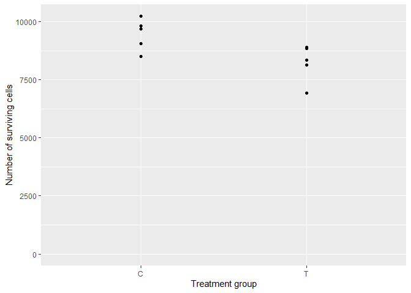
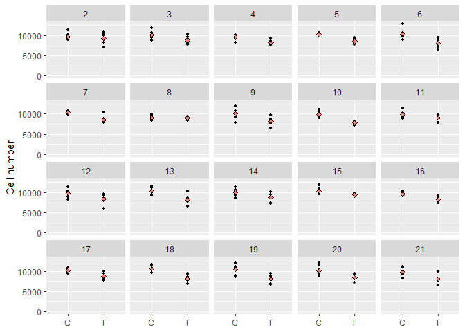

Review of None of the Above
================
Erika Duan
2025-02-26

-   <a href="#a-review-of-p-values" id="toc-a-review-of-p-values">A review
    of P-values</a>
-   <a href="#review-of-frequentist-versus-bayesian-methods"
    id="toc-review-of-frequentist-versus-bayesian-methods">Review of
    frequentist versus Bayesian methods</a>
-   <a href="#review-of-none-of-the-above"
    id="toc-review-of-none-of-the-above">Review of None of the Above</a>
-   <a href="#frequentist-versus-baysian-methods-in-ab-testing"
    id="toc-frequentist-versus-baysian-methods-in-ab-testing">Frequentist
    versus Baysian methods in A/B testing</a>
-   <a href="#key-messages" id="toc-key-messages">Key messages</a>
-   <a href="#other-resource" id="toc-other-resource">Other resource</a>

``` r
# Load required R packages -----------------------------------------------------
if (!require("pacman")) install.packages("pacman")
pacman::p_load(dplyr,
               purrr,
               ggplot2) 
```

This is a review of the following blog posts and articles:

-   [None of the
    Above](https://elevanth.org/blog/2023/07/17/none-of-the-above/)  
-   [The case for formal methodology in scientific
    reform](https://royalsocietypublishing.org/doi/10.1098/rsos.200805)  
-   [How conditioning on post-treatment variables can ruin your
    experiment and what to do about
    it](https://onlinelibrary.wiley.com/doi/10.1111/ajps.12357)  
-   [Connecting simple and precise p-values to complex and ambiguous
    realities](https://arxiv.org/abs/2304.01392)

# A review of P-values

Why do some biologists misunderstand p-values? Biology is built upon the
traditional scientific method, where the behaviour of natural phenomena
is inferred from carefully controlled experiments conducted on small
samples.

When you are the exhausted craftsperson setting up intricate hours long
experiments, you can fall victim to deterministic thinking (that any
observed changes must ONLY be due to your experimentally altered
variable). You forget that you are still at the mercy of randomness when
you measure small samples drawn from extremely niche hypothetical
populations.

Biology is also subject to extremely competitive publication pressures.
Only sensational discoveries about new biological mechanisms are
published in prestigious journals. So biologists are always chasing a
greater mechanistic mystery. It is easy to forget this process relies on
inferences from 100s of different experiments about the behaviours of
100s of different populations.

Let’s step away from biology and simulate some laboratory experiments to
refresh our understanding of P-values.

``` r
# Generate single experiment ---------------------------------------------------
# Imagine that two populations exist:   
# [C] - the population of HeLa tumour cells growing normally in a petri dish 
#     - after 3 days, the number of surviving cells has mean = 10000, sd = 1000
# [T] - the population of HeLa tumour cells growing in the presence of drug Z  
#     - after 3 days, the number of surviving cells has mean = 8500, sd = 1000

# In each experiment, we have 6 samples of C and 6 samples of T   
# Each experiment is a random draw from the population of all possible C and T 
# values. 

set.seed(111)

single_exp <- tibble(
  exp_id = rep(1, 12), 
  treatment = rep(c("C", "T"), 6)
) |> 
  mutate(
    survival = case_when(
      treatment == "C" ~ rnorm(12, mean = 10000, sd = 1000),
      treatment == "T" ~ rnorm(12, mean = 8500, sd = 1000),
      .default = NA_real_
    )) 

# Plot cell survival by treatment group  
single_exp |> 
  ggplot(aes(x = treatment, y = survival)) +
  geom_point() +
  scale_y_continuous(limits = c(0, NA)) +
  labs(
    x = "Treatment group",
    y = "Number of surviving cells"
  )
```



Unlike biologists, we can easily conduct 20 repeated experiments.

``` r
# Create function to simulate and plot many experiments ------------------------
perform_exp <- function(id, seed_number) {
  set.seed(seed_number)
  
  df <- tibble(
    exp_id = rep(id, 12), 
    treatment = rep(c("C", "T"), 6)
  ) |> 
    mutate(
      survival = case_when(
        treatment == "C" ~ rnorm(12, mean = 10000, sd = 1000),
        treatment == "T" ~ rnorm(12, mean = 8500, sd = 1000),
        .default = NA_real_
      )) 
  
  return(df)
  set.seed(NULL)
}

# Simulate 20 new experiments---------------------------------------------------
id <- seq(2, 21)
seed_number <- seq(112, 131)

twenty_exps <- map2(id, seed_number, perform_exp) |>
  bind_rows()

# Plot 20 simulations ----------------------------------------------------------
twenty_exps |>
  ggplot(aes(x = treatment, y = survival)) +
  geom_point(size = 1) +
  stat_summary(
    fun = "mean",        
    geom = "point",
    shape = 23,
    size = 1.5,
    fill = "salmon",
    colour = "black"
  ) + 
  scale_y_continuous(limits = c(0, NA)) +
  facet_wrap(vars(exp_id)) +
  labs(
    x = NULL,
    y = "Number of surviving cells",
    fill = "Treatment group"
  )
```



As this is a simulation, we already know that mean cancer cell survival
is different between the treatment and control groups (in real life, we
need experiments to help us estimate this answer). We specified that
")
and
").

But if we look at individual experiments:  
+ In the majority of our experiments, mean cancer cell survival is lower
in the treatment compared to control group.  
+ However, in experiments 2 and 8, mean cancer cell survival looks
similar between treatment and control groups **by random chance**.  
+ An unlucky scientist might conduct a single small experiment and be
mislead that mean cell survival is similar between treatment and control
groups, even when it is not. This could happen 2 out of 20 times in this
scenario.

Applied correctly, frequentist statistics is a rigorous method of
preventing such misleading interpretations about our populations of
interest. It estimates how likely the results from individual
experiments represent what is really happening at the population level.

# Review of frequentist versus Bayesian methods

# Review of None of the Above

The bad news is that frequentist statistics can be easily misused,
[especially through p-value
hacking](https://royalsocietypublishing.org/doi/10.1098/rsos.220346).

# Frequentist versus Baysian methods in A/B testing

# Key messages

# Other resource

-   Research article on [a compendium of p-value hacking
    strategies](https://royalsocietypublishing.org/doi/10.1098/rsos.220346)  
-   Discussion of [philosophical differences between frequentist and
    Bayesian
    statistics](https://stats.stackexchange.com/questions/491436/what-does-parameters-are-fixed-and-data-vary-in-frequentists-term-and-parame)  
-   Textbook chapter on frequentist versus Bayesian interpretations of
    [uncertainty](https://ml-science-book.com/uncertainty.html) in
    machine learning  
-   Discussion of [Bayesian approaches to A/B
    testing](https://www.youtube.com/watch?v=6269mm4XQOI)
