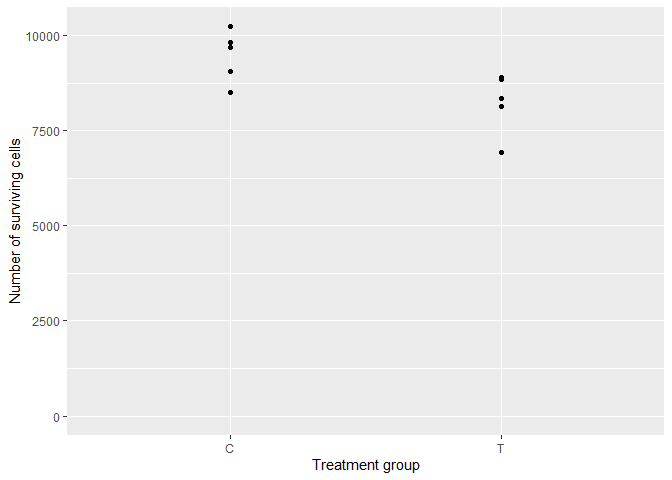
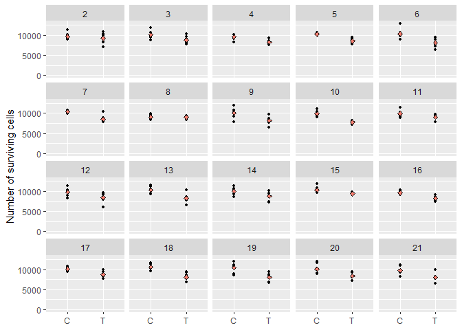
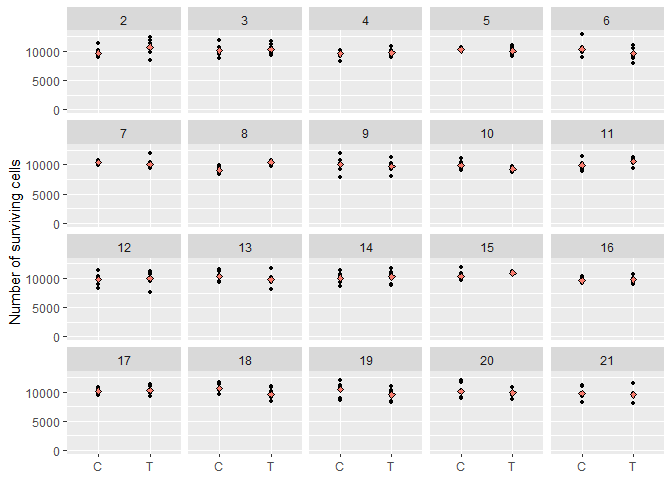
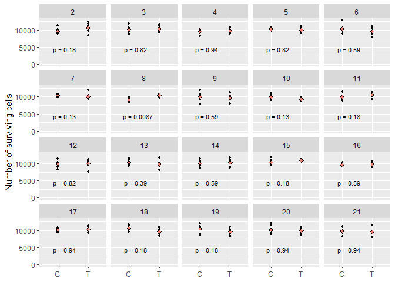

# Review of None of the Above
Erika Duan
2025-03-12

- [A review of P-values](#a-review-of-p-values)
- [Review of frequentist versus Bayesian
  methods](#review-of-frequentist-versus-bayesian-methods)
- [Review of None of the Above](#review-of-none-of-the-above)
  - [Bayes factors](#bayes-factors)
  - [Confidence intervals](#confidence-intervals)
  - [Pre-registration](#pre-registration)
  - [Causal inference](#causal-inference)
- [Key messages](#key-messages)
- [Other resources](#other-resources)

``` r
# Load required R packages -----------------------------------------------------
if (!require("pacman")) install.packages("pacman")
pacman::p_load(dplyr,
               purrr,
               ggplot2,
               ggpubr) 
```

This is a review of the following blog posts and articles:

- [None of the
  Above](https://elevanth.org/blog/2023/07/17/none-of-the-above/)  
- [The case for formal methodology in scientific
  reform](https://royalsocietypublishing.org/doi/10.1098/rsos.200805)  
- [How conditioning on post-treatment variables can ruin your experiment
  and what to do about
  it](https://onlinelibrary.wiley.com/doi/10.1111/ajps.12357)  
- [Connecting simple and precise p-values to complex and ambiguous
  realities](https://arxiv.org/abs/2304.01392)

# A review of P-values

Why do some biologists misunderstand p-values? Biology is built upon the
traditional scientific method, where the behaviour of natural phenomena
is inferred from carefully controlled experiments conducted on small
samples.

When you are the exhausted craftsperson setting up intricate hours long
experiments, you can fall victim to deterministic thinking (that any
observed changes must ONLY be due to your experimentally altered
variable). You forget that you are still at the mercy of randomness when
you measure small samples drawn from extremely niche hypothetical
populations.

Biology is also subject to extremely competitive publication pressures.
Only sensational discoveries about new biological mechanisms are
published in prestigious journals. So biologists are always chasing a
greater mechanistic mystery. This process relies on cobbling together
inferences from 100s of different experiments about the behaviours of
100s of different populations (so if your P-value is 0.05, then a few
inferences are likely wrong).

Let’s step away from biology and simulate some laboratory experiments to
refresh our understanding of random sampling from populations.

``` r
# Generate single experiment ---------------------------------------------------
# Imagine that two populations exist:   
# [C] - the population of HeLa tumour cells growing normally in a petri dish 
#     - after 3 days, the number of surviving cells has mean = 10000, sd = 1000
# [T] - the population of HeLa tumour cells growing in the presence of drug Z  
#     - after 3 days, the number of surviving cells has mean = 8500, sd = 1000

# In each experiment, we have 6 samples of C and 6 samples of T   
# Each experiment is a random draw from the population of all possible C and T 
# values. 

set.seed(111)

single_exp <- tibble(
  exp_id = rep(1, 12), 
  treatment = rep(c("C", "T"), 6)
) |> 
  mutate(
    survival = case_when(
      treatment == "C" ~ rnorm(12, mean = 10000, sd = 1000),
      treatment == "T" ~ rnorm(12, mean = 8500, sd = 1000),
      .default = NA_real_
    )) 

# Plot cell survival by treatment group  
single_exp |> 
  ggplot(aes(x = treatment, y = survival)) +
  geom_point() +
  scale_y_continuous(limits = c(0, NA)) +
  labs(
    x = "Treatment group",
    y = "Number of surviving cells"
  )
```



As this is a simulation, we know that mean cell survival is lower in the
treatment compared to control tumour cell population (in real life, we
rely on experiments to estimate this property). In the code above, we
specified that
")
and
").

Our random single experiment accurately reflects the population level
behaviour of control versus treatment cells. Unlike biologists, we can
easily conduct 20 repeated experiments.

``` r
# Create function to simulate and plot many experiments ------------------------
perform_exp <- function(id, seed_number) {
  set.seed(seed_number)
  
  df <- tibble(
    exp_id = rep(id, 12), 
    treatment = rep(c("C", "T"), 6)
  ) |> 
    mutate(
      survival = case_when(
        treatment == "C" ~ rnorm(12, mean = 10000, sd = 1000),
        treatment == "T" ~ rnorm(12, mean = 8500, sd = 1000),
        .default = NA_real_
      )) 
  
  return(df)
  set.seed(NULL)
}

# Simulate 20 new experiments---------------------------------------------------
id <- seq(2, 21)
seed_number <- seq(112, 131)

twenty_exps <- map2(id, seed_number, perform_exp) |>
  bind_rows()

# Plot 20 simulations ----------------------------------------------------------
# Mean cell survival is plotted by an orange diamond symbol 
twenty_exps |>
  ggplot(aes(x = treatment, y = survival)) +
  geom_point(size = 1) +
  stat_summary(
    fun = "mean",        
    geom = "point",
    shape = 23,
    size = 1.5,
    fill = "salmon",
    colour = "black"
  ) + 
  scale_y_continuous(limits = c(0, NA)) +
  facet_wrap(vars(exp_id)) +
  labs(
    x = NULL,
    y = "Number of surviving cells",
    fill = "Treatment group"
  )
```



If we look at individual experiments:  
+ The mean cell survival varies slightly between each experiment.  
+ In most of our experiments, mean cell survival is lower in the
treatment compared to control group.  
+ However, in experiments 2 and 8, mean cell survival looks similar
between treatment and control groups **by random chance**.  
+ An unlucky biologist might conduct a single small experiment and be
mislead that mean cell survival is similar between treatment and control
groups when it is not. In this scenario, this could happen 2 out of 20
times and this error is called a **false negative** or **type II**
error. We can use [Power
tests](https://en.wikipedia.org/wiki/Power_(statistics)) to minimise the
probability of making a type II error.

Another scenario can also occur, where an unlucky biologist wrongly
concludes that mean cell survival is different between treatment and
control groups when it is identical. This is called a **false positive**
or **type I** error and is what significance testing using **P-values**
tries to minimise.

``` r
# Create function to simulate and plot many experiments ------------------------
# Mean cell survival is now the same between control and treatment populations  
perform_exp_same <- function(id, seed_number) {
  set.seed(seed_number)
  
  df <- tibble(
    exp_id = rep(id, 12), 
    treatment = rep(c("C", "T"), 6)
  ) |> 
    mutate(
      survival = case_when(
        treatment == "C" ~ rnorm(12, mean = 10000, sd = 1000),
        treatment == "T" ~ rnorm(12, mean = 10000, sd = 1000),
        .default = NA_real_
      )) 
  
  return(df)
  set.seed(NULL)
}

# Simulate 20 new experiments---------------------------------------------------
twenty_exps_same <- map2(id, seed_number, perform_exp_same) |>
  bind_rows()

# Plot 20 simulations ----------------------------------------------------------
# Mean cell survival is plotted by an orange diamond symbol
twenty_exps_same |>
  ggplot(aes(x = treatment, y = survival)) +
  geom_point(size = 1) +
  stat_summary(
    fun = "mean",        
    geom = "point",
    shape = 23,
    size = 1.5,
    fill = "salmon",
    colour = "black"
  ) + 
  scale_y_continuous(limits = c(0, NA)) +
  facet_wrap(vars(exp_id)) +
  labs(
    x = NULL,
    y = "Number of surviving cells",
    fill = "Treatment group"
  )
```



In this new scenario, from the code above, we know that mean cell
survival is identical in the treatment and control tumour cell
populations. We specified that
")
and
").

If we look at individual experiments:  
+ In most experiments, mean cell survival looks similar between the
treatment and control groups.  
+ In experiment 8, mean cell survival looks higher in the treatment
compared to control group **by random chance**.  
+ In experiment 18, mean cell survival looks slightly lower in the
treatment compared to control group **by random chance**.  
+ An unlucky biologist might conduct a single small experiment and be
mislead that mean cell survival is different between treatment and
control groups. Making this error causes biologists to waste money and
time focusing on the wrong research target.

To prevent type I errors, scientists rely on significance testing with
**P-values** to help them estimate whether the mean outcome is likely to
be different between two (or more) populations.

A **P-value of 0.05** from a single experiment means that there is only
a **5% chance** of observing this result if mean cell survival was
identical in treatment and control tumour cell populations. A P-value \<
0.05 indicates that mean cell survival is more likely to be different
between our populations of interest.

Applied correctly, frequentist statistics is a rigorous method of
preventing type I errors. The **P-value** of an experiment is a **random
variable** that helps us infer reality from small-scale experiments. It
is random because the exact **P-value** varies between individual
experiments due to random sampling. We can visualise this by calculating
the P-values from the experiments from the second scenario.

``` r
# Plot 20 simulations with P-values calculated ---------------------------------
# Mean cell survival is plotted by an orange diamond symbol
# P-values are calculated for mean cell survival between groups C and T for each
# experiment, assuming that mean cell survival is identical between populations 
# C and T.       

twenty_exps_same |>
  ggplot(aes(x = treatment, y = survival)) +
  geom_point(size = 1) +
  stat_summary(
    fun = "mean",        
    geom = "point",
    shape = 23,
    size = 1.5,
    fill = "salmon",
    colour = "black"
  ) + 
  stat_compare_means(
    label = "p.format",
    size = 3,
    vjust = 6
  ) +
  scale_y_continuous(limits = c(0, NA)) +
  facet_wrap(vars(exp_id)) +
  labs(
    x = NULL,
    y = "Number of surviving cells",
    fill = "Treatment group"
  )
```



Inferring reality from small experiments is not perfect. If we had
conducted experiment 8 by chance (which has a P-value of 0.008), we
would have wrongly concluded that mean cell survival was different
between treatment and control populations. This is the fine print about
using P-values - that there is always a small to very rare possibility
of randomly observing a misleading result from a single experiment.

# Review of frequentist versus Bayesian methods

[This
post](https://stats.stackexchange.com/questions/491436/what-does-parameters-are-fixed-and-data-vary-in-frequentists-term-and-parame)
best explains the differences between frequentist and Bayesian
approaches. To paraphrase:

- Frequentist statistics treat parameters as fixed and non-random
  objects. For example, most biologists believe that the behaviour of
  higher-level biological phenomenon is non-random **within a carefully
  controlled environment**.  
- Frequentists therefore treat the results from an experimental data set
  as being randomly generated (due to random sampling from a much larger
  population).

I think that this is a reasonable pragmatic belief. For example, when
studying the impact of protein X on cell death, we expect that switching
off protein X leads to a fixed amount of cell death if all other
conditions are constant. **The flaw is that biologists can forget that
individual data sets are actually random.**

- Bayesian statistics treats parameters as random variables that have a
  distribution (described by a probability mass or density function).  
- Bayesians may believe that a true fixed parameter ultimately exists as
  we still need to approximate
  ").  
- Bayesians encode additional beliefs about that range of values that
  the parameter of interest takes on given new or more information.  
- Hence
   = \tfrac{f(x| \theta)\times\pi_0(\theta)}{p(x)}").

The ability to update our belief about the behavior of a parameter using
new data is very clever. At a macroscopic level, this is actually how
scientific theory evolves.

However, the selection of a prior distribution
")
is open-ended and may lead to different posterior distributions (that
influence different pathways of action).

Some Bayesians adopt an empirical approach when choosing their prior
distribution, but idiosyncratic beliefs could still influence their
choices. For example, personal choices may still influence the selection
of ‘similar-enough’ experiments to aggregate to calculate the prior
distribution.

I find it very interesting that Bayesians still use frequentist terms
(by referring to the existence of a true population level behaviour)
when discussing a shared ground truth in [A/B
testing](https://www.youtube.com/watch?v=6269mm4XQOI). The Bayesian
interpretation of A/B testing is that the posterior distribution should
be interpreted as betting odds and that all final decisions are still
bets.

# Review of None of the Above

Frequentist statistics can be easily misused [through P-value
hacking](https://royalsocietypublishing.org/doi/10.1098/rsos.220346) and
this is a very widely known but uncorrected problem in biology.
McElreath emphatically dislikes P-values and null hypothesis
significance testing.

McElreath does not think that **Bayes factors**, **confidence (or
credibility) intervals** and **pre-registration** are useful solutions
either.

## Bayes factors

Bayes factors are difficult to compute and can be sensitive to priors in
ways that parameter estimates are not. Differences in priors that have
minimal impact on the posterior distribution can have a massive impact
on the Bayes factor.

## Confidence intervals

Confidence (or credibility) intervals are slightly better as we can at
least distinguish between a large estimate with a large uncertainty and
a small estimate with a small uncertainty. However, McElreath thinks
that readers will still misinterpret confidence intervals similar to
P-values.

## Pre-registration

Pre-registration (submitting your study plan in advance of collecting
your results) helps prevent P-hacking through multiple testing. However,
McElreath thinks that pre-registration is useless if a scientific study
does not propose a logically-specified scientific model that can then be
validated or invalidated given the available data.

This is a problem when researchers conduct analyses which use
post-treatment variables (that can be causally related to the outcome of
interest) [as a control
variable](https://janhove.github.io/posts/2021-06-29-posttreatment/).
Post-treatment variables are problematic as they can be:

- **Mediators** where
  .
  Conditioning on the mediator M can underestimate the effect of X on
  Y.  
- **Confounders** where \$ X C\$ and
  .
  Conditioning on the confounder C can produce misleading results about
  the effect of X on Y.

## Causal inference

McElreath thinks that we need scientific models that exist separate to
the statistical models. This is a radical departure from traditional
biological experimentation, where the scientific hypothesis is specified
and limited by the statistical model.

Separate quantitative scientific models:

- Help us clarify and develop precise scientific theories.  
- Forces us to account for the realities of real data (expected effect
  sizes, expected variance, data missingness, spatial or temporal
  correlations and etc.).

McElreath also states that the general problem of covariate (or feature)
selection also requires a scientific model. This contrasts hugely to the
algorithmic methods of feature selection often proposed in machine
learning.

McElreath also criticises the huge data wastage problem in science.
Scientists in different laboratories generate diverse sources of
evidence about a common phenomenon. Yet these data sets are rarely
satisfactorily combined to establish informed consensus about a
scientific phenomenon.

# Key messages

- The frequentist approach of using P-values and null hypothesis
  significance testing is easily misused and misinterpreted.  
- Reporting confidence intervals and enforcing pre-registration are
  helpful but do not address the foundational need to develop scientific
  models that can be rigorously and transparently analysed and
  discussed.  
- Null hypothesis significance testing can be thought of as a
  statistical hack that prevents scientists from generating clear causal
  models for rigorous analyses.

# Other resources

- Research article on [a compendium of P-value hacking
  strategies](https://royalsocietypublishing.org/doi/10.1098/rsos.220346)  
- Discussion of [philosophical differences between frequentist and
  Bayesian
  statistics](https://stats.stackexchange.com/questions/491436/what-does-parameters-are-fixed-and-data-vary-in-frequentists-term-and-parame)  
- Textbook chapter on frequentist versus Bayesian interpretations of
  [uncertainty](https://ml-science-book.com/uncertainty.html) in machine
  learning  
- Discussion of [Bayesian approaches to A/B
  testing](https://www.youtube.com/watch?v=6269mm4XQOI)
