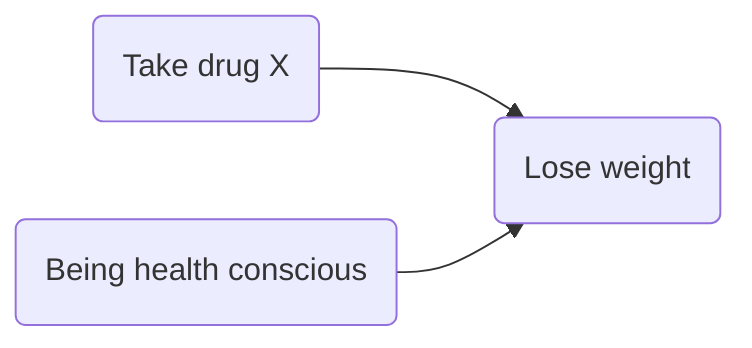

# Review of randomised controlled trials
Erika Duan
2025-04-22

- [RCT validity considerations](#rct-validity-considerations)
- [Randomisation vs random sampling](#randomisation-vs-random-sampling)
- [Converting RCT outputs into
  information](#converting-rct-outputs-into-information)
- [Trinary hypothesis testing](#trinary-hypothesis-testing)
- [Bayesian shrinkage](#bayesian-shrinkage)
- [Key messages](#key-messages)

This is a review of [Decoding Randomized Controlled Trials: An
Information Science
Perspective](https://hdsr.mitpress.mit.edu/pub/yb9eq8ja/release/2) by
Pavlos Msaouel. Randomised controlled trials (RCTs) are viewed as a gold
standard for causal inference, but real-world design and analysis
decisions affect the validity of trial conclusions.

# RCT validity considerations

RCTs compare two or more interventions. An internally valid RCT is one
where the observed results are genuinely attributable to the
experimental intervention as opposed to other factors.

Critical data generation questions include:

**Trial design** questions:

- Did the trial use proper concurrent controls?  
- Did the trial specify meaningful endpoints to estimate **before** the
  trial was conducted?  
- Are there unaccounted sources of systemic errors, for example
  improperly selected patients, nonadherence to assigned intervention,
  performance bias when patients or investigators are aware of the
  assigned intervention?

**Data life cycle** questions:

- What data are missing?  
- How was data recorded, processed and linked to the final RCT data set?

# Randomisation vs random sampling

**Random sampling** allows us to generalise our inferences from a sample
to the broader population. True random sampling is extremely difficult
to achieve in medicine compared to A/B testing. (In A/B testing, we can
randomly sample from an entire list of product or platform users to
receive intervention A or B.)

Randomisation is different to random sampling. Randomisation is the
**random allocation** of interventions that are being compared in an
RCT. Randomisation only allows us to perform **comparative inferences**
rather than population-level or group-specific inferences in the absence
of random sampling.

To visualise the impact of randomisation, let us imagine the factors
affecting patients taking weight loss medication (drug X).

A confounder could exist where being health conscious causes an
increased possibility of taking drug X AND an increased possibility of
losing weight through non-medication methods in the general population.


Random assignment of a group of patients to drug X or placebo breaks the
relationship between health consciousness and taking drug X. The effect
of drug X on weight loss is now easier to estimate.



Almost all medical RCTs use **convenience sampling** based on trial
entry criteria and patient trial access ease rather than random
sampling. The mean survival time for a treatment arm in a medical RCT
therefore offers limited insight as estimates of parameters for broader
patient populations.

Comparative estimates represented by treatment arm differences (such as
risk ratios, odds ratios or hazard ratios) are the most informative
outputs of RCTs. Extrapolating this comparative knowledge to individual
patients requires domain knowledge of patient or disease characteristics
beyond the information generated by RCTs.

# Converting RCT outputs into information

Refuting a hypothesis requires fewer assumptions than confirming it.
Information from RCTS is therefore often used to refute a hypothesis,
like the null hypothesis of no difference between RCT treatment arms.

A more intuitive way to interpret P-values is to convert them into
binary digits of refutational information (Shannon information values).

``` r
# Convert P-value into S-value -------------------------------------------------
calculate_s_value <- function(p_value){
  # We cannot take log2(0) so the p_value must be non-zero
  stopifnot(p_value > 0,
            p_value <= 1)
  
  -log2(p_value)
}

calculate_s_value(c(0.05, 0.01, 0.005, 0.001))
#> [1] 4.321928 6.643856 7.643856 9.965784  

# A value of 8 is equivalent to the degree of surprise from observing all tails
# in 8 fair coin tosses.  
```

The S-value measures information against all underlying statistical
model assumptions. If we assume that all other statistical model
assumptions are correct, the S-value will measure our ***surprise***
against our tested hypothesis.

- Large S-values correspond to greater surprise and stronger evidence to
  refute the tested null hypothesis.  
- S-values are typically rounded to the nearest integer, so P-values of
  0.49, 0.51 and 0.6 all convert to approximately 4 bits of surprise and
  carry roughly similar information.

``` r
# S-values may prevent P-values hacking to obtain a target P-value <= 0.05 -----
calculate_s_value(c(0.051, 0.049, 0.06))
#> [1] 4.293359 4.351074 4.058894
```

In medicine, the commonly used significance threshold of 0.05 only
equates 4 bits of refutational information (our surprise at observing
all tails in 4 fair coin tosses). This does not sound like a very robust
significance threshold anymore. In particle physics, the significance
threshold is 22 bits of refutational information.

S-values can also be used to more intuitively interpret frequentist
confidence intervals (CI).

- CIs are commonly misinterpreted (that for a 95% CI, the true parameter
  has a 95% probability of being contained within the observed CI).  
- An observed frequentist 95% CI will either contain or not contain the
  true parameter of interest.  
- 95% refers to the frequency with which the true parameter would be
  contained in many unobserved 95% CIs across many RCTs.  
- A frequentist 95% CI corresponds to a P-value threshold of
  `1 - 0.95 = 0.05`, which is approximately an S-value of 4 bits.  
- A frequentist 95% CI therefore contains values against which there are
  no more than 4 bits of refutational information.

# Trinary hypothesis testing

Consider the following 3 simulated RCT scenarios below.

- The survival plots visualise the time points at which the P-value for
  differences between groups is less than 0.05.  
- The grey polygon represents the confidence bands for the cumulative
  event curve difference under the assumption that there is no treatment
  effect difference.  
- When the survival curve intersects with the confidence band, a P-value
  \< 0.05 exists.  
- Narrow confidence bands suggest lower uncertainty and wider confidence
  bands suggest greater uncertainty in estimating the survival
  differences between groups.


Using this visualisation framework (with the grey polygon), we can
better distinguish between scenarios 1B and 1C.

- In scenario 1B, we can be reasonably confident that there is no
  difference between the treatment and control arms.
- In scenario 1C, there is greater uncertainty as the gray polygon grows
  progressively wider and we should best deem the RCT data as
  inconclusive.

This is the trinary hypothesis testing framework.

# Bayesian shrinkage

RCT results can be analysed using frequentist or Bayesian models,
although frequentist outputs are more commonly used.

A key advantage of Bayesian approaches is that they can use prior
distributions to constrain the observed effects of RCTs. Such shrinkage
can be useful because there is a publication bias in medicine to publish
positive results with larger effect sizes. Many published RCTs also have
a low signal-to-noise ratio (ratio of true treatment effect to the
standard error of its estimate).

To create a prior distribution for the observed effects of RCTs:

- Recent analysis of 23551 medical RCTS from the Cochrane Database of
  Systemic Reviews (CDSR) can provide an empirical prior distribution to
  restrain expected exaggeration effects in newly published RCTs.  
- If a new RCT meets the quality standards for inclusion in the CDSR,
  the prior distribution can be plausibly used to shrink the reported
  frequentist estimate and mitigate the exaggeration effect.

Bayesian CIs are also more intuitive to interpret (given that we accept
the selected prior distribution and assumed statistical model).

# Key messages

- Frequentist P-values and CIs are commonly misinterpreted and Shannon
  information values can provide a more intuitive framework for
  evaluating evidence strength from RCTs.  
- A framework to separate inconclusive RCTs from conclusive negative
  RCTs is important (the trinary hypothesis testing framework).  
- Bayesian shrinkage can help mitigate the effect size exaggeration
  effect of published RCTs.  
- Most medical RCTs only facilitate comparative inferences. To
  extrapolate the conclusions of an RCT to an individual patient, domain
  knowledge outside information provided by the RCT is required (the
  clinician infers that their patient shares relevant biological and
  other causal properties as the RCT participants).
