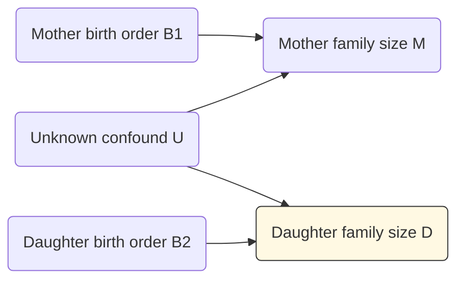
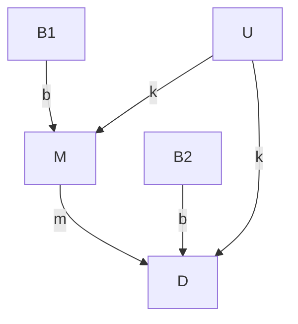
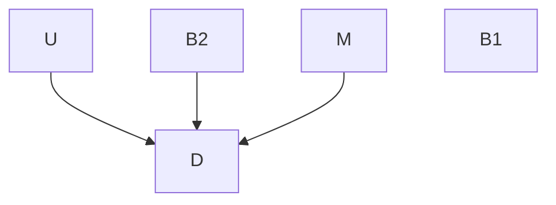

Review of Regression, Fire and Dangerous Things
================
Erika Duan
2024-04-25

-   <a href="#part-1-causal-salad" id="toc-part-1-causal-salad">Part 1:
    Causal Salad</a>
-   <a href="#part-2-causal-design" id="toc-part-2-causal-design">Part 2:
    Causal Design</a>
-   <a href="#part-3-bayesian-inference"
    id="toc-part-3-bayesian-inference">Part 3: Bayesian Inference</a>
-   <a href="#key-messages" id="toc-key-messages">Key messages</a>

This is a review of the following blog posts:

-   Regression, Fire and Dangerous Things [Part
    1](https://elevanth.org/blog/2021/06/15/regression-fire-and-dangerous-things-1-3/)  
-   Regression, Fire and Dangerous Things [Part
    2](https://elevanth.org/blog/2021/06/21/regression-fire-and-dangerous-things-2-3/)  
-   Regression, Fire and Dangerous Things [Part
    3](https://elevanth.org/blog/2021/06/29/regression-fire-and-dangerous-things-3-3/)

# Part 1: Causal Salad

There are a few reasons for performing regression modelling, as listed
in [Regression and Other
Stories](https://avehtari.github.io/ROS-Examples/) (ROS) by Gelman et
al. 

-   Predicting or forecasting outcomes using existing data (does not aim
    to understand causality).  
-   Exploring associations between variables of interest and an
    outcome.  
-   Adjusting outcomes from a sample to infer something about a
    population of interest.  
-   Estimating treatment effects by comparing outcomes between a
    treatment and control (defined in ROS as causal inference).

McElreath emphasises that what scientific practitioners are often
looking for is a method to **separate spurious associations from true
causal relationships**. McElreath is critical of those who carelessly
use regression modelling to identify causal relationships.

**Scenario:**

We are interested in whether the family size of the mother has any
impact on the family size of the daughter.

-   We have data on the family sizes of mother and daughter pairs.  
-   We expect unmeasured confounds (shared environmental exposures) for
    mother and daughter pairs.  
-   Previous research indicates that birth order is associated with
    fertility, which impacts family size.

``` r
# Create a synthetic data model ------------------------------------------------
set.seed(111)

N <- 200 # Number of mother-daughter pairs
U <- rnorm(N) # Simulate confounds

U[1:5]
#> [1] -0.3832159 -0.6019343  0.8216938 -0.4526242  0.3254342

# B1 represents the mother's birth order where 1 indicates 'is first born'
B1 <- rbinom(N, size = 1, prob = 0.5) # Probability 50% are first born
B1[1:5]
#> [1] 0 1 0 0 0

# M represents the mother's family size
# In our model, the mother's family size is directly influenced by B1 and U
M <- rnorm(N, mean = 2*B1 + U) 
M[1:5]
#> [1]  0.37835160  0.03283694 -0.51075527 -4.15239295  1.66977563

M <- ifelse(M < 0, 0, round(M, digits = 0))
M[1:5]
#> [1] 0 0 0 0 2

# B2 represents the daughter's birth order where 1 indicates 'is first born' 
# B2 occurs independently of B1 
B2 <- rbinom(N, size = 1, prob = 0.5)
B2[1:5]
#> [1] 1 1 0 0 1 

# D represents the daughter's family size 
# We first assume that the mother's family size has no impact on the daughter's 
# family size.  
D <- rnorm(N, 2*B2 + U + 0*M) 
D[1:5]
#> [1]  0.4896820  2.4589650  0.5504082 -2.3242933  2.9083178  

D <- ifelse(D < 0, 0, round(D, digits = 0))
D[1:5]
#> [1] 0 2 1 0 3
```

A diagram of the causal relationships in our synthetic data model can be
drawn.



Of note, the effect size of the confound (U) is as large as the causal
effect of the daughter’s birth order (B2) on the daughter’s family size
(D).


Our synthetic data model specifies that the mother’s family size has
**no impact** on the daughter’s family size. But what happens when we
include the mother’s family size in a regression model?

``` r
# Build linear regression model D = b0 + b1*M ---------------------------------- 
only_M <- lm(D ~ M)

# Output tidy linear regression coefficients and p-values  
tidy(only_M) 
```

    # A tibble: 2 x 5
      term        estimate std.error statistic  p.value
      <chr>          <dbl>     <dbl>     <dbl>    <dbl>
    1 (Intercept)    0.978    0.118       8.26 2.03e-14
    2 M              0.231    0.0685      3.38 8.82e- 4

``` r
# Output model performance metrics
glance(only_M)
```

    # A tibble: 1 x 12
      r.squared adj.r.squared sigma statistic  p.value    df logLik   AIC   BIC
          <dbl>         <dbl> <dbl>     <dbl>    <dbl> <dbl>  <dbl> <dbl> <dbl>
    1    0.0545        0.0497  1.23      11.4 0.000882     1  -324.  654.  663.
    # i 3 more variables: deviance <dbl>, df.residual <int>, nobs <int>

The linear regression model indicates that the size of the mother’s
family (M) is positively associated with the size of the daughter’s
family (D)
i.e.  = 0.98 + 0.23 M").
**This contrasts with our prior knowledge that D is independent of M.**

What happens if we add more variables into our linear regression model?
Does the misleading association between M and D disappear?

``` r
# Build linear regression model D = b0 + b1*M + b2*B1 + b3*B2 ------------------ 
M_B1_B2 <- lm(D ~ M + B1 + B2)

# Output tidy linear regression coefficients and p-values  
tidy(M_B1_B2) 
```

    # A tibble: 4 x 5
      term        estimate std.error statistic  p.value
      <chr>          <dbl>     <dbl>     <dbl>    <dbl>
    1 (Intercept)    0.400    0.132       3.02 2.88e- 3
    2 M              0.373    0.0658      5.67 5.15e- 8
    3 B1            -0.437    0.166      -2.64 9.07e- 3
    4 B2             1.33     0.145       9.16 6.85e-17

``` r
# Output model performance metrics
glance(M_B1_B2)
```

    # A tibble: 1 x 12
      r.squared adj.r.squared sigma statistic  p.value    df logLik   AIC   BIC
          <dbl>         <dbl> <dbl>     <dbl>    <dbl> <dbl>  <dbl> <dbl> <dbl>
    1     0.352         0.343  1.02      35.6 2.15e-18     3  -286.  582.  598.
    # i 3 more variables: deviance <dbl>, df.residual <int>, nobs <int>

Unfortunately, adding the variables B1 and B2 produced a model with a
larger 
coefficient for M. B1 is also negatively associated with D, despite our
synthetic model specifying M to be positively dependent on B1 (so we
expect B1 and M to at least have

coefficients with the same sign).

If we examined model performance metrics like AIC and BIC, we would be
misled into concluding that the second model was the better model. It is
likely that the second model is a more predictive model. However, the
second model is also more misleading if we wanted to infer causal
relationships between the predictor (B1, B2 and M) and response (D)
variables.

This example illustrates the dangers of causal salads, where we throw
many variables into a model and hope to identify some statistically
significant ones. The best way to counter this practice is to explicitly
think about the **causal relationships among predictor variables** and
not just the causal relationships between predictor and response
variables.

In this case, our scenario is the result of **bias amplification**:

-   A predictor variable or exposure of interest (M) is confounded by
    another variable (U).  
-   Another predictor variable (B1) is included, which is also a strong
    predictor of the original exposure of interest (M). This is because
    `M <- rnorm(N, 2*B1 + U)`.  
-   The addition of B1 tends to amplify the effects of U and make
    inference worse.  
-   Best practice would be to add additional predictor variables which
    are hypothesised to be strong predictors of the outcome **but** not
    the exposure.

``` r
# Build linear regression model D = b0 + b1*M + b2*B2 ------------------ 
M_B2 <- lm(D ~ M + B2)

# Output tidy linear regression coefficients and p-values  
tidy(M_B2) 
```

    # A tibble: 3 x 5
      term        estimate std.error statistic  p.value
      <chr>          <dbl>     <dbl>     <dbl>    <dbl>
    1 (Intercept)    0.282    0.126       2.23 2.70e- 2
    2 M              0.288    0.0582      4.94 1.63e- 6
    3 B2             1.33     0.148       8.99 2.06e-16

``` r
# The coefficients of the model D ~ M + B2 are more sensible than those of 
# D ~ M + B1 + B2, although the coefficient of M is still misleading.   
```

# Part 2: Causal Design

Regression has no direction whereas causal models are built from
directional relationships. The simplest model

tells us that:

-   A change in X will cause a change in Y.  
-   A change in Y will not impact X.

We can turn our modelling question into the causal graph below. This
graph represents our hypothesis about what is happening, which is why we
include an arrow from mother’s family size (M) to daughter’s family size
(D).



Other graph construction decisions:

-   We assume that the influence of birth order on family size ***b***
    is consistent over time (the same effect size for mothers and
    daughters). This assumption may come from domain knowledge or be a
    common sense simplification.  
-   We also assume that the influence of the unobserved confound ***k***
    is the same for mothers and daughters.

The covariance between two variables can be calculated directly from a
causal graph.

If ***b*** is the causal influence of B1 on M, then the covariance
between B1 and M is just the causal effect ***b*** multiplied by the
variance of B1.

 = b \times var(B_1)")

}{var(B_1)}")

``` r
# Check causal influence estimation using a causal graph -----------------------
cov(B1, M) / var(B1)

#> [1] 1.246625  
```

``` r
# Check covariate estimation using linear regression ---------------------------
lm(M ~ B1) |>
  tidy()
```

    # A tibble: 2 x 5
      term        estimate std.error statistic  p.value
      <chr>          <dbl>     <dbl>     <dbl>    <dbl>
    1 (Intercept)    0.545     0.111      4.90 2.01e- 6
    2 B1             1.25      0.157      7.95 1.36e-13

We are interested in the causal influence of M and D and would like to
estimate ***m***. We know the following things:

-   We cannot directly estimate
    
    because **the confound U acts on both M and D**. Another way of
    saying this is that both ***m*** and ***k*** contribute to
    ").  
-   We do not know U or ***k*** as U is unobserved.  
-   We can calculate
     = b\times m \times var(B_1)")
    as we multiply the causes ***b*** and ***m*** when there are
    multiple arrows on a path.

We can therefore solve for ***m***.

}{b\times var(B_1)}")
where
}{var(B_1)}")

}{cov(B_1, M)}")

``` r
# Solve for m using a causal graph ---------------------------------------------
cov(B1, D) / cov(B1, M)
#> [1] -0.02005616  

# This agrees with our prior knowledge that M has no effect on D  
```

``` r
# Test for different values of m -----------------------------------------------
set.seed(111)

D2 <- rnorm(N, 2*B2 + U + 0.7*M) 
D2 <- ifelse(D2 < 0, 0, round(D2, digits = 0))

cov(B1, D2) / cov(B1, M)
#> [1] 0.3991978

D3 <- rnorm(N, 2*B2 + U + 1.5*M) 
D3 <- ifelse(D3 < 0, 0, round(D3, digits = 0))

cov(B1, D3) / cov(B1, M)
#> [1] 1.19655
```

However, this solution does not provide us information about the
uncertainty of our estimate of ***m***. A computationally intensive way
of doing this is to repeat the data simulation many times and obtain a
bootstrap estimate.

``` r
# Calculate bootstrap estimate for 1000 simulations ----------------------------
set.seed(200)

N <- 200 
U <- rnorm(N, 0, 1) 
B1 <- rbinom(N, size=1, prob = 0.5) 
M <- rnorm(N, 2*B1 + U)
M <- ifelse(M < 0, 0, round(M, digits = 0))
B2 <- rbinom(N, size = 1, prob = 0.5)
D <- rnorm(N, 2*B2 + U + 0*M)
D <- ifelse(D < 0, 0, round(D, digits = 0))

# Define bootstrap statistic i.e. m = cov(B1, D) / cov(B1, M)  
f <- function(data,indices) 
  with(data[indices,], cov(B1, D) / cov(B1, M))

# Define dataset structure
data_sim <- data.frame(
  M = M,
  D = D,
  B1 = B1,
  B2 = B2
)

# Perform bootstrap
boot(data = data_sim, statistic = f, R = 1000) |>
  tidy()
```

    # A tibble: 1 x 3
      statistic     bias std.error
          <dbl>    <dbl>     <dbl>
    1     0.116 0.000196     0.136

Thinking like a graph involves multiple stages:

-   **Step 1:** Specify a generative model of the data and include
    unmeasured confounds. This generative model can be a simple directed
    acyclic graph (DAG) or a detailed system of equations.  
-   **Step 2:** Choose a specific exposure of interest and outcome of
    interest, for example M and D respectively.  
-   **Step 3:** Use the model structure to deduce a procedure for
    calculating the causal influence of the exposure on the outcome.  
-   **Step 4:** Repeat steps 2 and 3 if calculating multiple causal
    effects.

A single causal model implies a variety of statistical models, with
potentially a different statistical model for each causal question.

Even if we do not have any ideas about the exact functions between
different variables, we can use **do-calculus** to query a DAG and
determine if there is a method to estimate a causal effect.

The key ideas behind do-calculus are:

-   Use statistical or experimental design choices to remove confounds
    for an association of interest between an exposure and outcome.
    Graphically, this is equivalent to removing all arrows entering the
    exposure of interest. In medical research, we can achieve this
    scenario by conducting randomised controlled trials (RCTs) to
    experimentally set different values for M.  
-   The remaining association is an estimate of the causal effect.

In our scenario, we would be interested in modelling the intervention
below to calculate
)"),
which is the distribution of D when we intervene on M.



When RCTs cannot be conducted (for ethical or financial reasons),
do-calculus provides an algorithm for deducing statistical methods to
convert our original model into the simplified model above and to then
calculate
)").

# Part 3: Bayesian Inference

# Key messages

-   The interpretation of statistical results always depends upon causal
    assumptions, assumptions that ultimately cannot be tested with
    available data.
