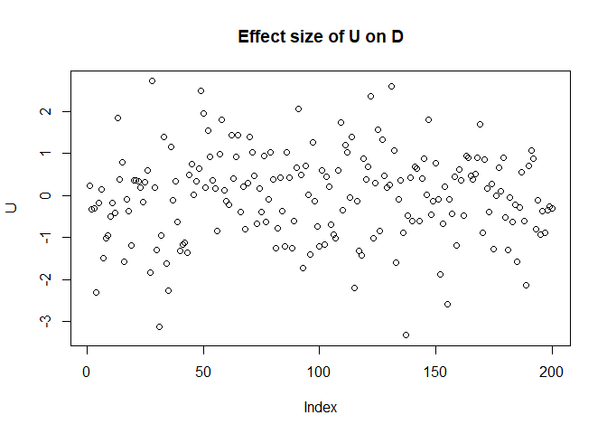

Review of Regression, Fire and Dangerous Things
================
Erika Duan
2024-04-16

-   <a href="#part-1-causal-salad" id="toc-part-1-causal-salad">Part 1:
    Causal Salad</a>
-   <a href="#part-2-causal-design" id="toc-part-2-causal-design">Part 2:
    Causal Design</a>

This is a review of the following blog posts:

-   Regression, Fire and Dangerous Things [Part
    1](https://elevanth.org/blog/2021/06/15/regression-fire-and-dangerous-things-1-3/)  
-   Regression, Fire and Dangerous Things [Part
    2](https://elevanth.org/blog/2021/06/21/regression-fire-and-dangerous-things-2-3/)  
-   Regression, Fire and Dangerous Things [Part
    3](https://elevanth.org/blog/2021/06/29/regression-fire-and-dangerous-things-3-3/)

# Part 1: Causal Salad

There are a few reasons for performing regression modelling, as listed
in [Regression and Other
Stories](https://avehtari.github.io/ROS-Examples/) (ROS) by Gelman et
al. 

-   Predicting or forecasting outcomes using existing data (does not aim
    to understand causality).  
-   Exploring associations between variables of interest and an
    outcome.  
-   Adjusting outcomes from a sample to infer something about a
    population of interest.  
-   Estimating treatment effects by comparing outcomes between a
    treatment and control (defined in ROS as causal inference).

McElreath emphasises that what scientific practitioners are often
looking for is a method to **separate spurious associations from true
causal relationships**. McElreath is critical of those who carelessly
use regression modelling to identify causal relationships.

**Scenario:**

We are interested in whether the family size of the mother has any
impact on the family size of the daughter.

-   We have data on the family sizes of mother and daughter pairs.  
-   We expect unmeasured confounds (shared environmental exposures) for
    mother and daughter pairs.  
-   Previous research indicates that birth order is associated with
    fertility, which impacts family size.

``` r
# Create a synthetic data model ------------------------------------------------
set.seed(111)

N <- 200 # Number of mother-daughter pairs
U <- rnorm(N) # Simulate confounds

U[1:5]
#> [1] -0.3832159 -0.6019343  0.8216938 -0.4526242  0.3254342

# B1 represents the mother's birth order where 1 indicates 'is first born'
B1 <- rbinom(N, size = 1, prob = 0.5) # Probability 50% are first born
B1[1:5]
#> [1] 0 1 0 0 0

# M represents the mother's family size
# In our model, the mother's family size is directly influenced by B1 and U
M <- rnorm(N, mean = 2*B1 + U) 
M[1:5]
#> [1]  0.37835160  0.03283694 -0.51075527 -4.15239295  1.66977563

M <- ifelse(M < 0, 0, round(M, digits = 0))
M[1:5]
#> [1] 0 0 0 0 2

# B2 represents the daughter's birth order where 1 indicates 'is first born' 
# B2 occurs independently of B1 
B2 <- rbinom(N, size = 1, prob = 0.5)
B2[1:5]
#> [1] 1 1 0 0 1 

# D represents the daughter's family size 
# We first assume that the mother's family size has no impact on the daughter's 
# family size.  
D <- rnorm(N, 2*B2 + U + 0*M) 
D[1:5]
#> [1]  0.4896820  2.4589650  0.5504082 -2.3242933  2.9083178  

D <- ifelse(D < 0, 0, round(D, digits = 0))
D[1:5]
#> [1] 0 2 1 0 3
```

A diagram of the causal relationships in our synthetic data model can be
drawn.


Of note, the effect size of the confound (U) is as large as the causal
effect of the daughter’s birth order (B2) on the daughter’s family size
(D).




Our synthetic data model specifies that the mother’s family size has
**no impact** on the daughter’s family size. But what happens when we
include the mother’s family size in a regression model?

``` r
# Build linear regression model D = b0 + b1*M ---------------------------------- 
only_M <- lm(D ~ M)

# Output tidy linear regression coefficients and p-values  
tidy(only_M) 
```

    # A tibble: 2 x 5
      term        estimate std.error statistic  p.value
      <chr>          <dbl>     <dbl>     <dbl>    <dbl>
    1 (Intercept)    0.978    0.118       8.26 2.03e-14
    2 M              0.231    0.0685      3.38 8.82e- 4

``` r
# Output model performance metrics
glance(only_M)
```

    # A tibble: 1 x 12
      r.squared adj.r.squared sigma statistic  p.value    df logLik   AIC   BIC
          <dbl>         <dbl> <dbl>     <dbl>    <dbl> <dbl>  <dbl> <dbl> <dbl>
    1    0.0545        0.0497  1.23      11.4 0.000882     1  -324.  654.  663.
    # i 3 more variables: deviance <dbl>, df.residual <int>, nobs <int>

The linear regression model indicates that the size of the mother’s
family (M) is positively associated with the size of the daughter’s
family (D)
i.e.  = 0.98 + 0.23 M").
**This contrasts with our prior knowledge that D is independent of M.**

What happens if we add more variables into our linear regression model?
Does the misleading association between M and D disappear?

``` r
# Build linear regression model D = b0 + b1*M + b2*B1 + b3*B2 ------------------ 
M_B1_B2 <- lm(D ~ M + B1 + B2)

# Output tidy linear regression coefficients and p-values  
tidy(M_B1_B2) 
```

    # A tibble: 4 x 5
      term        estimate std.error statistic  p.value
      <chr>          <dbl>     <dbl>     <dbl>    <dbl>
    1 (Intercept)    0.400    0.132       3.02 2.88e- 3
    2 M              0.373    0.0658      5.67 5.15e- 8
    3 B1            -0.437    0.166      -2.64 9.07e- 3
    4 B2             1.33     0.145       9.16 6.85e-17

``` r
# Output model performance metrics
glance(M_B1_B2)
```

    # A tibble: 1 x 12
      r.squared adj.r.squared sigma statistic  p.value    df logLik   AIC   BIC
          <dbl>         <dbl> <dbl>     <dbl>    <dbl> <dbl>  <dbl> <dbl> <dbl>
    1     0.352         0.343  1.02      35.6 2.15e-18     3  -286.  582.  598.
    # i 3 more variables: deviance <dbl>, df.residual <int>, nobs <int>

Unfortunately, adding the variables B1 and B2 produced a model with a
larger 
coefficient for M. B1 is also negatively associated with D, despite our
synthetic model specifying M to be positively dependent on B1 (so we
expect B1 and M to at least have

coefficients with the same sign).

If we examined model performance metrics like AIC and BIC, we would be
misled into concluding that the second model was the better model. It is
likely that the second model is a more predictive model. However, the
second model is also more misleading if we wanted to infer causal
relationships between the predictor (B1, B2 and M) and response (D)
variables.

This example illustrates the dangers of causal salads, where we throw
many variables into a model and hope to identify some statistically
significant ones. The best way to counter this practice is to explicitly
think about the **causal relationships among predictor variables** and
not just the causal relationships between predictor and response
variables.

# Part 2: Causal Design

Regression has no direction whereas causal models are built from
directional relationships. The simplest model

tells us that:

-   A change in X will cause a change in Y.  
-   A change in Y will not impact X.

We can turn our modelling question into the causal graph below. This
graph represents our hypothesis about what is happening, which is why we
include an arrow from mother’s family size (M) to daughter’s family size
(D).

``` mermaid
flowchart TD  
  B1 -- b --> M  
  ((U)) -- k --> M  
  ((U)) -- k --> D   
  B2 -- b --> D
  
  M -- m --> D
```
