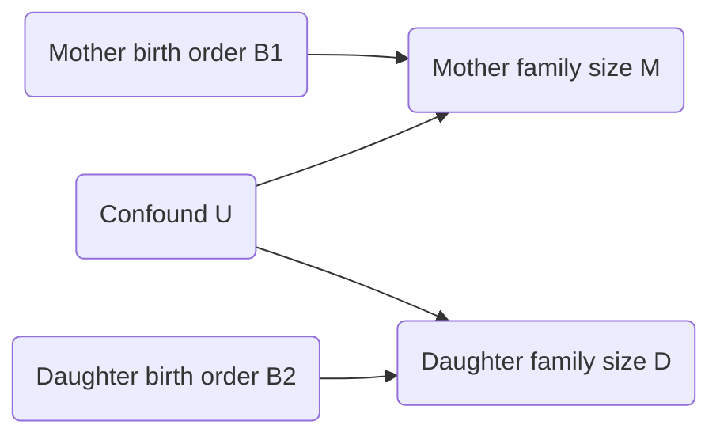
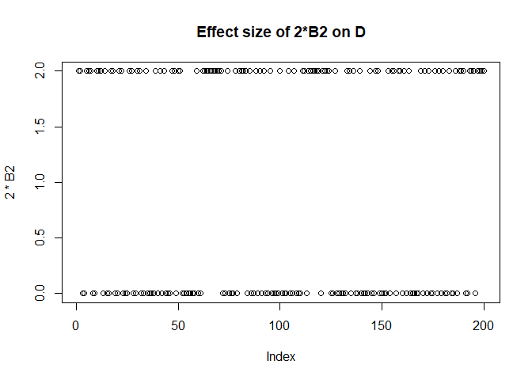
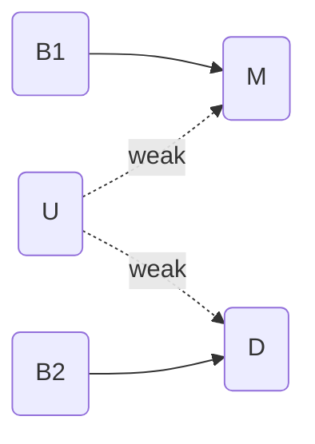
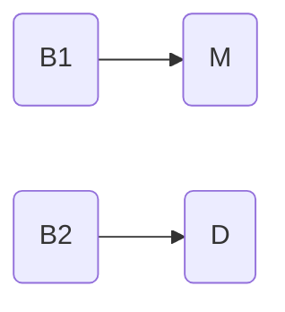
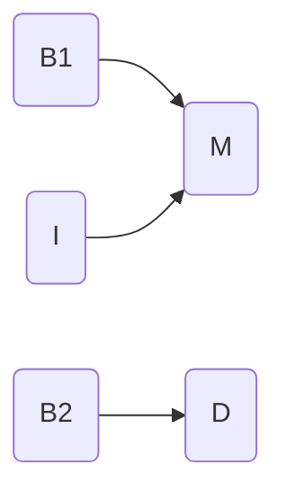
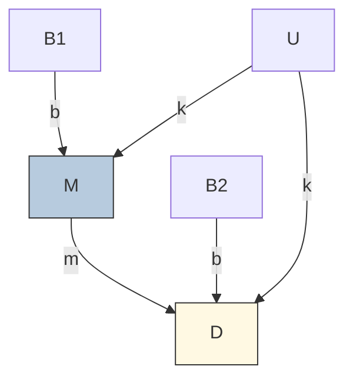
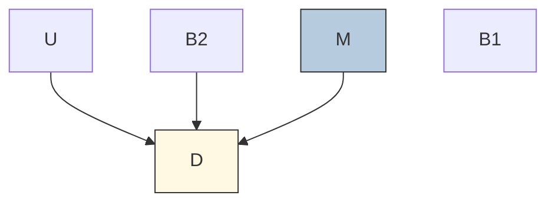
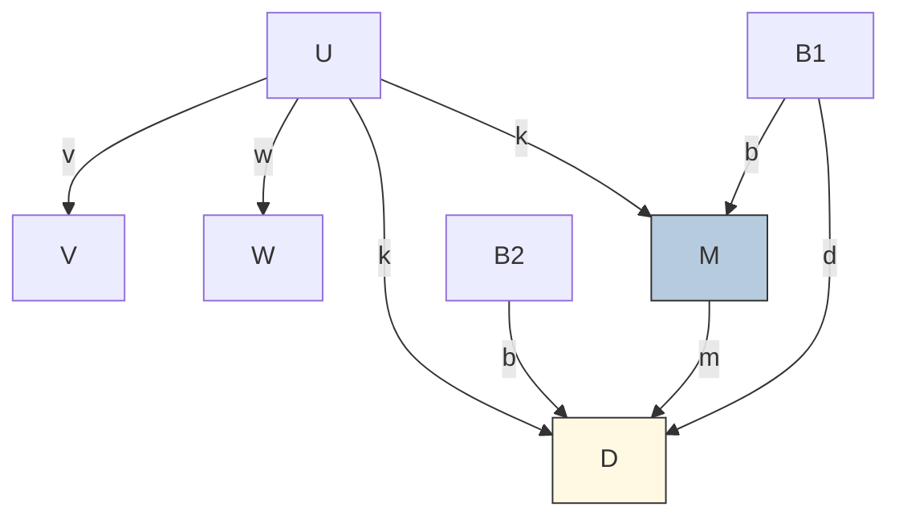

Review of Regression, Fire and Dangerous Things
================
Erika Duan
2025-01-30

-   <a href="#part-1-causal-salad" id="toc-part-1-causal-salad">Part 1:
    Causal Salad</a>
    -   <a href="#confounder-impacts-on-linear-regression-modelling"
        id="toc-confounder-impacts-on-linear-regression-modelling">Confounder
        impacts on linear regression modelling</a>
-   <a href="#part-2-causal-design" id="toc-part-2-causal-design">Part 2:
    Causal Design</a>
-   <a href="#part-3-bayesian-inference"
    id="toc-part-3-bayesian-inference">Part 3: Bayesian Inference</a>
    -   <a href="#step-1-express-the-model-as-a-joint-probability-distribution"
        id="toc-step-1-express-the-model-as-a-joint-probability-distribution">Step
        1: Express the model as a joint probability distribution</a>
    -   <a href="#step-2-teach-the-distribution-to-a-computer"
        id="toc-step-2-teach-the-distribution-to-a-computer">Step 2: Teach the
        distribution to a computer</a>
    -   <a href="#step-3-simulate-causal-interventions"
        id="toc-step-3-simulate-causal-interventions">Step 3: Simulate causal
        interventions</a>
    -   <a href="#dealing-with-confounds"
        id="toc-dealing-with-confounds">Dealing with confounds</a>
-   <a href="#key-messages" id="toc-key-messages">Key messages</a>

This is a review of the following blog posts:

-   Regression, Fire and Dangerous Things [Part
    1](https://elevanth.org/blog/2021/06/15/regression-fire-and-dangerous-things-1-3/)  
-   Regression, Fire and Dangerous Things [Part
    2](https://elevanth.org/blog/2021/06/21/regression-fire-and-dangerous-things-2-3/)  
-   Regression, Fire and Dangerous Things [Part
    3](https://elevanth.org/blog/2021/06/29/regression-fire-and-dangerous-things-3-3/)

# Part 1: Causal Salad

There are a few reasons for performing regression modelling, as listed
in [Regression and Other
Stories](https://avehtari.github.io/ROS-Examples/) (ROS) by Gelman et
al. 

-   Predicting or forecasting the mean outcome using existing data,
    **without** aiming to understand causality.  
-   Exploring (potentially misleading) associations between variables of
    interest and an outcome.  
-   Adjusting observations from a sample to infer the characteristic(s)
    of a population of interest.  
-   Estimating treatment effects by comparing outcomes between
    treatment(s) and control. This is the aim of most scientific
    experiments and clinical trials and is defined in
    [ROS](https://avehtari.github.io/ROS-Examples/) as causal inference.

Scientists are often looking for a method to **separate spurious
associations from true causal relationships**, but regression modelling
is not designed for this. McElreath is critical of those who carelessly
use regression modelling to identify causal relationships.

**Scenario 1:**

We are interested in whether the family size of the mother has any
impact on the family size of the daughter.

-   We have data on the family sizes of mother and daughter pairs.  
-   We expect unmeasured confounds for mother and daughter pairs, for
    example different environmental exposures shared by each
    mother-daughter pair.  
-   Previous research indicates that birth order is associated with
    fertility, which impacts family size.

``` r
# Create a generative data model -----------------------------------------------
set.seed(111)

N <- 200 # Number of mother-daughter pairs
U <- rnorm(N) # Simulate confounds

U[1:5]
#> [1] 0.2352207 -0.3307359 -0.3116238 -2.3023457 -0.1708760

# B1 represents the mother's birth order where 1 indicates 'is first born'
B1 <- rbinom(N, size = 1, prob = 0.5) # Probability 50% are first born
B1[1:5]
#> [1] 0 1 0 0 0

# M represents the mother's family size
# In our model, the mother's family size is directly influenced by B1 and U
M <- rnorm(N, mean = 2*B1 + U) 
M[1:5]
#> [1]  0.37835160  0.03283694 -0.51075527 -4.15239295  1.66977563

# B2 represents the daughter's birth order where 1 indicates 'is first born' 
# B2 occurs independently of B1 
B2 <- rbinom(N, size = 1, prob = 0.5)
B2[1:5]
#> [1] 1 1 0 0 1 

# D represents the daughter's family size 
# Our generative model states that the mother's family size has no impact on the
# daughter's family size.  
D <- rnorm(N, mean = 2*B2 + U + 0*M) 
D[1:5]
#> [1]  0.4896820  2.4589650  0.5504082 -2.3242933  2.9083178  

# For simplicity, we assume values of M and D to be real numbers instead of 0 
# and positive integers.
```

A diagram of the causal relationships in our generative data model is
below.



Note that the effect size of the confounder (U) is reasonably
significant when `U <- rnorm(N, 0, 1)` and
`D <- rnorm(N, 2*B2 + U + 0*M)`.





In our generative model, the mother’s family size (M) has **no impact**
on the daughter’s family size (D). But what happens when we include M in
a regression model to predict D?

``` r
# Build linear regression model D = b0 + b1*M ---------------------------------- 
only_M <- lm(D ~ M)

# Output tidy linear regression coefficients and p-values  
tidy(only_M) 
```

    # A tibble: 2 x 5
      term        estimate std.error statistic      p.value
      <chr>          <dbl>     <dbl>     <dbl>        <dbl>
    1 (Intercept)    0.713    0.128       5.58 0.0000000769
    2 M              0.288    0.0683      4.22 0.0000370   

``` r
# Output model performance metrics
glance(only_M)
```

    # A tibble: 1 x 12
      r.squared adj.r.squared sigma statistic   p.value    df logLik   AIC   BIC
          <dbl>         <dbl> <dbl>     <dbl>     <dbl> <dbl>  <dbl> <dbl> <dbl>
    1    0.0826        0.0779  1.58      17.8 0.0000370     1  -374.  754.  764.
    # i 3 more variables: deviance <dbl>, df.residual <int>, nobs <int>

The linear regression model indicates that M is positively associated
with D!

This conflicts with our ground truth that **D is not influenced by M**.
Although the adjusted
 indicates that
our model `E(D) = 0.71 + 0.29M` is terrible at predicting D, we should
still be alarmed.

What happens if we add more predictor variables into our linear
regression model? Does the misleading association between M and D
disappear?

``` r
# Build linear regression model D = b0 + b1*M + b2*B1 + b3*B2 ------------------
M_B1_B2 <- lm(D ~ M + B1 + B2)

tidy(M_B1_B2) 
```

    # A tibble: 4 x 5
      term        estimate std.error statistic  p.value
      <chr>          <dbl>     <dbl>     <dbl>    <dbl>
    1 (Intercept)   0.0844    0.156      0.543 5.88e- 1
    2 M             0.444     0.0631     7.05  3.05e-11
    3 B1           -0.728     0.206     -3.54  5.02e- 4
    4 B2            1.80      0.180     10.0   2.63e-19

``` r
glance(M_B1_B2)
```

    # A tibble: 1 x 12
      r.squared adj.r.squared sigma statistic  p.value    df logLik   AIC   BIC
          <dbl>         <dbl> <dbl>     <dbl>    <dbl> <dbl>  <dbl> <dbl> <dbl>
    1     0.417         0.408  1.26      46.8 7.76e-23     3  -329.  668.  684.
    # i 3 more variables: deviance <dbl>, df.residual <int>, nobs <int>

Unfortunately, adding the variables B1 and B2 produced a model with an
even larger

coefficient for M!

B1 is also negatively associated with D, despite our generative model
specifying that M is positively dependent on B1 (so we expect B1 and M
to have non-zero

coefficients with the same sign if M had a causal effect on D).

If we examined model performance metrics like AIC and BIC, we might
wrongly conclude that the second model is superior and use it for
scientific inference. It is likely that the second model is more
predictive. However, the second model is more misleading if we wanted to
infer causal relationships between the predictor (B1, B2 and M) and
response (D) variables.

This example illustrates the dangers of causal salads, where we throw
many variables into a model and hope to identify some statistically
significant ones. The best way to counter this practice is to
additionally consider the causal relationships **among predictor
variables** and not just the causal relationship between predictor and
response variables.

Our first scenario is specifically the result of **bias amplification**:

-   Both the predictor and response variables are confounded by another
    variable (U).  
-   Another predictor variable (B1) is included in the model and is a
    strong predictor of M as `M <- rnorm(N, 2*B1 + U)`.  
-   The addition of B1 tends to amplify the unmeasured effects of U and
    make inference much worse.  
-   In best practice, we should add other predictor variables
    hypothesised to be strong predictors of **D but not of M**. In
    research however, it is usually very difficult to identify such
    variables confidently, especially when there is limited information
    about existing causal relationships.

``` r
# Build linear regression model D = b0 + b1*M + b2*B2 -------------------------- 
# Only include other predictor variables known to be associated with D
M_B2 <- lm(D ~ M + B2)

# The coefficients of the model D ~ M + B2 are more sensible than 
# D ~ M + B1 + B2 as the negative coefficient for B1 is omitted. However, the 
# coefficient of M is still very misleading.   
tidy(M_B2) 
```

    # A tibble: 3 x 5
      term        estimate std.error statistic  p.value
      <chr>          <dbl>     <dbl>     <dbl>    <dbl>
    1 (Intercept)   -0.182    0.140      -1.30 1.94e- 1
    2 M              0.335    0.0565      5.92 1.39e- 8
    3 B2             1.80     0.185       9.72 1.73e-18

``` r
# The model performance is similar to D ~ M + B1 + B2 
glance(M_B2)
```

    # A tibble: 1 x 12
      r.squared adj.r.squared sigma statistic  p.value    df logLik   AIC   BIC
          <dbl>         <dbl> <dbl>     <dbl>    <dbl> <dbl>  <dbl> <dbl> <dbl>
    1     0.380         0.374  1.30      60.3 3.62e-21     2  -335.  678.  691.
    # i 3 more variables: deviance <dbl>, df.residual <int>, nobs <int>

## Confounder impacts on linear regression modelling

How much do unmeasured confounds contribute to misleading regression
modelling results? Let’s examine three scenarios below.

**Scenario 2:** The effect size of U is relatively weak compared to the
effect sizes of B1 and B2. The new generative model is below.



``` r
# Create new values for M and D when U = 0.1 -----------------------------------
set.seed(111)  

M_low_U <- rnorm(N, mean = 2*B1 + 0.1*U) 
D_low_U <- rnorm(N, mean = 2*B2 + 0.1*U)

# Build linear regression model D_low_U = b0 + b1*M_low_U + b2*B2 --------------
M_B2_low_U <- lm(D_low_U ~ M_low_U + B2)

# The coefficient for M is zero (non-significant) as expected and model 
# performance is also increased.  
tidy(M_B2_low_U)
```

    # A tibble: 3 x 5
      term        estimate std.error statistic  p.value
      <chr>          <dbl>     <dbl>     <dbl>    <dbl>
    1 (Intercept)  0.148      0.105      1.40  1.62e- 1
    2 M_low_U     -0.00562    0.0455    -0.124 9.02e- 1
    3 B2           1.87       0.133     14.0   2.61e-31

``` r
glance(M_B2_low_U)
```

    # A tibble: 1 x 12
      r.squared adj.r.squared sigma statistic  p.value    df logLik   AIC   BIC
          <dbl>         <dbl> <dbl>     <dbl>    <dbl> <dbl>  <dbl> <dbl> <dbl>
    1     0.502         0.497 0.936      99.2 1.58e-30     2  -269.  546.  559.
    # i 3 more variables: deviance <dbl>, df.residual <int>, nobs <int>

**Scenario 3:** There is no unmeasured confounder U impacting M and D.
The modelling includes B1, which is highly predictive of M and may
introduce some multicollinearity. The new ground truth is represented
below.



``` r
# Create new values for M and D when U = 0 -------------------------------------
set.seed(111)

M_no_U <- rnorm(N, mean = 2*B1) 
D_no_U <- rnorm(N, mean = 2*B2)

# Build linear regression models -----------------------------------------------
M_B2_no_U <- lm(D_no_U ~ M_no_U + B2) # No multicollinearity
M_B1_B2_no_U <- lm(D_no_U ~ M_no_U + B1 + B2) # Multicollinearity through B1

# The addition of B1 does not impact the value of other model coefficients or 
# the model's predictive performance.   
tidy(M_B2_no_U)
```

    # A tibble: 3 x 5
      term        estimate std.error statistic  p.value
      <chr>          <dbl>     <dbl>     <dbl>    <dbl>
    1 (Intercept)   0.199     0.106       1.87 6.29e- 2
    2 M_no_U       -0.0590    0.0479     -1.23 2.19e- 1
    3 B2            1.87      0.133      14.0  1.87e-31

``` r
tidy(M_B1_B2_no_U)
```

    # A tibble: 4 x 5
      term        estimate std.error statistic  p.value
      <chr>          <dbl>     <dbl>     <dbl>    <dbl>
    1 (Intercept)   0.172     0.116      1.49  1.39e- 1
    2 M_no_U       -0.0857    0.0643    -1.33  1.85e- 1
    3 B1            0.111     0.178      0.622 5.35e- 1
    4 B2            1.87      0.134     14.0   3.25e-31

``` r
glance(M_B2_no_U)
```

    # A tibble: 1 x 12
      r.squared adj.r.squared sigma statistic  p.value    df logLik   AIC   BIC
          <dbl>         <dbl> <dbl>     <dbl>    <dbl> <dbl>  <dbl> <dbl> <dbl>
    1     0.509         0.504 0.937      102. 3.39e-31     2  -269.  546.  560.
    # i 3 more variables: deviance <dbl>, df.residual <int>, nobs <int>

``` r
glance(M_B1_B2_no_U)
```

    # A tibble: 1 x 12
      r.squared adj.r.squared sigma statistic  p.value    df logLik   AIC   BIC
          <dbl>         <dbl> <dbl>     <dbl>    <dbl> <dbl>  <dbl> <dbl> <dbl>
    1     0.510         0.503 0.938      68.1 3.21e-30     3  -269.  548.  565.
    # i 3 more variables: deviance <dbl>, df.residual <int>, nobs <int>

**Scenario 4:** An unmeasured variable I only affects M (it is not a
confounder of D) and the model includes B1, which may introduce some
multicollinearity. The new ground truth is represented below.



``` r
# Build linear regression model D_no_U = b0 + b1*M + b2*B2 ---------------------
M_B2_I <- lm(D_no_U ~ M + B2) # No multicollinearity
M_B1_B2_I <- lm(D_no_U ~ M + B1 + B2) # Multicollinearity through B1

# The model coefficients for M and B2 are unchanged after the inclusion of B1, 
# highlighting that bias amplification specifically exists when U confounds a 
# predictive and response variable.   

tidy(M_B2_I)
```

    # A tibble: 3 x 5
      term        estimate std.error statistic  p.value
      <chr>          <dbl>     <dbl>     <dbl>    <dbl>
    1 (Intercept)   0.176     0.101       1.75 8.25e- 2
    2 M            -0.0424    0.0407     -1.04 2.99e- 1
    3 B2            1.88      0.133      14.1  1.16e-31

``` r
tidy(M_B1_B2_I)
```

    # A tibble: 4 x 5
      term        estimate std.error statistic  p.value
      <chr>          <dbl>     <dbl>     <dbl>    <dbl>
    1 (Intercept)   0.166     0.116      1.44  1.53e- 1
    2 M            -0.0465    0.0469    -0.993 3.22e- 1
    3 B1            0.0274    0.153      0.179 8.58e- 1
    4 B2            1.88      0.134     14.1   1.64e-31

``` r
glance(M_B2_I)
```

    # A tibble: 1 x 12
      r.squared adj.r.squared sigma statistic  p.value    df logLik   AIC   BIC
          <dbl>         <dbl> <dbl>     <dbl>    <dbl> <dbl>  <dbl> <dbl> <dbl>
    1     0.508         0.503 0.938      102. 4.20e-31     2  -269.  547.  560.
    # i 3 more variables: deviance <dbl>, df.residual <int>, nobs <int>

``` r
glance(M_B1_B2_I)
```

    # A tibble: 1 x 12
      r.squared adj.r.squared sigma statistic  p.value    df logLik   AIC   BIC
          <dbl>         <dbl> <dbl>     <dbl>    <dbl> <dbl>  <dbl> <dbl> <dbl>
    1     0.508         0.501 0.940      67.6 4.74e-30     3  -269.  549.  565.
    # i 3 more variables: deviance <dbl>, df.residual <int>, nobs <int>

Shown above, misleading causal salads are generated when unmeasured
confounds impact **both** the predictor and response variables of
interest. Amplification bias occurs specifically when confounding
exists. In contrast, potential multicollinearity (through the addition
of B1 as well as M) does not hurt our model very much.

In research, it is difficult to rule out the existence of unmeasured
confounds, unless one is extremely confident about the causal
relationships between all measured and unmeasured variables.

# Part 2: Causal Design

Regression has no direction whereas causal models are built from
directional relationships. The simplest model

tells us that:

-   A change in X will cause a change in Y.  
-   A change in Y will not impact X.

We can turn our first modelling question into the causal graph below.
The new graph represents our hypothesis about what is happening, which
is why we now include an arrow from M to D.



New graph construction decisions:

-   We assume that the influence of birth order on family size ***b***
    is consistent over different generations. This assumption may come
    from domain knowledge or be a common sense simplification.  
-   We also assume that the influence of the unmeasured confound ***k***
    is the same for mothers and daughters.

Our generative model is a linear one as each variable is produced by an
additive combination of other variables. In a linear model, the
covariance between two variables (the extent of variation between two
variables measured using observation pairs) can be calculated directly
from the graph.

If ***b*** is the causal influence of B1 on M, then the covariance
between B1 and M is just the causal effect ***b*** multiplied by the
variance of B1.

 = b \times var(B_1)")

}{var(B_1)}")

``` r
# Check causal influence estimation using a causal graph -----------------------
cov(B1, M) / var(B1)

#> [1] 1.613775 
```

``` r
# Check covariate estimation using linear regression ---------------------------
lm(M ~ B1) |>
  tidy()
```

    # A tibble: 2 x 5
      term        estimate std.error statistic  p.value
      <chr>          <dbl>     <dbl>     <dbl>    <dbl>
    1 (Intercept)   0.0948     0.144     0.660 5.10e- 1
    2 B1            1.61       0.202     7.99  1.12e-13

We are interested in the causal influence of M on D and would therefore
like to estimate ***m***. We know the following things:

-   We do not know U or ***k*** as U is unobserved.  
-   We cannot calculate
    ")
    directly as it is influenced by ***k*** and ***m***.  
-   We can calculate
     = b\times m \times var(B_1)")
    as we multiply the causes ***b*** and ***m*** when there are
    multiple arrows on a path.

We can therefore solve for ***m***.

}{b\times var(B_1)}")
where
}{var(B_1)}")

}{cov(B_1, M)}")

``` r
# Solve for m using a causal graph ---------------------------------------------
cov(B1, D) / cov(B1, M)
#> [1] -0.05053256

# This agrees with our prior knowledge that M has no effect on D  
```

``` r
# Test for different values of m -----------------------------------------------
set.seed(111)

D_m2 <- rnorm(N, 2*B2 + U + 0.7*M) 
cov(B1, D_m2) / cov(B1, M)
#> [1] 0.4714197

D_m3 <- rnorm(N, 2*B2 + U + 1.5*M) 
cov(B1, D_m3) / cov(B1, M)
#> [1] 1.33463
```

However, this solution does not provide us any information about the
uncertainty of our estimate of ***m***. A computationally intensive way
of doing this is to repeat the data simulation many times and obtain a
bootstrap estimate. However, performing bootstraps is not always
possible.

``` r
# Calculate bootstrap estimate for 1000 simulations ----------------------------
set.seed(111)

N <- 200 
U <- rnorm(N, 0, 1) 
B1 <- rbinom(N, size=1, prob = 0.5) 
M <- rnorm(N, 2*B1 + U)

B2 <- rbinom(N, size = 1, prob = 0.5)
D <- rnorm(N, 2*B2 + U + 0*M)

# Define bootstrap statistic i.e. m = cov(B1, D) / cov(B1, M)  
f <- function(data,indices) 
  with(data[indices,], cov(B1, D) / cov(B1, M))

# Define dataset structure
data_sim <- data.frame(
  M = M,
  D = D,
  B1 = B1,
  B2 = B2
)

# Perform bootstrap
boot(data = data_sim, statistic = f, R = 1000) |>
  tidy()
```

    # A tibble: 1 x 3
      statistic     bias std.error
          <dbl>    <dbl>     <dbl>
    1   -0.0505 -0.00205     0.150

Thinking like a graph involves multiple stages:

-   **Step 1:** Specify a generative model of the data and include
    unmeasured confounds. This generative model can be a simple directed
    acyclic graph (DAG) or a detailed system of equations.  
-   **Step 2:** Choose a specific exposure of interest and outcome of
    interest, for example M and D respectively.  
-   **Step 3:** Use the model structure to deduce a procedure for
    calculating the causal influence of the exposure on the outcome.  
-   **Step 4:** Repeat steps 2 and 3 if calculating multiple causal
    effects.

A single causal model implies a variety of statistical models, with
potentially a different statistical model for each causal question.

Even if we do not have any ideas about the exact functions between
different variables, we can use **do-calculus** to query a DAG and
determine if there is a method to estimate a causal effect.

The key ideas behind **do-calculus** are:

-   Use statistical or experimental design choices to remove confounds
    for an association of interest between an exposure and outcome.
    Graphically, this is equivalent to removing all arrows entering the
    exposure of interest. In medical research, we can achieve this
    scenario by conducting randomised controlled trials (RCTs) to
    experimentally set different values for M.  
-   The remaining association is an estimate of the causal effect of the
    exposure on the outcome.  
-   Other variables (B2) are still included in the analysis to improve
    the precision of the estimated effect size.

In our scenario, we would be interested in modelling the intervention
below to calculate
)"),
which is the distribution of D when we intervene on M thought a RCT.



When RCTs cannot be conducted (for ethical or financial reasons),
do-calculus provides an algorithm for deducing statistical methods to
convert our original hypothesised model into the simplified model above
and to then calculate
)").

# Part 3: Bayesian Inference

According to McElreath, **full-luxury Bayesian inference** is an
approach which:

-   Uses all variables and expresses all of their relationships as a
    joint probability distribution (hence we only use one statistical
    model unlike the causal graph approach).  
-   Any available data can be used to constrain the joint probability
    distribution, eliminate possibilities and refine information about
    causal effects.  
-   This process automatically realises and derives the statistical
    implications of the causal model.  
-   This process allows estimations in finite samples, with missing
    data, measurement errors or other common errors present.

## Step 1: Express the model as a joint probability distribution

We can rewrite our original generative code as a joint probability
distribution.


``` r
# Original generative model to be converted ------------------------------------
set.seed(111)

N <- 200 
U <- rnorm(N, 0, 1) 
B1 <- rbinom(N, size=1, prob = 0.5) 
M <- rnorm(N, 2*B1 + U)

B2 <- rbinom(N, size = 1, prob = 0.5)
D <- rnorm(N, 2*B2 + U + 0*M)
```

Let  represent an
individual mother-daughter pair. The joint probability distribution is
derived from the following distinct probability distributions:

")
where


")
where


")

")

The values for U have not been observed so we cannot estimate the mean
and variance of U. However, it is fine to assign U a standardised normal
distribution. U is an unobserved variable and therefore also a prior.

We also need to specify probability distributions for the latent
variables ***b***, ***m***, ***k*** and so on. These parameters are also
unobserved variables and therefore priors. Assigning prior probability
distributions to unobserved variables is an art that can be refined by
simulating the observations implied by the prior probability
assignments. For our scenario, we will use weakly regularising
distributions that encode skepticism of large causal effects.

")  
")  
")

The parameter ***k*** has been assigned an exponential distribution to
constrain it to be positive. Although we do not know if the effect of U
on M or D is positive or negative, we need to force it to be one or the
other as the sign of U impacts each M-D pair. This enforced constraint
helps with the next step.

## Step 2: Teach the distribution to a computer

The variables of our final joint probability distribution are:

-   the observed variables (the data)  
-   the latent variables (the unmeasured or unknown parameters)

Every time we acquire new data, we acquire new information about these
variables and we can update the joint distribution to see if it implies
new information about any of the other i.e. latent variables.

In our scenario, the information we have is observations of M, D, B1 and
B2. We want to know if these observations imply anything about ***m***.

``` r
# Load Bayesian modelling packages ---------------------------------------------
library(rethinking)
library(cmdstanr)

# Define Bayesian model --------------------------------------------------------
data <- list(N = N,
             M = M,
             D = D,
             B1 = B1,
             B2 = B2)

set.seed(111)

bayes_model <- ulam(
  alist(
    # Mum model
    M ~ normal(mu, sigma),
    mu <- a1 + b*B1 + k*U[i],
    
    # Daughter model
    D ~ normal(nu, tau),
    nu <- a2 + b*B2 + m*M + k*U[i],
    
    # B1 and B2
    B1 ~ bernoulli(p),
    B2 ~ bernoulli(p),
    
    # Unmeasured confound is also included
    vector[N]:U ~ normal(0, 1),
    
    # Priors or latent variables
    c(a1, a2, b, m) ~ normal(0, 0.5),
    c(k, sigma, tau) ~ exponential(1),
    p ~ beta(2, 2)
  ),
  data = data,
  chains = 4, 
  cores = 4, 
  iter = 2000, 
  cmdstan = TRUE)
```

The `cmdstanr` package uses automatic differentiation to sample from the
approximate joint distribution of the specified model, **conditional on
the observed data**.

``` r
# Summarise the marginal distributions of m, b and k ---------------------------
precis(bayes_model, pars = c("m", "b", "k")) 
```

            mean        sd       5.5%     94.5%     rhat  ess_bulk
    m -0.0151959 0.1187216 -0.2051512 0.1763706 1.019832  291.7719
    b  1.5983015 0.1264243  1.3915224 1.7982806 1.002297 1448.3153
    k  0.9567002 0.1580053  0.6939557 1.1929514 1.022180  250.7948

The estimates for m, b and k are much closer to the original values from
our generative model where m = 0, b = 2 and k = 1.

## Step 3: Simulate causal interventions

Imagine that we also want to know the causal effect of intervening on B1
on D
i.e. )").
This causal effect depends on multiple parameters i.e. the product of
both ***b*** and ***m*** instead of only ***m***.

As our causal model is linear, we can compute
)")
directly or by simulating the intervention on B1.

``` r
# Directly calculate b*m from original Bayesian model --------------------------
# As the causal model is a linear model, the average effect of intervening on B1
# must be b * m.    

posterior <- extract.samples(bayes_model)
quantile(with(posterior, b*m))
```

             0%         25%         50%         75%        100% 
    -0.66636523 -0.14962560 -0.02255177  0.10047505  0.57699430 

The median is -0.0225518 and there is a wide range of both positive and
negative effects, which indicates that there is no effect on D when we
intervene on B1. This is expected, as ***m*** is close to 0 and
uncertain.

``` r
# Simulate intervention on B1 and its effect on D ------------------------------
# B1 can only be 0 or 1 

# Scenario 1: Let B1 = 0  
# Simulate the distribution of M   
M_B1_0 <- with(posterior, a1 + b*0 + k*0)
# Use simulated values of M to simulate the distribution of D  
D_B1_0 <- with(posterior, a2 + b*0 + m*M_B1_0 + k*0)

# Scenario 2: Let B1 = 1
M_B1_1 <- with(posterior, a1 + b*1 + k*0)
D_B1_1 <- with(posterior, a2 + b*0 + m*M_B1_1 + k*0)

# Obtain distribution of D_B1_1 - D_B1_0 --------------------------------------- 
# This is the causal effect of changing B1 from 0 to 1    
dist_D_B1 <- D_B1_1 - D_B1_0
quantile(dist_D_B1)
```

             0%         25%         50%         75%        100% 
    -0.66636523 -0.14962560 -0.02255177  0.10047505  0.57699430 

The quantiles calculated by the two methods are identical, as they are
computed from the same simulated samples from the joint probability
distribution.

## Dealing with confounds

An advantage of Bayesian inference is that it can automatically discover
ways to manage confounds like U.

Imagine we have a more complicated generative model where B1 also
influences D directly (for example, because first-born mothers tend to
gain an inheritance which can support their daughter’s future family).
We also have two new variables V and W, which are caused by U.



B1 therefore becomes another confound that we have to control for when
calculating the causal effect of M on D. However, we can now use V and W
to remove the confounding effect of U.

``` r
# Define more complex Bayesian model -------------------------------------------
set.seed(111)

N <- 200 

# Simulate unobserved confound U and its effects on V and W
U <- rnorm(N, 0, 1) 
V <- rnorm(N, U, 1)
W <- rnorm(N, U, 1)

# Simulate birth order and family size
B1 <- rbinom(N, size = 1, prob = 0.5) 
M <- rnorm(N, 2*B1 + U)

B2 <- rbinom(N, size = 1, prob = 0.5)
D <- rnorm(N, 2*B2 + 0.5*B1 + U + 0*M) # D depends on B1 and M

# Define Bayesian model --------------------------------------------------------
# We no longer know the distributions of B1 and B2
complex_data <- list(
  N = N,
  M = M,
  D = D,
  B1 = B1,
  B2 = B2,
  V = V,
  W = W)

complex_bayes_model <- ulam(
    alist(
        M ~ normal(muM, sigmaM),
        muM <- a1 + b*B1 + k*U[i],
        
        D ~ normal(muD, sigmaD),
        muD <- a2 + b*B2 + d*B1 + m*M + k*U[i],
        
        W ~ normal(muW, sigmaW),
        muW <- a3 + w*U[i],
        
        V ~ normal(muV , sigmaV),
        muV <- a4 + v*U[i],
        
        vector[N]:U ~ normal(0, 1),
        
        # Still use weakly regularising distributions for priors
        c(a1, a2, a3, a4, b, d, m) ~ normal(0, 0.5),
        c(k, w, v) ~ exponential(1),
        c(sigmaM, sigmaD, sigmaW, sigmaV) ~ exponential(1)
        
    ), 
    data = complex_data,
    chains = 4, 
    cores = 4 , 
    iter = 2000 , 
    cmdstan = TRUE)
```

``` r
precis(complex_bayes_model)
```

                  mean         sd        5.5%      94.5%      rhat ess_bulk
    m       0.16960054 0.08188694  0.03960823 0.30279672 1.0012207 2147.273
    d       0.11476251 0.21787101 -0.21937491 0.46469234 1.0009631 3376.670
    b       1.95276557 0.11099411  1.77532945 2.12747330 1.0014163 4492.762
    a4      0.06231286 0.09396005 -0.09135014 0.21177960 1.0018730 1730.048
    a3     -0.09258681 0.09619545 -0.24360191 0.06319867 1.0015615 2133.334
    a2      0.02533199 0.14210585 -0.19491012 0.25011709 1.0002476 2927.299
    a1     -0.02933989 0.10772048 -0.20312861 0.14205601 1.0002731 2216.305
    v       1.03576492 0.09353699  0.89094659 1.18875650 1.0015247 1612.433
    w       0.94411181 0.09734003  0.79335103 1.10128210 0.9999713 2242.923
    k       0.97237904 0.09985011  0.81729938 1.13449495 1.0028707 1117.619
    sigmaV  0.85668174 0.07402561  0.73700181 0.97304161 1.0008793 1755.953
    sigmaW  1.01028818 0.06871882  0.90271051 1.12292165 1.0000127 3043.080
    sigmaD  1.12867762 0.07092363  1.02012395 1.24701320 0.9997250 4284.407
    sigmaM  0.98410645 0.07165032  0.87547982 1.10058695 1.0030935 2006.551

``` r
# Examine results from confounded multiple regression model --------------------
lm(D ~ M + B1 + B2 + V + W) |>
  tidy()
```

    # A tibble: 6 x 5
      term        estimate std.error statistic  p.value
      <chr>          <dbl>     <dbl>     <dbl>    <dbl>
    1 (Intercept)  -0.0982    0.160     -0.615 5.39e- 1
    2 M             0.380     0.0779     4.88  2.24e- 6
    3 B1           -0.258     0.232     -1.11  2.67e- 1
    4 B2            2.17      0.174     12.5   1.39e-26
    5 V             0.260     0.0836     3.11  2.17e- 3
    6 W             0.297     0.0755     3.93  1.18e- 4

Multiple regression fails to account for confounding relationships and
still provides a misleading positive coefficient for ***m***. However,
both Bayesian inference and multiple regression fail to calculate the
correct coefficient for ***d***.

A disadvantage of the Bayesian inference approach is that some
calculations are inefficient or impossible to run. Some algebraic
thinking can help make the inference more efficient and reliable.

For example, in our original model, we can ignore the impact of U by
treating M and D as pairs of values drawn from a common (multivariate
normal) distribution with some correlation induced by U.

The joint probability distribution now does not need to explicitly
include U:

 \sim MVNormal \Bigl( \bigl( \begin{matrix} u_i \\ v_i \end{matrix} \bigr) , \Sigma \Bigr)")


")

``` r
# Define simplified Bayesian model ---------------------------------------------
set.seed(111)

# Sigma is the covariance matrix that attempts to learn the residual association
# between M and D due to U so U can be excluded

mvn_bayes_model <- ulam(
    alist(
        c(M, D) ~ multi_normal(c(mu, nu), Rho, Sigma),
        mu <- a1 + b*B1, 
        nu <- a2 + b*B2 + m*M,
        
        c(a1, a2, b, m) ~ normal(0, 0.5),
        Rho ~ lkj_corr(2),
        Sigma ~ exponential(1)
    ), 
    data = data, 
    chains = 4, 
    cores = 4, 
    cmdstan = TRUE)
```

``` r
precis(mvn_bayes_model, 3) # We expect m = 0 and b = 2
```

                   mean         sd        5.5%     94.5%     rhat  ess_bulk
    m        0.02066232 0.11149481 -0.16029598 0.1924507 1.011278  687.2803
    b        1.61153072 0.12896440  1.40922945 1.8136227 1.001938 1171.1111
    a2       0.18458220 0.15819515 -0.06317454 0.4454406 1.004494  849.0465
    a1       0.08973344 0.11604483 -0.09664543 0.2703045 1.002635 1181.1223
    Rho[1,1] 1.00000000 0.00000000  1.00000000 1.0000000       NA        NA
    Rho[2,1] 0.41020630 0.10745310  0.22930779 0.5762249 1.008960  764.2950
    Rho[1,2] 0.41020630 0.10745310  0.22930779 0.5762249 1.008960  764.2950
    Rho[2,2] 1.00000000 0.00000000  1.00000000 1.0000000       NA        NA
    Sigma[1] 1.43007923 0.07160340  1.31994175 1.5460066 1.002861 1630.1825
    Sigma[2] 1.40915172 0.09913354  1.26424450 1.5820359 1.009441  801.3400

A problem with the Bayesian inference approach is that we do not
necessarily understand how our analysis extracts the final information,
as it is all hidden under complex probability theory. Understanding why
an inference is possible or not helps us anticipate results and design
better research.

The full-luxury Bayesian inference approach and the causal design
approach complement each other because 1) we can use do-calculus to
identify when inference is possible and which variables can be ignored,
and then 2) use Bayesian inference to perform the calculations. Both
models depend on the thoughtful definition and analysis of a generative
model. The assumptions required to build a generative model must come
from prior research or hypotheses constructed using domain knowledge.

# Key messages

-   Our causal assumptions unintentionally impact the interpretation of
    statistical results. Our assumptions cannot be tested with available
    data. This is why we need to interpret statistical modelling and
    machine learning results with caution and be skeptical of those
    making claims about causality. See [Westreich et al
    2013](https://academic.oup.com/aje/article/177/4/292/147738) for a
    more detailed example.  
-   Graphical causal inference (including RCTs) requires a different
    statistical model for each causal query.  
-   Bayesian inference only requires a single statistical model (the
    joint probability distribution) to obtain different causal queries
    through different simulations.  
-   We should always care about estimating uncertainty when we have a
    finite sample. Using a causal design approach without incorporating
    Bayesian inference is incomplete, as we lack a reliable and
    efficient method to estimate uncertainty.
