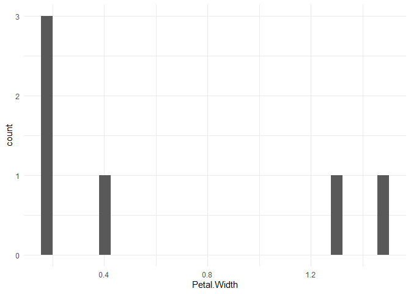

# Building RAPs with R - Part 1.7
Erika Duan
2023-08-06

- [Writing reports for data
  projects](#writing-reports-for-data-projects)
  - [Basic `knitr` tips](#basic-knitr-tips)
- [Minimise code repetition for report
  generation](#minimise-code-repetition-for-report-generation)
  - [Generate simple report templates using
    functions](#generate-simple-report-templates-using-functions)
  - [Generate report templates using
    `knitr::knit_expand()`](#generate-report-templates-using-knitrknit_expand)
    - [Frequency table for variable:
      Species](#frequency-table-for-variable-species)
    - [Frequency table for variable:
      Sepal.Length](#frequency-table-for-variable-sepal.length)
    - [Frequency table for variable:
      Sepal.Width](#frequency-table-for-variable-sepal.width)
    - [Frequency table for variable:
      Petal.Length](#frequency-table-for-variable-petal.length)
    - [Frequency table for variable:
      Petal.Width](#frequency-table-for-variable-petal.width)
    - [Frequency table for variable:
      Species](#frequency-table-for-variable-species-1)
  - [Generate report templates using child
    documents](#generate-report-templates-using-child-documents)
    - [Frequency table for variable:
      Petal.Width](#frequency-table-for-variable-petal.width-1)
    - [Plot for variable: Petal.Width](#plot-for-variable-petal.width)
    - [Frequency table for variable:
      Species](#frequency-table-for-variable-species-2)
    - [Plot for variable: Species](#plot-for-variable-species)
  - [Generate report templates using parameterised
    reports](#generate-report-templates-using-parameterised-reports)
  - [Good packages for printing
    tables](#good-packages-for-printing-tables)

# Writing reports for data projects

A typical analytical project also contains a report or presentation
component. The process to generate a report can be tedious if our
process requires manually updating report outputs like figures, tables
or numbers.

An ideal analytical project workflow involves integrating the report or
presentation generation step as a component in your workflow that starts
from the same source code as your analysis. This is the practice of
**literate programming**, where a workflow contains both code and
descriptive prose and compiles a report with directly embedded data
analysis.

``` mermaid
flowchart LR

A(&quot;Clean and 
analyse data&quot;) --&gt; B(&quot;Draft report&quot;)  

B --&gt; C(&quot;Change report parameters,
update data or
fix mistakes&quot;)

C -. Rerun code .-&gt; A
```

There are two tools for literate programming in R:  
+ `knitr` - built in 2012 and provides the widely used R Markdown
format. To render an R Markdown document into a PDF, the
`rmarkdown::render()` function first converts the Rmd file into a source
LaTex file and then converts that LaTex file into a PDF. This is why you
need a working LaTeX distribution to compile PDF documents.  
+ `quarto` - superseded `knitr` as the preferred format for the RStudio
IDE in 2022 and is also compatible with Jupyter notebooks. Combines the
functionality of R Markdown and other packages for creating websites or
PowerPoint presentations in a single standalone package.

**Note:** It is a matter of user preference to use either `knitr` or
`quarto`, as `knitr` will continue to be supported in R alongside
`quarto` and the cost of switching from one to the other format is
negligible for R users.

## Basic `knitr` tips

The Markdown syntax is rendered by R Markdown and Quarto notebooks for
R, Jupyter notebooks for Python and markdown documents by code
repositories like GitHub and BitBucket. Cheat sheets can be found for
[Markdown](https://www.markdownguide.org/cheat-sheet/) and [R
Markdown](https://www.rstudio.com/wp-content/uploads/2015/02/rmarkdown-cheatsheet.pdf)
syntax.

Code block options can be set globally using the syntax below for
[Quarto
notebooks](https://quarto.org/docs/computations/execution-options.html).

``` r
---
title: "Building RAPs with R - Part 1.7"
author: "Erika Duan"
date: "`r Sys.Date()`"

execute:
  echo: true
  output: false
  message: false
  warning: false
---
```

Global options can be overwritten locally by specifying options like
`#| echo: false` at the beginning of individual code chunks.

Code is evaluated inside code blocks or an inline code chunk. Inline
code chunks are created using single backward ticks and are useful for
outputting parameters in sentences and paragraphs in a report.

LaTeX equations are authored using standard Pandoc markdown syntax and
rendered for PDF and HTML outputs.

# Minimise code repetition for report generation

## Generate simple report templates using functions

We can create report templates using functions that, for example, output
different tables given different function inputs.

``` r
# Create a function that outputs a count table in Rmd or Qmd notebooks ---------
print_count_table <- function(dataset, count_by) {
  dataset |>
    dplyr::count(!!rlang::ensym(count_by)) |>
    knitr::kable()
}

# When print_count_table() is executed inside a code chunk with echo: false, 
# only the table is outputted when the notebook is rendered. For documentation
# purposes, we will set echo: true so the code remains visible.  

# We can also apply print_count_table() to multiple variables using lapply() or
# purrr::map() i.e. lapply(colnames(iris), print_count_table, dataset = iris)
```

``` r
print_count_table(iris, Species)
```

| Species    |   n |
|:-----------|----:|
| setosa     |  50 |
| versicolor |  50 |
| virginica  |  50 |

## Generate report templates using `knitr::knit_expand()`

We can extend our code template further by creating a function that
first generates a subheading for the variable of interest and then
outputs the count table. The function `knitr::knit_expand()` allows us
to do this, as expressions encapsulated inside `{{}}` are expanded to
their value in R.

``` r
# Create a function that additionally outputs a subheading and count table -----
print_count_table_section <- function(dataset, count_by) {
  output <- knitr::knit_expand(
    text = c(
      # Print subheading  
      "### Frequency table for variable: {{variable}}",
      # Print count table under the subheading
      print_count_table(dataset, !!rlang::ensym(count_by))
    ),
    variable = count_by)
  
  cat(output, sep = "\n")
}

# When print_count_table_section() is executed inside a code chunk with 
# echo: false and output: asis, only the subheading and table are outputted when 
# the notebook is rendered. 

# output: asis allows us to output literal R Markdown code (without rendering)
```

``` r
print_count_table_section(iris, "Species")
```

### Frequency table for variable: Species

| Species    |   n |
|:-----------|----:|
| setosa     |  50 |
| versicolor |  50 |
| virginica  |  50 |

If we need to apply the same template created by
`print_count_table_section()` to multiple different variables in the
same dataset, we can use `lapply()` with `invisible()` or
`purrr:walk()`. As `print_count_table_section()` does not return an R
object but prints outputs to the console, we need to use `invisible()`
or `purrr:walk()` to remove NULL outputs.

``` r
withr::with_seed(
  seed = 111, 
  invisible( # Suppresses NULL outputs from print_count_table_section()
    lapply(colnames(iris),
           print_count_table_section,
           dataset = sample_n(iris, 6))) 
)
```

### Frequency table for variable: Sepal.Length

| Sepal.Length |   n |
|-------------:|----:|
|          4.8 |   1 |
|          5.0 |   1 |
|          5.1 |   1 |
|          5.3 |   1 |
|          6.1 |   1 |
|          6.2 |   1 |

### Frequency table for variable: Sepal.Width

| Sepal.Width |   n |
|------------:|----:|
|         2.2 |   1 |
|         2.8 |   1 |
|         3.0 |   1 |
|         3.4 |   1 |
|         3.7 |   1 |
|         3.8 |   1 |

### Frequency table for variable: Petal.Length

| Petal.Length |   n |
|-------------:|----:|
|          1.5 |   1 |
|          1.6 |   1 |
|          1.9 |   2 |
|          4.0 |   1 |
|          4.5 |   1 |

### Frequency table for variable: Petal.Width

| Petal.Width |   n |
|------------:|----:|
|         0.2 |   3 |
|         0.4 |   1 |
|         1.3 |   1 |
|         1.5 |   1 |

### Frequency table for variable: Species

| Species    |   n |
|:-----------|----:|
| setosa     |   4 |
| versicolor |   2 |

**Note:** `knitr::knit_expand` does not work predictably with additional
text inserted in between the section heading and table, so
`knitr::knit_child()` is recommended for creating report template
functions.

## Generate report templates using child documents

[Child
documents](https://bookdown.org/yihui/rmarkdown-cookbook/child-document.html)
are smaller `.Rmd` or `.Qmd` notebooks that can be embedded into the
parent notebook i.e. the final report template. Child documents are
useful when we need to print more complex objects like ggplots, which
cannot be rendered using `knitr::knit_expand()`.

The function `knitr::knit_child()` can be used to compile child
documents inside a code chunk in the parent notebook. We can combine
`lapply()` with `knitr::knit_child()` to output the same template for
multiple variables.

An example of a standalone child document can be found
[here](./raps_part_1_7_child_notebook.qmd). The value `x` is used in
place of a hard-coded variable.

**Note:** For outputs to be printed correctly, the parent document code
chunk must be set to `output: asis` and the relevant child document code
chunks set to `output: asis` for tables and `output: true` for plots.

``` r
output <- lapply(c("Petal.Width", "Species"), function(x) {
  knitr::knit_child(
    'raps_part_1_7_child_notebook.qmd',
    envir = environment(),
    quiet = TRUE
  )
})

cat(unlist(output), sep = '\n')
```

### Frequency table for variable: Petal.Width

The frequency table for Petal.Width is displayed below.

<div class="cell-output-display">

| Petal.Width |   n |
|------------:|----:|
|         0.2 |   3 |
|         0.4 |   1 |
|         1.3 |   1 |
|         1.5 |   1 |

</div>

### Plot for variable: Petal.Width

The plot for Petal.Width is displayed below.



### Frequency table for variable: Species

The frequency table for Species is displayed below.

<div class="cell-output-display">

| Species    |   n |
|:-----------|----:|
| setosa     |   4 |
| versicolor |   2 |

</div>

### Plot for variable: Species

The plot for Species is displayed below.


## Generate report templates using parameterised reports

Parameterised reports are useful when you want to generate separate
reports for each parameter of interest. An example of a standardised
parameterised report can be found
[here](./raps_part_1_7_parameterised_report.qmd).

To set up report parameterisation:

1.  Replace hard-coded variable inputs with parameter keys throughout
    your report template. In contrast to child documents, parameterised
    report can store multiple parameters that must be explicitly
    assigned key-value pairs and referred to in the document body as
    `params$key`.  
2.  List all parameters and set a default value for each parameter key
    in your global code chunk options.

``` r
---
title: "Analysis of `r params$dataset` by `r params$var`"
format: gfm
date: "`r Sys.Date()`"

execute:
  message: false
  warning: false

params:
  dataset: iris
  var: "Petal.Width"
---
```

3.  Render the report template using a separate R script. The code below
    uses `lapply()` to apply the same `rmarkdown::render()` function for
    each continuous variable from the iris data set.

``` r
# Create function that renders an input report template ------------------------
# rmarkdown::render() renders an input report template as an output file and 
# accepts multiple parameters  
iris_variables <- setdiff(colnames(iris), "Species") 

render_report_by_var <- function(variable) {
  rmarkdown::render(
    input = "raps_part_1_7_parameterised_report.qmd",
    output_file = paste0(
      "./raps_part_1_7_files/iris_report_", snakecase::to_snake_case(variable), ".md"
    ),
    params = list(
      dataset = "iris",
      var = variable))
}

# Apply render_report_by_var() to every iris variable excepting Species --------
lapply(
  iris_variables, 
  render_report_by_var
)
```

## Good packages for printing tables

These packages work consistently across HTML, PDF or Microsoft Word
outputs.

- The package `flextable` for any table type.  
- The package `modelsummary` for regression and summary tables.

``` r
# Use flextable to output html table -------------------------------------------
iris |>
  group_by(Species) |> 
  summarise(across(everything(), mean)) |>
  flextable() |>
  set_caption(caption = "Mean value by iris species") |>
  theme_booktabs()
```


``` r
# Use modelsummary to output regression results --------------------------------
model_1 <- lm(mpg ~ hp + am, data = mtcars)
model_2 <- lm(mpg ~ hp, data = mtcars)

# Store model results as list object
models <- list("Model 1" = model_1,
               "Model 2" = model_2)

modelsummary(models)
```

|             | Model 1 | Model 2 |
|:------------|--------:|--------:|
| (Intercept) |  26.585 |  30.099 |
|             | (1.425) | (1.634) |
| hp          |  -0.059 |  -0.068 |
|             | (0.008) | (0.010) |
| am          |   5.277 |         |
|             | (1.080) |         |
| :————       |    ——–: |    ——–: |
| Num.Obs.    |      32 |      32 |
| R2          |   0.782 |   0.602 |
| R2 Adj.     |   0.767 |   0.589 |
| AIC         |   164.0 |   181.2 |
| BIC         |   169.9 |   185.6 |
| Log.Lik.    | -78.003 | -87.619 |
| RMSE        |    2.77 |    3.74 |
