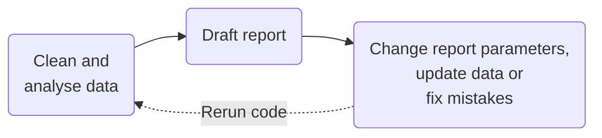
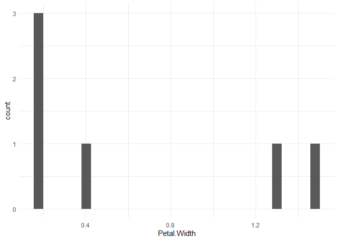
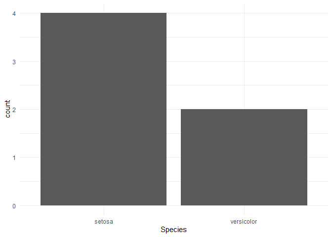
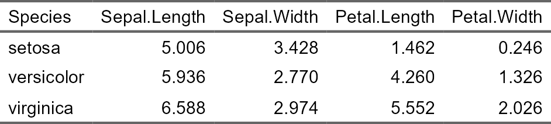

# Building RAPs with R - Part 1.7
Erika Duan
2025-06-10

- [Writing reports for data
  projects](#writing-reports-for-data-projects)
  - [Basic `knitr` tips](#basic-knitr-tips)
- [Minimise code repetition for report
  generation](#minimise-code-repetition-for-report-generation)
  - [Create custom `dplyr` functions](#create-custom-dplyr-functions)
  - [Generate report templates using
    `knitr::knit_expand()`](#generate-report-templates-using-knitrknit_expand)
  - [Generate report templates using child
    documents](#generate-report-templates-using-child-documents)
    - [Frequency table for variable:
      Petal.Width](#frequency-table-for-variable-petalwidth)
    - [Plot for variable: Petal.Width](#plot-for-variable-petalwidth)
    - [Frequency table for variable:
      Species](#frequency-table-for-variable-species)
    - [Plot for variable: Species](#plot-for-variable-species)
  - [Generate report templates using parameterised
    reports](#generate-report-templates-using-parameterised-reports)
- [Good packages for printing
  tables](#good-packages-for-printing-tables)
- [Other resources](#other-resources)

# Writing reports for data projects

A typical analytical project contains a report or presentation
component. The process to generate a report can be tedious if our
process requires manually updating report outputs like figures, tables
or numbers.

An ideal analytical project workflow involves integrating the report or
presentation generation step as a component in your workflow that starts
from the same source code as your analysis. This is the practice of
**literate programming**, where a workflow contains both code and
descriptive prose and compiles a report with directly embedded data
analysis.



There are two tools for literate programming in R:

- `knitr` - built in 2012 and provides the widely used R Markdown
  format. To render an R Markdown document into a PDF, the
  `rmarkdown::render()` function first converts the Rmd file into a
  source LaTex file and then converts that LaTex file into a PDF. This
  is why you need a working LaTeX distribution to compile PDF
  documents.  
- `quarto` - superseded `knitr` as the preferred format for the RStudio
  IDE in 2022 and is also compatible with Jupyter notebooks. Combines
  the functionality of R Markdown and other packages for creating
  websites or PowerPoint presentations in a single standalone package.

**Note:** It is a matter of user preference to use either `knitr` or
`quarto`, as `knitr` will continue to be supported in R alongside
`quarto` and the cost of switching from one to the other format is
negligible for R users.

## Basic `knitr` tips

The Markdown syntax is rendered by R Markdown and Quarto notebooks for
R, Jupyter notebooks for Python and markdown documents by code
repositories like GitHub and BitBucket. Cheat sheets can be found for
[Markdown](https://www.markdownguide.org/cheat-sheet/) and [R
Markdown](https://www.rstudio.com/wp-content/uploads/2015/02/rmarkdown-cheatsheet.pdf)
syntax.

Code block options can be set globally using the syntax below for
[Quarto
notebooks](https://quarto.org/docs/computations/execution-options.html).

``` r
---
title: "Building RAPs with R - Part 1.7"
author: "Erika Duan"
date: "`r Sys.Date()`"

execute:
  echo: true
  output: false
  message: false
  warning: false
---
```

Global options can be overwritten locally by specifying options like
`#| echo: false` at the beginning of individual code chunks.

Code is evaluated inside code blocks or an inline code chunk. Inline
code chunks are created using single backward ticks and are useful for
outputting parameters in sentences and paragraphs in a report.

LaTeX equations are authored using standard Pandoc markdown syntax and
rendered for PDF and HTML outputs.

# Minimise code repetition for report generation

## Create custom `dplyr` functions

We can create report templates using functions that, for example, output
different tables given different input variables.

Report template generation is complicated by [tidy
evaluation](https://adv-r.hadley.nz/evaluation.html) behaviours when we
create custom functions that use `dplyr` functions for data manipulation
or plotting:

- Our function input is often a column name that we store as a **bare
  symbol** (unquoted column name).  
- We want our custom tidyverse function to evaluate the column name as a
  symbol and not a character string.  
- We may want to apply this custom function to multiple column names
  using `purrr::map()`.

There are two different scenarios to be aware of:

- Writing a custom function that takes a bare symbol as its input
  i.e. `print_count_table(iris, Species)`. The conversion of the bare
  symbol into a symbol (for code injection and execution) is found
  inside the function.  
- Writing a custom function that takes one or multiple character strings
  (of column names) as its input. The character string(s) must first be
  converted into a bare symbol before the function is executed.

``` r
# Create a custom function that accepts unquotes column names ------------------
# {{}} is a modern alternative to !!rlang::ensym() for column name evaluation
# using dplyr functions. 

# rlang::ensym() converts an expression from a bare symbol or string into a symbol 
# !! injects the converted symbol into the code (the dplyr expression) 

print_count_table <- function(dataset, count_by) {
  dataset |>
    dplyr::count({{ count_by }}) |>
    knitr::kable()
}

# Output count table for one variable    
print_count_table(mtcars, cyl)
```

| cyl |   n |
|----:|----:|
|   4 |  11 |
|   6 |   7 |
|   8 |  14 |

``` r
# The code print_count_table(mtcars, "cyl") outputs nonsense identical to what 
# mtcars |> count("cyl") would do.  
```

Creating custom functions using `{{}}` is perfectly fine but has a
complication. When we want to apply the custom function on multiple
columns, we can only input **a vector of character strings** instead of
unquoted column names. We therefore need to convert this vector of
characters into a vector of symbols using `sym()`.

``` r
# Apply custom functions across multiple columns -------------------------------
# Column names must be string inputs as non-string input objects do not exist
# in the global environment 
cols <- c("vs", "am", "gear", "carb") 

# lapply(cols, print_count_table, dataset = mtcars) outputs nonsense identical 
# to what mtcars |> count("cyl") does.  

# lapply(!!sym(cols), print_count_table, dataset = mtcars) does not work 

# We need to unquote the character strings inside cols using !!sym() 
# sym() converts a string into a symbol 
# !!sym() can only be used on a function argument
purrr::map(cols, ~ print_count_table(mtcars, !!sym(.x)))
```

    [[1]]


    | vs|  n|
    |--:|--:|
    |  0| 18|
    |  1| 14|

    [[2]]


    | am|  n|
    |--:|--:|
    |  0| 19|
    |  1| 13|

    [[3]]


    | gear|  n|
    |----:|--:|
    |    3| 15|
    |    4| 12|
    |    5|  5|

    [[4]]


    | carb|  n|
    |----:|--:|
    |    1|  7|
    |    2| 10|
    |    3|  3|
    |    4| 10|
    |    6|  1|
    |    8|  1|

## Generate report templates using `knitr::knit_expand()`

I recommend skipping `knitr::knit_expand()` as it has limited use (it
only renders text) and is less readable than directly creating creating
custom report templates.

When using custom functions to print outputs to the console, use
`invisible(lapply())` or `purrr:walk()` to remove NULL outputs.

## Generate report templates using child documents

[Child
documents](https://bookdown.org/yihui/rmarkdown-cookbook/child-document.html)
are smaller `.Rmd` or `.Qmd` notebooks that can be embedded into the
parent notebook i.e. the final report. The function
`knitr::knit_child()` can be used to compile child documents inside a
code chunk in the parent notebook.

We can use `knitr::knit_child()` to output a report template for
multiple columns **within the same report** but there are some hidden
code quirks.

- We can only use `lapply()` and not `purrr::map()` with
  `knitr::knit_child()`.
- The child template must use `!!rlang::ensym()` instead of `{{}}` or
  the custom tidyverse functions will not work correctly.  
- For outputs to be printed correctly, the parent document code chunk
  must be set to `output: asis` and the relevant child document code
  chunks set to `output: asis` for tables and `output: true` for plots.

An example of a child document is
[here](./raps_part_1_7_child_notebook.qmd). The symbol `x` is used in
place of a hard-coded variable.

``` r
# Print report template for multiple columns -----------------------------------
output <- lapply(c("Petal.Width", "Species"), function(x) {
  knitr::knit_child(
    'raps_part_1_7_child_notebook.qmd',
    envir = environment(),
    quiet = TRUE
  )
})

cat(unlist(output), sep = '\n')
```

### Frequency table for variable: Petal.Width

The frequency table for Petal.Width is displayed below.

| Petal.Width |   n |
|------------:|----:|
|         0.2 |   3 |
|         0.4 |   1 |
|         1.3 |   1 |
|         1.5 |   1 |

### Plot for variable: Petal.Width

The plot for Petal.Width is displayed below.



### Frequency table for variable: Species

The frequency table for Species is displayed below.

| Species    |   n |
|:-----------|----:|
| setosa     |   4 |
| versicolor |   2 |

### Plot for variable: Species

The plot for Species is displayed below.



In practice, this method feels very fiddly and I find it more intuitive
to use YAML parameters (when individual reports for different variable
categories are useful). YAML parameters also accept multiple parameters
as analytical inputs.

## Generate report templates using parameterised reports

Parameterised reports are useful when you want to generate separate
reports for each parameter of interest. An example of a parameterised
report is [here](./raps_part_1_7_parameterised_report.Rmd).

**Note:** You can directly use parameter keys inside tidyverse functions
without worrying about tidy evaluation requirements like `{{}}`.

To set up parameterised reports:

1.  Replace hard-coded variable inputs with parameter keys throughout
    your report template. Unlike child documents, parameterised report
    can store multiple parameters that must be explicitly assigned
    key-value pairs and referred to in the document body as
    `params$key`.  
2.  List all parameters and set a default value for each parameter key
    in your global code chunk options. A quick way to check for template
    report code errors is by rendering a temporary report using the
    default parameter values.

``` r
---
title: "Analysis of Iris data set by `r params$species` species"
output: github_document
date: "`r Sys.Date()`"  

params:
  species: "setosa"
---
```

3.  Render the report template using a separate R script. The code below
    uses `lapply()` to apply the same `rmarkdown::render()` function for
    each continuous variable from the iris data set. An example of a
    rendered report can be accessed [here](./report_iris_setosa.md).

``` r
# Create function that renders an input report template ------------------------
# rmarkdown::render() renders an input report template as an output file and 
# accepts multiple parameters  
iris_species <- unique(iris$Species) |>
  as.character()

render_report<- function(variable) {
  rmarkdown::render(
    input = "raps_part_1_7_parameterised_report.Rmd",
    output_format = rmarkdown::github_document(html_preview = FALSE), 
    output_file = paste0(
      "report_iris_", snakecase::to_snake_case(variable), ".md"
    ),
    params = list(
      species = variable
      ))
}

# Apply render_report_by_var() to every iris variable excepting Species --------
lapply(
  iris_species, 
  render_report
)
```

# Good packages for printing tables

These packages work consistently across HTML, PDF or Microsoft Word
outputs.

- The package `flextable` for any table type.  
- The package `modelsummary` for regression and summary tables.

``` r
# Use flextable to output html table -------------------------------------------
iris |>
  group_by(Species) |> 
  summarise(across(everything(), mean)) |>
  flextable() |>
  set_caption(caption = "Mean value by iris species") |>
  theme_booktabs()
```



``` r
# Use modelsummary to output regression results --------------------------------
model_1 <- lm(mpg ~ hp + am, data = mtcars)
model_2 <- lm(mpg ~ hp, data = mtcars)

# Store model results as list object
models <- list("Model 1" = model_1,
               "Model 2" = model_2)

modelsummary(models, output = "flextable")
```


# Other resources

- An in-depth
  [tutorial](https://book.rwithoutstatistics.com/parameterized-reports-chapter.html)
  on creating parameterised reports using `purrr::pwalk()`.
