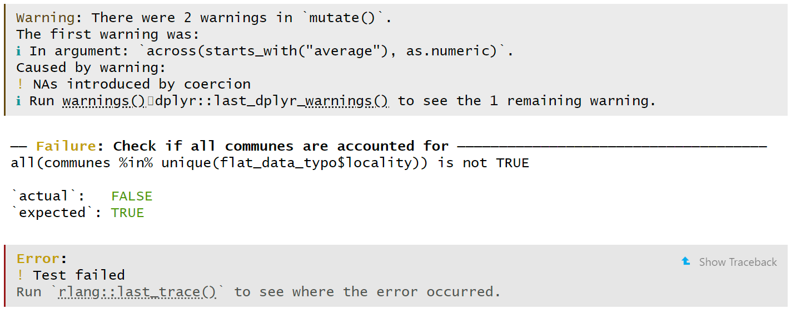

```{r}
# Load required R packages -----------------------------------------------------
if (!require("pacman")) install.packages("pacman")
pacman::p_load(here,
               testthat,
               assertthat)

# Source revised scripts 1 and 2 -----------------------------------------------
# This makes custom functions available for running the unit tests below
source(here("tutorials", "revised_script_01.R"))
source(here("tutorials", "revised_script_02.R"))
```


# Testing code  

The key to testing is to write everything down and re-run tests any time the code from a project gets changed.    

There are 2 types of tests:  

+ **Unit tests:** These are written in separate test files when developing code (i.e. creating custom functions) for an R package.    

+ **Assertive tests**: These are executed at run time and ensure that function inputs or outputs have expected properties.   


# Unit testing   

A unit test should be a self-contained code chunk that can be executed independently.   

During R package development, `usethis::use_test_that()` followed by `usethis::use_test()` helps to create a test file for each R script.  Unit tests can then be run using `devtools::test()`.    

As functions become more complex, it becomes difficult to ensure that changing one part of a function does not affect another part of your pipeline. This is why unit tests are important.    

Returning to our [revised data analytical script 1](./revised_script_01.R), an example of a unit test is to check that all communes in Luxembourg are found in `commune_level_data`.   

```{r}
# Test clean_raw_data outputs to make sure that all communes exist -------------
# Each unit test is independent so we need to recreate the list of communes and
# the cleaned raw dataset. This unit test requires that all custom functions 
# like get_former_communes() are available (which is true when developing an R 
# package).   

# Load list of former and current communes  
former_communes <- get_former_communes()
current_communes <- get_current_communes()
communes <- get_test_communes(former_communes, current_communes)  

# Load cleaned raw data set  
raw_data <- get_raw_data(url = "https://github.com/b-rodrigues/rap4all/raw/master/datasets/vente-maison-2010-2021.xlsx")

# Clean raw data set  
flat_data <- clean_raw_data(raw_data)

# Check that all communes exist in the cleaned data set  
test_that("Check if all communes are accounted for", {

  expect_true(
    all(communes %in% unique(flat_data$locality))
  )

})
```

**Note:** The test `expect_true()` is wrapped inside `test_that()` to allow a test description to be printed if the unit test fails.   

In the unit test below, I deliberately introduce a typo in the `locality` variable of `flat_data_typo`, which causes a mismatch between all the distinct communes in `locality` and the Wikipedia generated `communes` list. 

The unit test fails and the R script (or notebook) stops code execution.  

```{r}
#| eval: false
# Test clean_raw_data outputs to make sure that all communes exist -------------
# Modified an existing commune name into a nonsensical one to fail the unit test   

# Load list of former and current communes  
former_communes <- get_former_communes()
current_communes <- get_current_communes()
communes <- get_test_communes(former_communes, current_communes)  

# Load cleaned raw data set  
raw_data <- get_raw_data(url = "https://github.com/b-rodrigues/rap4all/raw/master/datasets/vente-maison-2010-2021.xlsx")

# Clean raw data set  
flat_data_typo <- clean_raw_data(raw_data) |> 
  mutate(locality = if_else(locality == "Beaufort",
                            "Beauforg",
                            locality))

# We expect all communes listed in Wikipedia to exist in the cleaned data set  
test_that("Check if all communes are accounted for", {
  
  expect_true(
    all(communes %in% unique(flat_data_typo$locality))
  )
  
})
```

This is what is printed when an unit test fails.    

  
**Note:** If warnings unrelated to the unit test exist, they will be printed first and are potentially confusing for error debugging. This is a good motivation to ensure that your code does not produce warnings when it is run.  

Personally, I prefer to use unit tests to check the intended behaviour of individual functions and to use assertions to check the expected inputs and outputs of a data analytical pipeline (unlike the example above). Unit tests should be run during development time and assertions should be run during run time.     

In our [revised data analytical script 2](./revised_script_01.R), the custom function `get_laspeyeres_index(dataset, start_year = "2010")` expects a `dataset` argument of either `commune_level_data` or `country_level_data`.    

We can write an unit test which expects an error if any other data sets are used. Testing that functions fail when they should is also important.   

We can also write an unit test to check whether `get_laspeyeres_index()` performs the correct calculation, by applying it to an input data set with an expected output.   

```{r}
# Test get_laspeyeres_index() behaviour ----------------------------------------
# This unit test requires that get_laspeyeres_index() is available (which is 
# true when developing an R package).   

# We expect the function to fail if an irrelevant data set is used.
# Irrelevant data sets are data sets that are not named commune_level_data or 
# country_level_data.   
test_that("Wrong dataset used", {

  expect_error(
    get_laspeyeres_index(mtcars)
  )

})

# We expect get_laspeyeres() to produce the correct calculations
test_that("get_laspeyeres_index() produces correct results", {
  
  # Generate mock dataset as data.frame object
  input_df <- expand.grid(
    list("year" = c(2010, 2011),
         "locality" = c("Bascharage", "Luxembourg"))
  )

  input_df$n_offers <- c(123, 101, 1230, 1010)
  input_df$average_price_nominal_euros <- c(234, 345, 560, 670)
  input_df$average_price_m2_nominal_euros <- c(23, 34, 56, 67)

  expected_df <- input_df

  # p0 should be always equal to the value in the first year
  expected_df$p0 <- c(234, 234, 560, 560)
  expected_df$p0_m2 <- c(23, 23, 56, 56)

  # pl should be equal to the price divided by p0
  expected_df$pl <- expected_df$average_price_nominal_euros/expected_df$p0 * 100
  expected_df$pl_m2 <- expected_df$average_price_m2_nominal_euros/expected_df$p0_m2 * 100
  
  # Expect_equivalent is less strict that expect_equal and does not require the
  # object classes to be equal.  
  expect_equivalent(
    expected_df, get_laspeyeres_index(input_df)
  )

})
```

We need to be extra careful with [`expect_error()`](https://testthat.r-lib.org/reference/expect_error.html) unit tests as unrelated errors (like function typos) will also throw an error message (because function typos do not exist as attached functions).   

```{r}
# Example of undesirable expect_error() testing --------------------------------
# Using get_laspeyeres_index2() will automatically throw an error because this
# function does not exist. This means the unit test unfortunately also passes.    
test_that("Wrong dataset used", {

  expect_error(
    get_laspeyeres_index2(mtcars)
  )

})
```

An elegant solution to ensuring that the correct type of error is being tested is to use the `regexp` argument inside `expect_error()` to match against the expected error message **if it is a custom error message**.  

```{r}
#| eval: false
#| output: false
# Using error message matching to expect a specific error ----------------------
# stop() stops execution of the current expression and executes an error action   
stop_code <- function() stop("Eek! Stop the code!")

# Using expect_error() works as stop_code() forces an error 
expect_error(stop_code())

# Using expect_error() with its expected custom error message works  
expect_error(stop_code(), "Stop the code!")

# expect_error() throws an error if another non-matching error message is 
# specified
expect_error(stop_code(), "Input is not numeric")
#> Error: `stop_code()` threw an error with unexpected message.
#> Expected match: "Input is not numeric"
#> Actual message: "My error!"
```


# Assertive programming    

Assertive tests are executed at run time and are most useful for asserting whether our function inputs and outputs behave as expected.  

Assertive tests can be added  inside analytical scripts and notebooks or directly inside custom functions. The most commonly used assertions are `stopifnot()` and `assertthat::assert_that()`. The function `stopifnot()` is more useful if you want to create custom error messages. The function `assert_that()` generates more useful error messages to aid code debugging.  

```{r}
#| eval: false
#| output: false
# Test simple assertions -------------------------------------------------------
# If an assertion is FALSE, execution of the current expression is stopped and 
# an error action is executed.  
stopifnot(is.numeric("hello"))
#> Error: is.numeric("hello") is not TRUE

# assert_that() produces more helpful error messages for debugging
assert_that(is.numeric("hello"))
#> Error: "hello" is not a numeric or integer vector  
```

Assertions usually appear at the top of custom functions.  

```{r}
#| eval: false
#| output: false
# Create a custom function using assert_that() ---------------------------------
# assert_that() produces different error messages for different error types
is_odd <- function(x) {
  assert_that(is.numeric(x), length(x) == 1)
  x %% 2 == 1
}

is_odd(c(1, 2, 3))
#> Error: length(x) not equal to 1

is_odd("hello")
#> Error: x is not a numeric or integer vector
```

Assertions are very useful for checking whether function inputs are of the expected class, especially when functions expect a specific data set class or format as its input.    

```{r}
# Create a function that asserts that the function input is a data frame -------
overassertive_glimpse <- function(dataset){

  stopifnot("`dataset` must be a data frame" =
              inherits(dataset, "data.frame"))
  
  dplyr::glimpse(dataset)
}
```

```{r}
#| eval: false
#| output: false
# Test overassertive_glimpse() -------------------------------------------------
# mtcars[1] subsets the first column i.e. it returns another data.frame object
class(mtcars[1])
#> [1] "data.frame" 

# mtcars [1, 1] subsets the first column and first row i.e. it returns an atomic
# vector.   
class(mtcars[1, 1])
#> [1] "numeric"  

# This function works
overassertive_glimpse(mtcars[1])

# This function produces an error
overassertive_glimpse(mtcars[1, 1])
# Error in overassertive_glimpse(mtcars[1, 1]) : 
#   `dataset` must be a data frame
```

**Note:** `inherits()` checks if an object inherits from a specific class. Tibbles and data table `data.frame` objects will therefore both pass the `inherits(dataset, "data.frame")` assertion.  


# Test-driven development  

Test-driven development (TTD) is an interesting programming paradigm where you start by writing tests and then the function (especially if you have a clear idea of what the expected function output is).  

TTD is useful when:  

+ You need to write a complex function but you don't know exactly where to start. Writing tests helps you to specify the properties that the function should have.  
+ You use tests to brainstorm and document the initial requirements for a project.    


# Code coverage   

It is useful to know:   

+ Which functions are tested.  
+ How much of an individual function is tested. For example, if you have an `if ... else ...` clause, you may have tested when the clause evaluates to `TRUE` (for code downstream of `if`) but not `FALSE` (for code downstream of `else`).   

The R package `covr` allows you to track the test coverage of your R package. The function `covr::report()` creates a tab in your web browser that contains test coverage statistics. You can click on each script to check its individual test coverage. Code highlighted in green are tested and code highlighted in red are not.   

   

The function `covr::package_coverage()` alternatively outputs coverage statistics in the R console.   

**Note:** The functions `devtools::test_coverage_active_file()` and `devtools::test_coverage()` are wrappers around `covr::report()`.   


# Notes from R packages  

The chapter on [Designing your test suite](https://r-pkgs.org/testing-design.html) from the R packages textbook provides the following points:   

+ A test should ideally be self-sufficient and self-contained.   

  + In R, each `test_that()` has its own execution environment so R objects created inside a test do not exist after the test exits.   
  + However, calls like `library()`, `options()` and `Sys.setenv()` have a persistent effect after a test and should be avoided at all costs. 
  + The `withr` package can be alternatively used to make temporary changes in the global state.    

+ Test a single behaviour in one and only one unit test. If a behaviour later changes, you only need to update a single test.  

+ Avoid testing simple code that you are confident will work. Focus your time on code that is more complex, fragile or has complicated dependencies.   

+ Always write a test when you discover a bug in your code.  


