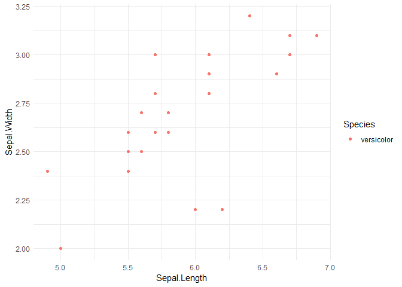

Analysis of Iris data set by versicolor species
================
2025-06-10

### Summary table for species `r`params\$species\`

The summary table for versicolor irises is displayed below.

| Sepal.Length_mean | Sepal.Length_sd | Sepal.Width_mean | Sepal.Width_sd | Petal.Length_mean | Petal.Length_sd | Petal.Width_mean | Petal.Width_sd |
|---:|---:|---:|---:|---:|---:|---:|---:|
| 5.9125 | 0.5076052 | 2.7 | 0.3120758 | 4.233333 | 0.4565148 | 1.258333 | 0.1998188 |

### Plot for species versicolor

The plot for versicolor sepal length versus sepal width is displayed
below.

<!-- -->
