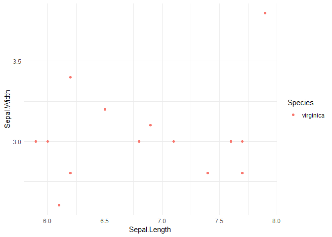

Analysis of Iris data set by virginica species
================
2025-06-10

### Summary table for species `r`params\$species\`

The summary table for virginica irises is displayed below.

| Sepal.Length_mean | Sepal.Length_sd | Sepal.Width_mean | Sepal.Width_sd | Petal.Length_mean | Petal.Length_sd | Petal.Width_mean | Petal.Width_sd |
|---:|---:|---:|---:|---:|---:|---:|---:|
| 6.857143 | 0.7143736 | 3.035714 | 0.2924884 | 5.657143 | 0.6489213 | 1.992857 | 0.2464027 |

### Plot for species virginica

The plot for virginica sepal length versus sepal width is displayed
below.

<!-- -->
