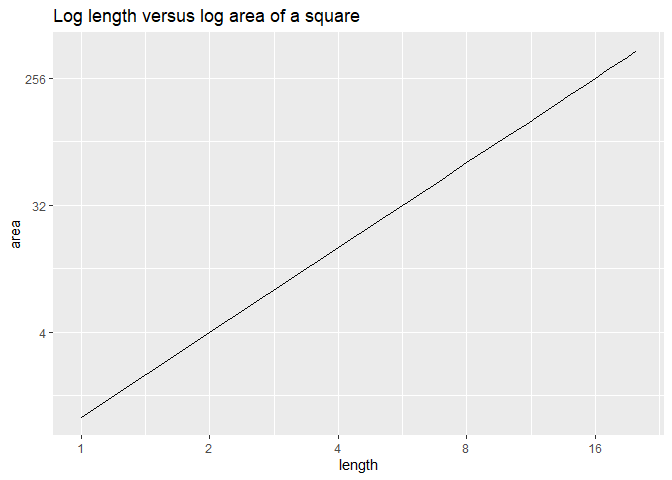
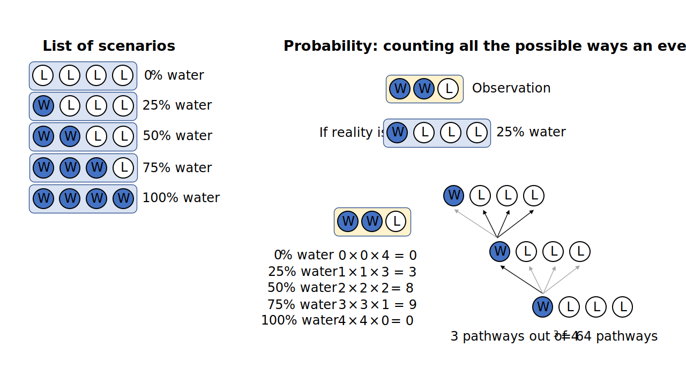

Statistical Rethinking - Chapters 1 and 2 notes
================
Erika Duan
2023-02-04

-   <a href="#chapter-1-notes" id="toc-chapter-1-notes">Chapter 1 notes</a>
    -   <a href="#what-is-the-purpose-of-statistical-models"
        id="toc-what-is-the-purpose-of-statistical-models">What is the purpose
        of statistical models?</a>
    -   <a href="#what-hurdles-are-in-our-way"
        id="toc-what-hurdles-are-in-our-way">What hurdles are in our way?</a>
    -   <a
        href="#relationship-between-statistical-modelling-and-measurement-error"
        id="toc-relationship-between-statistical-modelling-and-measurement-error">Relationship
        between statistical modelling and measurement error</a>
    -   <a href="#null-models" id="toc-null-models">Null models</a>
    -   <a href="#multi-level-models" id="toc-multi-level-models">Multi-level
        models</a>
-   <a href="#chapter-2-notes" id="toc-chapter-2-notes">Chapter 2 notes</a>
    -   <a href="#counting-possibilities"
        id="toc-counting-possibilities">Counting possibilities</a>
    -   <a href="#model-building" id="toc-model-building">Model building</a>
    -   <a href="#model-components" id="toc-model-components">Model
        components</a>
        -   <a href="#grid-approximation" id="toc-grid-approximation">Grid
            approximation</a>

# Chapter 1 notes

## What is the purpose of statistical models?

This is the first textbook that asks: **how do we validate our
scientific understanding of the world**?

We start with observations and consultation of other resources, which
prompts us to form different hypotheses. These hypotheses can be
specified by different process models (with the belief that only one
process model is true). Translation of process models into statistical
models must occur before we can use statistical tools.

We can only use statistical tools to evaluate which statistical model
(data generating process) is more likely to have occurred i.e., events
that can happen in more ways are more plausible and Bayesian statistics
is akin to counting the numbers of ways that something can happen.

Therefore, a good statistical practice is to: **search for a different
description of the existing evidence under which the data generating
processes now look very different to each other**.

## What hurdles are in our way?

Updating our scientific beliefs through the process above is difficult
as:

-   One hypothesis can be represented by multiple process models.
-   Two process models (describing two different hypotheses) can be
    consistent with the same statistical model. Statistical models tend
    to all rely on distributions from the exponential family.  
-   Statistical models describe associations between variables and not a
    causal pathway (also why one statistical model can correspond to
    multiple different process models).
-   Scientific hypotheses are tempted by the logic of falsification
    i.e., $H_0:$ all swans are white and therefore the observation of
    one black swan leads us to wholly reject $H_0$. However, the most
    insightful scientific questions are quantitative rather than
    logically discreet i.e., $H_0:$ swans are rarely black.

``` r
# The textbook mentions that allele distributions exist according to a power law

# A power law distribution has the form Y = k * X^a where a relative change in 
# one quality leads to a proportional change in another quality.  

# Illustrate how changing the length of a square changes its area --------------
# Power law area = length^2 i.e. k = 1 and a = 2  
tibble(length = 1:20, 
       area = length^2) %>%
  ggplot(aes(x = length, y = area)) +
  geom_line() +
  labs(title = "Length versus area of a square")
```


``` r
tibble(length = 1:20, 
       area = length^2) %>%
  ggplot(aes(x = length, y = area)) +
  geom_line() +
  scale_x_continuous(trans = "log2") +
  scale_y_continuous(trans = "log2") + 
  labs(title = "Log length versus log area of a square")
```



## Relationship between statistical modelling and measurement error

Measurement errors are more likely to influence data collection at the
boundaries of knowledge i.e., the detection of subatomic particles in
Physics. Measurement error and its impact on data representativeness is
not commonly discussed by generalist data practitioners yet acknowledged
as a major limitation by scientists.

## Null models

Frequentist statistics is interested in:

-   Rejecting a null hypothesis (which usually corresponds to a neutral
    process model). However, multiple neutral process models exist and
    it is not clear which one should be picked. Also, failing to reject
    the null hypothesis is different to verifying that the null
    hypothesis is true.  
-   Defining measurements (or sampling distributions) based on an
    imaginary resampling from a very large pool of data.  
-   Mathematically, a null model often takes the form $Y= \alpha + C$
    from the specification of a null hypothesis $H_0: B_1 = 0$ for a
    model $Y= \alpha + \beta_1X + C$. This is not possible for natural
    phenomenon like population dynamics or social networks.

**Note:** In Bayesian statistics, randomness really just describes
**uncertainty in the face of incomplete knowledge**.

## Multi-level models

Multi-level models should be considered as the default statistical model
rather than single-level models i.e. when you recognise clusters of
groups that differ from each other i.e. the same patient responding to
multiple different treatments or some patients being re-sampled more
than others.

Multi-level models are also used to explicitly model variation among
individuals or subgroups within the data.

# Chapter 2 notes

## Counting possibilities

Bayesian statistics and probability theory share one thing in common: in
order to find the most plausible answer (the answer that occurs the most
often), **it helps to count every possibility of how something could
have happened**.



When another observation is made, the prior counts of possible scenarios
are updated to provide the new posterior counts. For example, if the
next observation was **L**, the new posterior counts for seeing **W W L
L** would be:

| Scenario   | Prior counts | Chances of obtaining L | Posterior counts |
|:-----------|:-------------|:-----------------------|:-----------------|
| 0% water   | 0            | 4                      | 0                |
| 25% water  | 3            | 3                      | 9                |
| 50% water  | 8            | 2                      | 16               |
| 75% water  | 9            | 1                      | 9                |
| 100% water | 0            | 0                      | 0                |

The approach above requires:

-   Defining a data generation model of the sample (mapping all the
    possible ways that sample generation occurs i.e. drawing all the
    possible forking paths).  
-   Defining all the possible scenarios to calculate and compare how
    likely each scenario is to have occurred (similar to defining a
    specific estimand and describing the range of values that the
    estimand may take).  
-   Designing a statistical test so we can confidently identify whether
    one outcome is statistically more plausible than the others.

**Note:** The emphasis is first on identifying a sound data generation
process (or process model). In the example above, we assume that each
fork is equally likely to occur but with real life processes, we usually
have reason to assume that one pathway is more plausible than another.

Instead of counts, it is easier to use **probabilities** (as we may
encounter scenarios with extremely high counts). To convert prior and
posterior counts into probabilities, we simply divide the counts by the
sum of counts.

| Scenario   | Prior prob | Prior prob $\times$ ways to generate **W W L L** | Posterior prob (standardised) |
|:-----------|:-----------|:-------------------------------------------------|:------------------------------|
| 0% water   | 0          | 0 $\times$ 4 = 0                                 | 0                             |
| 25% water  | 0.15       | 0.15 $\times$ 3 = 0.45                           | 0.265                         |
| 50% water  | 0.4        | 0.4 $\times$ 2 = 0.8                             | 0.471                         |
| 75% water  | 0.45       | 0.45 $\times$ 1 = 0.45                           | 0.265                         |
| 100% water | 0          | 0 $\times$ 0 = 0                                 | 0                             |

``` r
# Calculate prior probabilities ------------------------------------------------
priors <- c(0, 3, 8, 9, 0)
priors/sum(priors)
```

    [1] 0.00 0.15 0.40 0.45 0.00

``` r
#> [1] 0.00 0.15 0.40 0.45 0.00  

posteriors <- c(0, 9, 16, 9, 0)
posteriors/sum(posteriors)
```

    [1] 0.0000000 0.2647059 0.4705882 0.2647059 0.0000000

``` r
#> [1] 0.0000000 0.2647059 0.4705882 0.2647059 0.0000000  

products <- c(0, 0.45, 0.8, 0.45)  
products/sum(products)
```

    [1] 0.0000000 0.2647059 0.4705882 0.2647059

``` r
#> [1] 0.0000000 0.2647059 0.4705882 0.2647059  
```

**Parameter:** the true proportion of Earth covered by water i.e. an
unobserved variable.  
**Likelihood:** the relative number of ways that the observed data could
have been produced based on a hypothesised value of the parameter.  
**Prior probability:** the prior plausibility of the hypothesised value
of the parameter being observed.  
**Posterior probability:** the updated plausibility of the hypothesised
value of the parameter being observed, following inclusion of new
information.

## Model building

To construct a statistical (Bayesian) model:

-   Build a model by narrating how the data might arise using a
    descriptive or causal story. Data stories (which consider sampling,
    measurement and precise statements about variable relationships) are
    actually more complex than the null versus alternate hypotheses
    generated by Frequentist methods.  
-   Educate or update your model by feeding it the data. There is no
    point in checking if a model is true, as we know that our model is
    only an approximation of the true data generation process.  
-   Evaluate your statistical model, leading possibly to model revision.
    The objective is to check the model’s adequacy for some purpose (by
    asking and answering additional scientific questions).

**Note:** A model that is highly confident about an inference can still
be a misleading model, as the inference is still conditional on the
model being able to accurately describe the real world.

## Model components

To construct the model above, we identify our parameter (unobserved
variable) of interest and specify how our observed variables (the counts
of W and L respectively) relate to each other:

-   Only W or L is observed.  
-   Every toss is independent of other tosses.  
-   The probability of W is the same on every toss.

Instead of manual counting, we can use mathematical functions or
distribution functions assigned to observed variables to calculate how
plausible an event is (i.e. number of ways that the observed event could
have happened out of all possible events).

We therefore have two model components:

| Component            | Property                                                                                                                                                                                |
|:---------------------|:----------------------------------------------------------------------------------------------------------------------------------------------------------------------------------------|
| \$W Binomial(N,p) \$ | Model to calculate plausibility of observing W counts out of a total of N tosses, given a hypothesised probability of W.                                                                |
| \$p Uniform(0,1) \$  | A flat prior (when no observations exist, the probability of W is equally likely to exist between 0 and 1). We can improve the model for the prior based on other scientific knowledge. |

``` r
# Counts of W and L are distributed binomially with p = probability of W -------
# This is the prior plausibility of your Bayesian model  

# Calculate probability of observing 6 W out of 9 tosses, where p = 0.5  
dbinom(6, size = 9, prob = 0.2)  
```

    [1] 0.002752512

``` r
#> [1] 0.002752512 

dbinom(6, size = 9, prob = 0.6)  
```

    [1] 0.2508227

``` r
#> [1] 0.2508227  

dbinom(6, size = 9, prob = 0.9)  
```

    [1] 0.04464104

``` r
#> [1] 0.04464104
```

The posterior distribution $Pr(p\,|\,W,\,L)$ contains the relative
plausibility of different parameter values **conditional on the data and
model**.

### Grid approximation

Although $p$ is a continuous parameter, we can still achieve a good
approximation of this continuous posterior distribution using a finite
grid of parameter values.

The weakness of grid approximation is that it does not scale well when
there are a large number of parameter.

``` r
# Grid approximation to condition the data on the prior distribution -----------

# Define how many points to use to estimate the posterior and create a list  
# p = proportion of global covered by water  
p_grid <- seq(from = 0, to = 1, length.out = 20)

# Define flat prior for each parameter value on the grid
prior <- rep(1, 20)

# Compute likelihood i.e. plausibility for each value in p_grid
likelihood <- dbinom(6, size = 9, prob = p_grid)

# Compute the product of the likelihood and prior   
unstd_posterior <- likelihood * prior   

# Standardise the posterior so all values sum to 1 to output probabilities  
posterior <- unstd_posterior/sum(unstd_posterior)

# Plot the posterior distribution 
tibble(p_grid,
       posterior) %>%
  ggplot(aes(x = p_grid, y = posterior)) +
  geom_line() + 
  labs(title = "Estimation of posterior distribution of p using 20 points")
```


