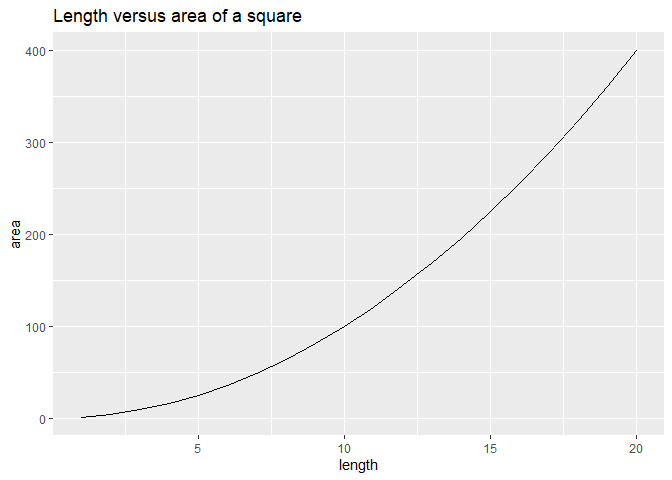

Statistical Rethinking - Chapters 1 and 2 notes
================
Erika Duan
2023-01-25

-   <a href="#chapter-1-notes" id="toc-chapter-1-notes">Chapter 1 notes</a>
    -   <a href="#what-is-the-purpose-of-statistical-models"
        id="toc-what-is-the-purpose-of-statistical-models">What is the purpose
        of statistical models?</a>
    -   <a href="#what-hurdles-are-in-our-way"
        id="toc-what-hurdles-are-in-our-way">What hurdles are in our way?</a>
    -   <a
        href="#relationship-between-statistical-modelling-and-measurement-error"
        id="toc-relationship-between-statistical-modelling-and-measurement-error">Relationship
        between statistical modelling and measurement error</a>
    -   <a href="#null-models" id="toc-null-models">Null models</a>
    -   <a href="#multi-level-models" id="toc-multi-level-models">Multi-level
        models</a>
-   <a href="#chapter-2-notes" id="toc-chapter-2-notes">Chapter 2 notes</a>


      There is a binary version available but the source version is later:
          binary source needs_compilation
    rstan 2.21.7 2.21.8              TRUE

    package 'brms' successfully unpacked and MD5 sums checked

    The downloaded binary packages are in
        C:\Users\Erika\AppData\Local\Temp\RtmpWIV8zM\downloaded_packages

      There is a binary version available but the source version is later:
          binary source needs_compilation
    rstan 2.21.7 2.21.8              TRUE

# Chapter 1 notes

## What is the purpose of statistical models?

This is the first textbook that asks: **how do we validate our
scientific understanding of the world**?

We start with observations and consultation of other resources, which
prompts us to form different hypotheses. These hypotheses can be
specified by different process models (with the belief that only one
process model is true). Translation of process models into statistical
models must occur before we can use statistical tools.

We can only use statistical tools to evaluate which statistical model
(data generating process) is more likely to have occurred i.e., events
that can happen in more ways are more plausible and Bayesian statistics
is akin to counting the numbers of ways that something can happen.

Therefore, a good statistical practice is to: **search for a different
description of the existing evidence under which the data generating
processes now look very different to each other**.

## What hurdles are in our way?

Updating our scientific beliefs through the process above is difficult
as:

-   One hypothesis can be represented by multiple process models.
-   Two process models (describing two different hypotheses) can be
    consistent with the same statistical model. Statistical models tend
    to all rely on distributions from the exponential family.  
-   Statistical models describe associations between variables and not a
    causal pathway (also why one statistical model can correspond to
    multiple different process models).
-   Scientific hypotheses are tempted by the logic of falsification
    i.e., $H_0:$ all swans are white and therefore the observation of
    one black swan leads us to wholly reject $H_0$. However, the most
    insightful scientific questions are quantitative rather than
    logically discreet i.e., $H_0:$ swans are rarely black.

``` r
# The textbook mentions that allele distributions exist according to a power law

# A power law distribution has the form Y = k * X^a where a relative change in 
# one quality leads to a proportional change in another quality.  

# Illustrate how changing the length of a square changes its area --------------
# Power law area = length^2 i.e. k = 1 and a = 2  
tibble(length = 1:20, 
       area = length^2) %>%
  ggplot(aes(x = length, y = area)) +
  geom_line() +
  labs(title = "Length versus area of a square")
```



``` r
tibble(length = 1:20, 
       area = length^2) %>%
  ggplot(aes(x = length, y = area)) +
  geom_line() +
  scale_x_continuous(trans = "log2") +
  scale_y_continuous(trans = "log2") + 
  labs(title = "Log length versus log area of a square")
```


## Relationship between statistical modelling and measurement error

Measurement errors are more likely to influence data collection at the
boundaries of knowledge i.e., the detection of subatomic particles in
Physics. Measurement error and its impact on data representativeness is
not commonly discussed by generalist data practitioners yet acknowledged
as a major limitation by scientists.

## Null models

Frequentist statistics is interested in:  
- Rejecting a null hypothesis (which usually corresponds to a neutral
process model). However, multiple neutral process models exist and it is
not clear which one should be picked. Also, failing to reject the null
hypothesis is different to verifying that the null hypothesis is true.  
- Defining measurements (or sampling distributions) based on an
imaginary resampling from a very large pool of data. - Mathematically, a
null model often takes the form $Y= \alpha + C$ from the specification
of a null hypothesis $H_0: B_1 = 0$ for a model
$Y= \alpha + \beta_1X + C$. This is not possible for natural phenomenon
like population dynamics or social networks.

**Note:** In Bayesian statistics, randomness really just describes
**uncertainty in the face of incomplete knowledge**.

## Multi-level models

# Chapter 2 notes
